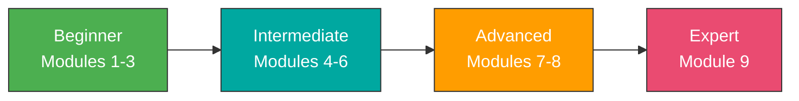
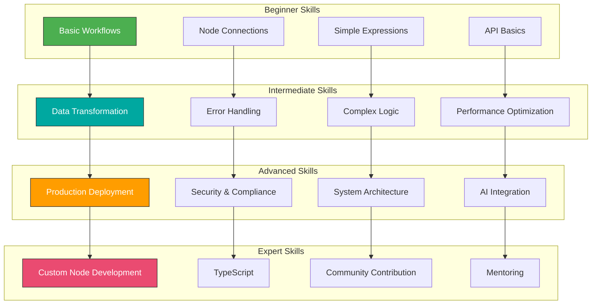

# n8n: Beginner to Expert Course

Complete hands-on course to master n8n workflow automation, from basics to expert-level implementations.

## 📚 Course Overview

This comprehensive course will take you from complete beginner to expert in n8n, the powerful workflow automation platform. You'll learn to build sophisticated automations, integrate multiple services, and create production-ready workflows.

**Total Duration:** 12-16 weeks (10-15 hours/week)



## 🎯 Learning Path

### Beginner Level (Modules 1-3) - Weeks 1-5

Learn n8n fundamentals and build your first workflows.

**Module 1: [Introduction to n8n and Workflow Automation](./modules/module-01-introduction/README.md)**
- Week 1: Getting started with n8n
- Installation and setup
- First workflows and basic concepts

**Module 2: [Core Concepts and Basic Workflows](./modules/module-02-core-concepts/README.md)**
- Week 2: Understanding nodes and data flow
- Week 3: Working with APIs

**Module 3: [Essential Integrations](./modules/module-03-essential-integrations/README.md)**
- Week 4: Popular app integrations (Gmail, Slack, databases)
- Week 5: Advanced integrations (cloud storage, CRM, payments)

### Intermediate Level (Modules 4-6) - Weeks 6-10

Master data transformation, error handling, and advanced features.

**Module 4: [Data Transformation and Logic](./modules/module-04-data-transformation/README.md)**
- Week 6: Advanced data manipulation with JavaScript
- Week 7: Advanced logic and flow control

**Module 5: [Error Handling and Monitoring](./modules/module-05-error-handling/README.md)**
- Week 8: Robust workflow design and debugging

**Module 6: [Advanced Features and Techniques](./modules/module-06-advanced-features/README.md)**
- Week 9: Subworkflows and modularity
- Week 10: Performance and scalability

### Advanced Level (Modules 7-8) - Weeks 11-14

Deploy production systems and build real-world applications.

**Module 7: [Enterprise Features and Self-Hosting](./modules/module-07-enterprise/README.md)**
- Week 11: Self-hosting and administration
- Week 12: Security and compliance

**Module 8: [Real-World Applications and Expert Patterns](./modules/module-08-real-world/README.md)**
- Week 13: Complex business automations
- Week 14: AI and advanced integrations

### Expert Level (Module 9) - Weeks 15-16

Build custom nodes and complete your capstone project.

**Module 9: [Expert Techniques and Advanced Patterns](./modules/module-09-expert/README.md)**
- Week 15: Custom nodes and extensions
- Week 16: Capstone project and best practices

## 🚀 Quick Start

### Prerequisites

- Basic computer literacy
- No coding experience required (helpful for advanced modules)
- Willingness to learn and experiment

### Getting Started

1. **Choose Your Path:**
   - **Cloud:** Sign up at [n8n.cloud](https://n8n.cloud) for instant access
   - **Local:** Follow the [installation guide](./modules/module-01-introduction/week-1/installation-guide.md)

2. **Start Learning:**
   - Begin with [Module 1, Week 1](./modules/module-01-introduction/week-1/README.md)
   - Complete exercises in order
   - Build the hands-on projects

3. **Join the Community:**
   - [n8n Community Forum](https://community.n8n.io)
   - [n8n Discord Server](https://discord.gg/n8n)
   - [n8n Reddit](https://reddit.com/r/n8n)

## 📖 Course Structure

Each module includes:

- **Learning Objectives** - Clear goals for each week
- **Comprehensive Guides** - Detailed explanations with diagrams
- **Hands-On Exercises** - Practical projects to build
- **Visual Aids** - Mermaid diagrams and flowcharts
- **Assessments** - Quizzes and projects to test knowledge
- **Resources** - Links to documentation and additional learning

## 🛠️ What You'll Build

Throughout this course, you'll create real-world projects:

### Beginner Projects
- ✅ Hello World workflow
- ✅ Scheduled email notifications
- ✅ API to email integration
- ✅ Data processing pipeline
- ✅ Multi-API integration

### Intermediate Projects
- ⚙️ Data transformation workflows
- ⚙️ Error handling systems
- ⚙️ Batch processing pipelines
- ⚙️ High-performance workflows
- ⚙️ Modular workflow libraries

### Advanced Projects
- 🚀 Production deployment
- 🚀 Multi-user enterprise setup
- 🚀 E-commerce integration hub
- 🚀 AI-powered applications
- 🚀 DevOps automation suite

### Expert Projects
- 🏆 Custom n8n nodes
- 🏆 Community contributions
- 🏆 **Capstone Project** - Your masterpiece

## 📊 Skill Progression



## 🎓 Assessment & Certification

### Skill Levels

**Beginner Level (Modules 1-3)**
- ✓ Create basic workflows with triggers and actions
- ✓ Understand data flow and basic transformations
- ✓ Connect to common APIs and services

**Intermediate Level (Modules 4-6)**
- ✓ Implement complex logic and error handling
- ✓ Create modular, reusable workflows
- ✓ Optimize for performance and reliability

**Advanced Level (Modules 7-8)**
- ✓ Deploy and manage production environments
- ✓ Design enterprise-grade automations
- ✓ Integrate advanced features like AI

**Expert Level (Module 9)**
- ✓ Create custom nodes and extensions
- ✓ Contribute to n8n ecosystem
- ✓ Architect complex automation systems
- ✓ Mentor others in the community

### Assessment Methods

- Weekly exercises and projects
- Module quizzes
- Hands-on demonstrations
- Final capstone project

## 📁 Repository Structure

```
n8n-course/
├── README.md                          # This file
├── CLAUDE.md                          # Claude Code guidance
├── n8n-beginner-to-expert-course.md  # Original course outline
├── diagrams/                          # Shared diagrams and visuals
│   └── README.md                      # Diagram documentation
├── assets/                            # Course assets
└── modules/                           # Course modules
    ├── module-01-introduction/
    │   ├── README.md
    │   └── week-1/
    │       ├── README.md
    │       ├── installation-guide.md
    │       └── exercises/
    ├── module-02-core-concepts/
    │   ├── README.md
    │   ├── week-2/
    │   └── week-3/
    ├── module-03-essential-integrations/
    ├── module-04-data-transformation/
    ├── module-05-error-handling/
    ├── module-06-advanced-features/
    ├── module-07-enterprise/
    ├── module-08-real-world/
    └── module-09-expert/
```

## 🤝 Contributing

This course is designed to be a living document. Contributions are welcome!

**Ways to Contribute:**
- Fix typos or errors
- Add examples and exercises
- Improve diagrams
- Share your projects
- Suggest improvements

## 📝 Study Tips

1. **Practice Daily**: Spend at least 30 minutes each day working with n8n
2. **Build Real Projects**: Don't just follow tutorials; solve actual problems
3. **Join the Community**: Engage with other learners and experts
4. **Document Your Work**: Keep notes on patterns and solutions
5. **Experiment Freely**: n8n is designed for experimentation
6. **Start Simple**: Master basics before jumping to advanced topics
7. **Read Others' Workflows**: Learn from community templates
8. **Version Control**: Save your workflows and track changes
9. **Focus on Use Cases**: Think about problems you can solve
10. **Be Patient**: Expertise takes time and consistent practice

## 🔗 Essential Resources

### Official Resources
- [n8n Documentation](https://docs.n8n.io)
- [n8n Community Forum](https://community.n8n.io)
- [n8n GitHub](https://github.com/n8n-io/n8n)
- [n8n YouTube Channel](https://www.youtube.com/@n8n-io)
- [n8n Blog](https://blog.n8n.io)
- [n8n Workflow Templates](https://n8n.io/workflows)

### Community
- [Discord Server](https://discord.gg/n8n)
- [Reddit Community](https://reddit.com/r/n8n)
- [Twitter/X](https://twitter.com/n8n_io)

### Learning Resources
- [Expression Documentation](https://docs.n8n.io/code-examples/expressions/)
- [Node Documentation](https://docs.n8n.io/integrations/)
- [Cron Expression Generator](https://crontab.guru/)
- [JSON Tutorial](https://www.json.org/)
- [REST API Guide](https://restfulapi.net/)

## 💡 Use Cases by Industry

### E-Commerce
- Order processing automation
- Inventory synchronization
- Customer communication
- Shipping integration

### Marketing
- Lead generation
- Email campaigns
- Social media automation
- Analytics reporting

### Development
- CI/CD pipelines
- Deployment automation
- Monitoring and alerts
- Issue tracking

### Finance
- Invoice processing
- Payment reconciliation
- Report generation
- Compliance automation

### Customer Support
- Ticket routing
- Automated responses
- SLA monitoring
- Knowledge base updates

## 🏆 Success Stories

Share your success story! After completing modules:
- Post your projects on the community forum
- Share workflows on n8n.io
- Write blog posts about your journey
- Help others learn n8n

## 📅 Course Schedule

### Self-Paced Option
- Start anytime
- Progress at your own speed
- Recommended: 10-15 hours/week
- Complete in 12-16 weeks

### Intensive Option
- Full-time study (30+ hours/week)
- Complete in 4-6 weeks
- Requires strong dedication
- Best for career transitions

### Casual Option
- 5-7 hours/week
- Complete in 6-9 months
- Balanced with other commitments
- Great for continuous learning

## 🎯 Learning Objectives by Module

| Module | Duration | Key Skills |
|--------|----------|------------|
| Module 1 | 1 week | n8n basics, first workflows |
| Module 2 | 2 weeks | Nodes, data flow, APIs |
| Module 3 | 2 weeks | Integrations, webhooks |
| Module 4 | 2 weeks | JavaScript, data transformation |
| Module 5 | 1 week | Error handling, monitoring |
| Module 6 | 2 weeks | Subworkflows, performance |
| Module 7 | 2 weeks | Production deployment, security |
| Module 8 | 2 weeks | Business automations, AI |
| Module 9 | 2 weeks | Custom nodes, capstone |

## 🚦 Getting Help

**Stuck on something?**
1. Check the module's troubleshooting guide
2. Search the community forum
3. Ask in the Discord server
4. Review the official documentation
5. Post a detailed question with:
   - What you're trying to achieve
   - What you've tried
   - Error messages or screenshots
   - Your n8n version

## 📜 License

This course content is created for educational purposes. n8n is licensed under the [n8n Sustainable Use License](https://github.com/n8n-io/n8n/blob/master/LICENSE.md).

## 🙏 Acknowledgments

- n8n team for creating an amazing platform
- n8n community for sharing knowledge
- All contributors to this course

---

## 🚀 Ready to Start?

**Begin your n8n journey now:**

👉 **[Start with Module 1, Week 1: Getting Started](./modules/module-01-introduction/week-1/README.md)**

Good luck on your journey to becoming an n8n expert!

---

**Course Version:** 1.0
**Last Updated:** November 2025
**Target n8n Version:** 1.0+

*This course is designed to be flexible. Adjust the pace based on your background, available time, and learning goals. The key is consistent practice and building real-world projects.*
