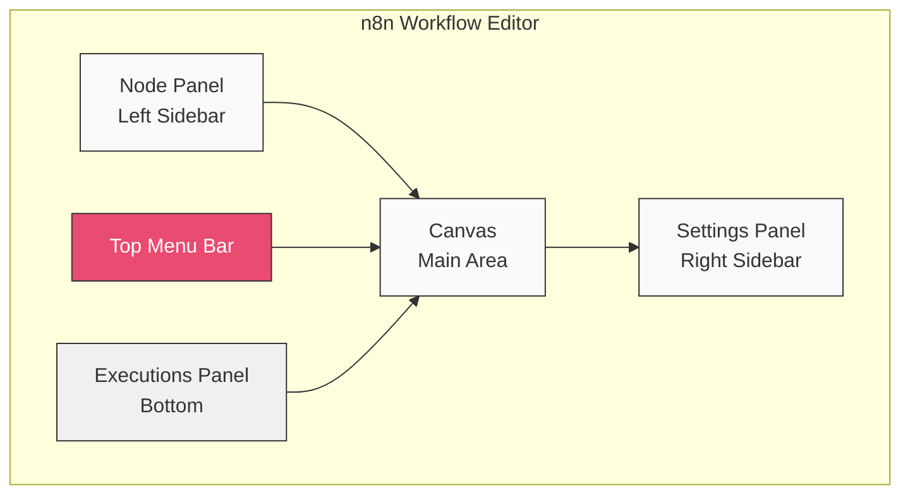
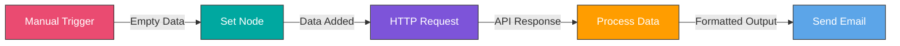
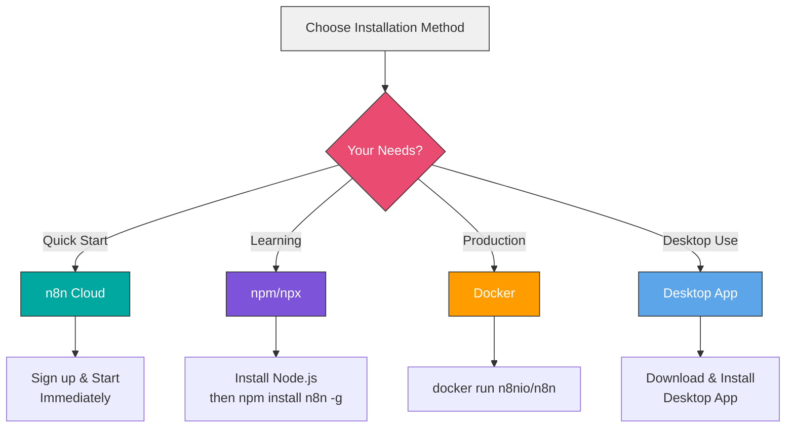

# Diagrams and Visual Aids

This directory contains Mermaid diagrams and visual aids used throughout the course.

All diagrams are created using Mermaid syntax and can be viewed directly in GitHub or any Mermaid-compatible markdown viewer.

## Diagram Index

### Module 1: Introduction to n8n (Week 1)
📍 **Location**: `/modules/module-01-introduction/week-1/diagrams.md`

- n8n Interface Overview
- Installation Options & Comparison
- First Workflow Examples
- Node Types Overview
- Data Flow Basics
- Common Workflow Patterns

### Module 2: Core Concepts (Weeks 2-3)
Already has comprehensive Mermaid diagrams in individual week README files:
- Week 2: Node types, data structures, expressions (10 diagrams)
- Week 3: API integration, authentication, error handling (9 diagrams)

### Module 3: Essential Integrations (Weeks 4-5)
Already has comprehensive Mermaid diagrams in individual week README files:
- Week 4: App integrations, credentials, webhooks (10 diagrams)
- Week 5: File storage, CRM, payment processing (7 diagrams)

### Module 4: Data Transformation (Weeks 6-7)
Already has comprehensive Mermaid diagrams in individual week README files:
- Week 6: Data manipulation, JavaScript, arrays (7 diagrams)
- Week 7: Logic, flow control, loops (13 diagrams)

### Module 5: Error Handling (Week 8)
Already has comprehensive Mermaid diagrams in individual week README files:
- Week 8: Error patterns, monitoring, debugging (15 diagrams)

### Module 6: Advanced Features (Weeks 9-10)
Already has comprehensive Mermaid diagrams in individual week README files:
- Week 9: Subworkflows, modularity (14 diagrams)
- Week 10: Performance, scalability, queuing (12 diagrams)

### Module 7: Enterprise Features (Weeks 11-12)
📍 **Week 11 Location**: `/modules/module-07-enterprise/week-11/diagrams.md`

**Week 11: Self-Hosting & Administration**
- Docker Deployment Architecture (Simple & Multi-Instance)
- Environment Deployment Flow
- Database Architecture & Connection Pooling
- SSL/TLS Configuration Flow
- User Management & RBAC
- Queue Mode Architecture
- Backup & Disaster Recovery
- Health Check Flow

📍 **Week 12 Location**: `/modules/module-07-enterprise/week-12/diagrams.md`

**Week 12: Security & Compliance**
- Credential Encryption Flow
- Environment Variable Hierarchy
- API Key Rotation Process (Zero-Downtime)
- GDPR Compliance Workflow
- Audit Trail Architecture
- Security Layers (Defense in Depth)
- Compliance Framework Mapping

### Module 8: Real-World Applications (Weeks 13-14)
📍 **Week 13 Location**: `/modules/module-08-real-world/week-13/diagrams.md`

**Week 13: Complex Business Automations**
- E-commerce Order Processing Flow
- Multi-Channel Order Integration
- Customer Onboarding Journey
- Multi-Stage Approval Workflow
- Event-Driven Architecture
- Financial Reconciliation Process
- Common Workflow Patterns

📍 **Week 14 Location**: `/modules/module-08-real-world/week-14/diagrams.md`

**Week 14: AI and Advanced Integrations**
- AI Integration Architecture
- AI Model Selection Flow
- Chatbot Conversation Flow
- Intent Recognition & Routing
- RAG (Retrieval Augmented Generation)
- Content Generation Pipeline
- Document Processing Workflow
- Sentiment Analysis System
- AI Cost Optimization

### Module 9: Expert Techniques (Weeks 15-16)
Weeks 15-16 use ASCII art diagrams extensively in their guides:
- Week 15: Custom node architecture (in development guides)
- Week 16: Capstone project architectures (in project guides)

---

## n8n Interface Overview

---

## Basic Workflow Flow

---

## Installation Options

