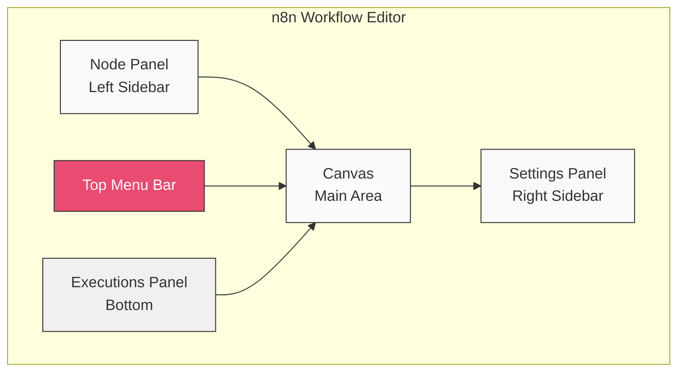
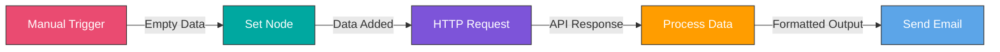
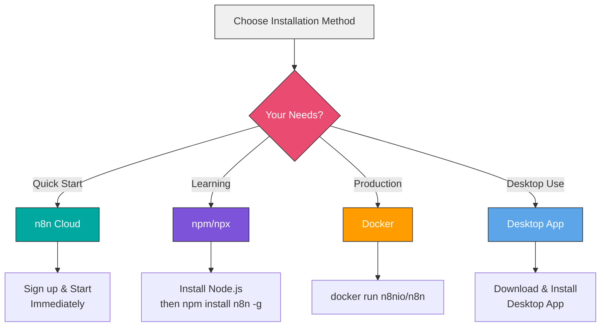

# Diagrams and Visual Aids

This directory contains Mermaid diagrams and visual aids used throughout the course.

All diagrams are created using Mermaid syntax and can be viewed directly in GitHub or any Mermaid-compatible markdown viewer.

## Diagram Index

### Module 1: Introduction
- [n8n Interface Overview](#n8n-interface-overview)
- [Basic Workflow Flow](#basic-workflow-flow)
- [Installation Options](#installation-options)

### Module 2: Core Concepts
- [Node Types](#node-types)
- [Data Flow](#data-flow)
- [Execution Modes](#execution-modes)

---

## n8n Interface Overview

---

## Basic Workflow Flow

---

## Installation Options

