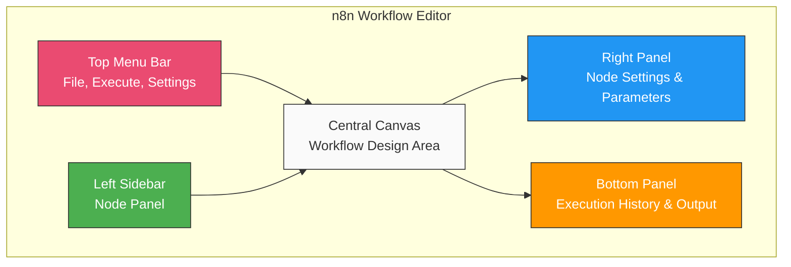

# Week 1: Getting Started with n8n

## Learning Objectives

By the end of this week, you will be able to:

- Explain what workflow automation is and why it's valuable
- Compare n8n to other automation tools (Zapier, Make, etc.)
- Set up n8n locally or in the cloud
- Navigate the n8n interface confidently
- Understand core n8n terminology
- Create and execute your first workflows

## Topics

### 1. What is Workflow Automation?

Workflow automation is the process of connecting different applications, services, and systems to automate repetitive tasks without writing complex code. It enables you to:

- Save time by automating manual processes
- Reduce human error in repetitive tasks
- Integrate multiple tools and services
- Create complex business logic flows
- Scale operations efficiently

**Common Use Cases:**
- Automatically save email attachments to cloud storage
- Sync data between multiple databases
- Send notifications based on specific triggers
- Process and transform data from APIs
- Create custom integrations between services

### 2. n8n vs Other Automation Tools

| Feature | n8n | Zapier | Make (Integromat) |
|---------|-----|--------|-------------------|
| **Hosting** | Self-hosted or Cloud | Cloud only | Cloud only |
| **Pricing** | Free (self-hosted) | Starts at $19.99/mo | Starts at $9/mo |
| **Open Source** | Yes | No | No |
| **Code Support** | JavaScript in nodes | Limited | Limited |
| **Visual Editor** | Yes | Yes | Yes |
| **Custom Nodes** | Yes | No | No |
| **Data Privacy** | Full control | Third-party | Third-party |

**Why Choose n8n?**
- Complete data ownership with self-hosting
- No execution limits on self-hosted version
- Open-source and extensible
- Active community and regular updates
- Fair-code distribution model

### 3. Installation Options

#### Option A: n8n Cloud (Easiest)
1. Visit [n8n.cloud](https://n8n.cloud)
2. Sign up for a free trial
3. Start building workflows immediately

**Pros:** No setup, automatic updates, managed hosting
**Cons:** Paid service, usage limits on free tier

#### Option B: npx (Quick Local Setup)
```bash
npx n8n
```

**Pros:** Instant start, no installation needed
**Cons:** Data not persisted between sessions

#### Option C: npm Global Install
```bash
npm install n8n -g
n8n start
```

**Pros:** Persistent data, full control
**Cons:** Requires Node.js knowledge

#### Option D: Docker (Recommended for Production)
```bash
docker run -it --rm \
  --name n8n \
  -p 5678:5678 \
  -v ~/.n8n:/home/node/.n8n \
  n8nio/n8n
```

**Pros:** Isolated environment, easy deployment
**Cons:** Requires Docker knowledge

See the [Installation Guide](./installation-guide.md) for detailed instructions.

### 4. n8n Interface Overview



**Key Components:**

1. **Canvas**: The main workspace where you build workflows
2. **Node Panel**: Left sidebar with available nodes
3. **Node Settings**: Right panel for configuring selected nodes
4. **Workflow Menu**: Top bar with save, execute, and settings
5. **Executions Panel**: View past workflow runs
6. **Credentials Panel**: Manage API keys and authentication

### 5. Core Terminology

- **Workflow**: A series of connected nodes that automate a process
- **Node**: A building block that performs a specific action
  - **Trigger Node**: Starts the workflow (webhook, schedule, etc.)
  - **Action Node**: Performs operations (HTTP request, database query, etc.)
- **Connection**: Links between nodes that pass data
- **Execution**: A single run of a workflow
- **Item**: Individual data records flowing through the workflow
- **Expression**: Dynamic values using double curly braces `{{ }}`
- **Credentials**: Stored authentication information

### 6. Your First Workflow

Let's create a simple "Hello World" workflow:

**Steps:**
1. Add a Manual Trigger node
2. Add a Set node
3. Configure the Set node to add a field named `message` with value `Hello World`
4. Connect the nodes
5. Execute the workflow

See [Exercise 1: Hello World](./exercises/exercise-1-hello-world.md) for detailed walkthrough.

## Hands-On Projects

### Project 1: Hello World Workflow
**Goal**: Create your first workflow using Manual Trigger and Set node
**Time**: 15 minutes
**Difficulty**: Beginner
[View Instructions](./exercises/exercise-1-hello-world.md)

### Project 2: Scheduled Email Notification
**Goal**: Build a workflow that sends an email on a schedule
**Time**: 30 minutes
**Difficulty**: Beginner
[View Instructions](./exercises/exercise-2-scheduled-email.md)

### Project 3: HTTP Request to Email
**Goal**: Fetch data from an API and send it via email
**Time**: 45 minutes
**Difficulty**: Beginner
[View Instructions](./exercises/exercise-3-api-to-email.md)

## Additional Resources

### Videos
- [n8n in 100 Seconds](https://www.youtube.com/watch?v=example) (placeholder)
- [n8n Quick Start Tutorial](https://www.youtube.com/watch?v=example) (placeholder)

### Reading
- [n8n Concepts Documentation](https://docs.n8n.io/workflows/concepts/)
- [Workflow Best Practices](https://docs.n8n.io/workflows/best-practices/)

### Community
- [n8n Community Forum](https://community.n8n.io)
- [n8n Discord Server](https://discord.gg/n8n)
- [n8n Reddit Community](https://reddit.com/r/n8n)

## Assessment

Complete the [Week 1 Quiz](./assessment/quiz.md) to test your understanding.

### Checklist

Before moving to Week 2, ensure you can:

- [ ] Explain what workflow automation is
- [ ] List 3 differences between n8n and other tools
- [ ] Successfully install and access n8n
- [ ] Navigate the n8n interface
- [ ] Define: workflow, node, trigger, execution
- [ ] Create a workflow with at least 2 nodes
- [ ] Execute a workflow successfully
- [ ] View execution results

## Next Steps

Congratulations on completing Week 1! You now have a solid foundation in n8n basics.

**Next:** [Module 2: Core Concepts and Basic Workflows](../../module-02-core-concepts/README.md)

## Need Help?

- Check the [FAQ](./faq.md)
- Ask questions in the [Community Forum](https://community.n8n.io)
- Review the [Troubleshooting Guide](./troubleshooting.md)
