# Week 1: Getting Started - Visual Guides

This document contains all visual diagrams for Week 1 content.

## Table of Contents

1. [n8n Interface Overview](#n8n-interface-overview)
2. [Installation Options](#installation-options)
3. [First Workflow Examples](#first-workflow-examples)
4. [Node Types Overview](#node-types-overview)
5. [Data Flow Basics](#data-flow-basics)

---

## n8n Interface Overview

### Main Interface Components


### Node Panel Organization


---

## Installation Options

### Choosing Your Installation Method

```mermaid
flowchart TD
    START{What's Your Goal?}

    START -->|Quick Start<br/>No Setup| CLOUD[n8n Cloud]
    START -->|Learning & Testing<br/>Local Development| NPX[npx/npm]
    START -->|Production Deployment<br/>Self-Hosted| DOCKER[Docker]
    START -->|Desktop Application<br/>Easy Setup| DESKTOP[Desktop App]

    CLOUD --> CLOUD_STEPS[1. Visit n8n.cloud<br/>2. Sign Up<br/>3. Start Building<br/>✓ Immediate Access]

    NPX --> NPX_STEPS[1. Install Node.js<br/>2. Run: npx n8n<br/>3. Open localhost:5678<br/>✓ Quick Local Setup]

    DOCKER --> DOCKER_STEPS[1. Install Docker<br/>2. Run: docker run n8nio/n8n<br/>3. Configure persistence<br/>✓ Production Ready]

    DESKTOP --> DESKTOP_STEPS[1. Download installer<br/>2. Install app<br/>3. Launch n8n<br/>✓ No Terminal Needed]

    style CLOUD fill:#4CAF50,stroke:#333,color:#fff
    style NPX fill:#2196F3,stroke:#333,color:#fff
    style DOCKER fill:#FF9800,stroke:#333,color:#fff
    style DESKTOP fill:#9C27B0,stroke:#333,color:#fff
```



### Installation Comparison Matrix

```mermaid
graph TB
    subgraph "Cloud (n8n.cloud)"
        CLOUD_PROS[✓ No setup required<br/>✓ Auto-updates<br/>✓ Managed hosting<br/>✗ Subscription cost<br/>✗ Data in cloud]
    end

    subgraph "npm/npx"
        NPM_PROS[✓ Quick start<br/>✓ Local development<br/>✓ Free<br/>✗ Manual updates<br/>✗ Not for production]
    end

    subgraph "Docker"
        DOCKER_PROS[✓ Production-ready<br/>✓ Easy scaling<br/>✓ Isolated environment<br/>✗ Requires Docker knowledge<br/>✗ More setup]
    end

    subgraph "Desktop App"
        DESKTOP_PROS[✓ User-friendly<br/>✓ No terminal<br/>✓ Local & secure<br/>✗ Desktop only<br/>✗ Limited for servers]
    end

    style CLOUD_PROS fill:#4CAF50,stroke:#333,color:#fff
    style DOCKER_PROS fill:#FF9800,stroke:#333,color:#fff
```



---

## First Workflow Examples

### Hello World Workflow


**Data Flow:**
```json
Manual Trigger: []
↓
Set Node: [
  {
    "message": "Hello World!",
    "timestamp": "2024-01-01T12:00:00Z"
  }
]
```

### Scheduled Email Notification


**Workflow Steps:**
1. **Schedule Trigger** fires daily at 9 AM
2. **HTTP Request** fetches weather data from API
3. **Send Email** sends formatted weather report

### API to Spreadsheet


---

## Node Types Overview

### Core Node Categories


### Trigger Nodes Explained

```mermaid
graph TB
    subgraph "Trigger Nodes (Start Workflows)"
        MANUAL[Manual Trigger<br/>👤 User clicks Execute]
        SCHEDULE[Schedule Trigger<br/>⏰ Time-based execution]
        WEBHOOK[Webhook Trigger<br/>🔗 External HTTP requests]
        EMAIL[Email Trigger<br/>📧 New email received]
    end

    subgraph "When to Use"
        MANUAL --> M_USE[• Testing workflows<br/>• Manual operations<br/>• One-time tasks]
        SCHEDULE --> S_USE[• Daily reports<br/>• Periodic backups<br/>• Scheduled posts]
        WEBHOOK --> W_USE[• API integrations<br/>• External events<br/>• Real-time triggers]
        EMAIL --> E_USE[• Email automation<br/>• Support tickets<br/>• Notifications]
    end

    style MANUAL fill:#EA4B71,stroke:#333,color:#fff
    style SCHEDULE fill:#FF9800,stroke:#333,color:#fff
    style WEBHOOK fill:#4CAF50,stroke:#333,color:#fff
    style EMAIL fill:#2196F3,stroke:#333,color:#fff
```



### Regular Nodes Explained


---

## Data Flow Basics

### How Data Flows Through Nodes


### Data Structure: JSON Format


### Multiple Input/Output Paths


---

## Common Workflow Patterns

### Simple Linear Workflow


**Use Case:** Simple automation tasks (e.g., scheduled backup)

### Conditional Workflow


**Use Case:** Decision-based automation (e.g., route by priority)

### Parallel Processing Workflow


**Use Case:** Multi-channel notifications (e.g., email + Slack + SMS)

---

## Getting Started Checklist

### Your First Hour with n8n


---

## Quick Start Commands

### Installation Commands

```bash
# Option 1: npx (No installation, run directly)
npx n8n

# Option 2: Global npm install
npm install n8n -g
n8n start

# Option 3: Docker
docker run -it --rm \
  --name n8n \
  -p 5678:5678 \
  -v ~/.n8n:/home/node/.n8n \
  n8nio/n8n

# Option 4: Docker Compose
# Create docker-compose.yml and run:
docker-compose up -d
```

### First Workflow Template

```javascript
// Manual Trigger → Set Node → Output

// Set Node Configuration:
{
  "values": {
    "string": [
      {
        "name": "message",
        "value": "Hello from n8n!"
      },
      {
        "name": "timestamp",
        "value": "={{ $now.toISO() }}"
      }
    ]
  }
}
```

---

## Key Concepts Summary


---

## Next Steps

After completing Week 1, you should be able to:
- ✓ Navigate the n8n interface confidently
- ✓ Understand different node types
- ✓ Create simple workflows
- ✓ Execute and test workflows
- ✓ View execution history

**Ready for Week 2?** Move on to learn about data flow, expressions, and more advanced node configurations!

---

**Welcome to n8n! You're on your way to becoming an automation expert.**
