# Exercise 2: Scheduled Email Notification

## Objective

Build a workflow that automatically sends an email on a schedule, demonstrating trigger nodes and real-world automation.

**Time Required:** 30 minutes
**Difficulty:** Beginner
**Prerequisites:**
- Completed Exercise 1
- Email account credentials (Gmail, Outlook, etc.)

---

## What You'll Learn

- How to use Schedule Trigger nodes
- How to configure email credentials
- How to send emails from n8n
- How to work with cron expressions
- How to test scheduled workflows

---

## Workflow Diagram


---

## Step-by-Step Instructions

### Step 1: Create a New Workflow

1. In n8n, click "+ New workflow"
2. Name it "Daily Email Notification"
3. Add tags: "schedule", "email", "learning"

### Step 2: Add a Schedule Trigger Node

1. Click "Add first step"
2. Search for "Schedule Trigger"
3. Click on the node to select it

**Configure the trigger:**
- **Trigger Interval**: Select "Days"
- **Days Between Triggers**: 1
- **Trigger at Hour**: 9
- **Trigger at Minute**: 0

This will trigger every day at 9:00 AM.

#### Understanding Cron Expressions

Alternatively, you can use "Cron" mode:
```
0 9 * * *
```

Breaking it down:
```
┌─────── minute (0-59)
│ ┌─────── hour (0-23)
│ │ ┌─────── day of month (1-31)
│ │ │ ┌─────── month (1-12)
│ │ │ │ ┌─────── day of week (0-6, Sun-Sat)
│ │ │ │ │
0 9 * * *  = Every day at 9:00 AM
```

**Other useful cron examples:**
- `*/15 * * * *` - Every 15 minutes
- `0 */2 * * *` - Every 2 hours
- `0 9 * * 1` - Every Monday at 9 AM
- `0 9 1 * *` - First day of each month at 9 AM

### Step 3: Add a Set Node

1. Click "+" on the Schedule Trigger node
2. Add a "Set" node
3. Configure the following fields:

```
Name: subject
Value: Daily Status Update - {{DateTime.now().toFormat('yyyy-MM-dd')}}

Name: message
Value: This is your automated daily notification from n8n!
Status: All systems operational.

Today's date: {{DateTime.now().toFormat('MMMM dd, yyyy')}}
Time: {{DateTime.now().toFormat('HH:mm:ss')}}

Name: recipient
Value: your-email@example.com
```

### Step 4: Configure Email Credentials

Before adding the email node, you need to set up credentials.

#### For Gmail:

1. Go to your Google Account settings
2. Enable 2-Factor Authentication
3. Generate an "App Password":
   - Visit https://myaccount.google.com/apppasswords
   - Select "Mail" and your device
   - Copy the generated 16-character password

#### In n8n:

1. Click on "Credentials" in the left sidebar
2. Click "Add Credential"
3. Search for "Gmail" (or "SMTP" for other email providers)
4. Fill in:
   - **Name**: My Gmail Account
   - **Email**: your-email@gmail.com
   - **Password**: [Your app password]
5. Click "Create"

### Step 5: Add Email Node

1. Add a new node after Set
2. Search for "Send Email" or "Gmail"
3. Select the appropriate email node

**Configure the email node:**
- **Credential**: Select your saved credential
- **To**: `{{$json.recipient}}`
- **Subject**: `{{$json.subject}}`
- **Email Type**: Text
- **Message**: `{{$json.message}}`

### Step 6: Test the Workflow

Since this is a scheduled workflow, you can't wait for 9 AM to test it!

**Option 1: Manual Test**
1. Click "Execute Workflow" button
2. This will run the workflow immediately, ignoring the schedule
3. Check your email inbox

**Option 2: Temporary Schedule**
1. Change the schedule to trigger every minute for testing
2. Activate the workflow
3. Wait 1 minute
4. Check your email
5. Deactivate and change back to your desired schedule

---

## Final Workflow Structure

```mermaid
graph LR
    A["Schedule Trigger<br/>⏰ Daily at 9 AM<br/><br/>Cron: 0 9 * * *"]
    B["Set Node<br/>📝<br/><br/>• subject<br/>• message<br/>• recipient"]
    C["Send Email<br/>📧<br/><br/>Gmail/SMTP"]

    A -->|"Empty data<br/>{}"| B
    B -->|"Email data<br/>{subject, message, recipient}"| C
    C -->|"Success<br/>{sent: true}"| D["✓ Email Sent"]

    style A fill:#EA4B71,stroke:#333,color:#fff
    style B fill:#00A8A0,stroke:#333,color:#fff
    style C fill:#7D54D9,stroke:#333,color:#fff
    style D fill:#4CAF50,stroke:#333,color:#fff
```



---

## Challenge: Extend Your Workflow

### Challenge 1: Weather Update Email
Modify the workflow to include weather information (you'll need a weather API).

### Challenge 2: Weekly Summary
Change the schedule to send weekly instead of daily:
- Cron: `0 9 * * 1` (Every Monday at 9 AM)
- Add a summary of the past week

### Challenge 3: Conditional Sending
Add an IF node to only send the email on weekdays:
```javascript
{{DateTime.now().weekday <= 5}}
```

---

## Troubleshooting

### Issue: Email Not Sending

**Check these:**
1. Credentials are correctly configured
2. App password (not regular password) for Gmail
3. "Less secure apps" enabled (if not using app password)
4. Correct email format in recipient field

### Issue: Schedule Not Triggering

**Solutions:**
1. Make sure workflow is ACTIVATED (toggle switch)
2. Check execution history for errors
3. Verify timezone settings in n8n
4. Wait the full interval before expecting first execution

### Issue: Gmail "Less Secure Apps" Error

**Solution:**
Use App Passwords instead:
1. Enable 2FA on your Google Account
2. Generate App Password
3. Use that in n8n credentials

---

## Understanding Workflow Activation


**Key Points:**
- Scheduled workflows must be ACTIVATED to run
- Manual execution works even when inactive
- Check the toggle switch in top right corner
- Active workflows run even when you're not logged in

---

## Best Practices

1. **Test Before Scheduling**: Always test with manual execution first
2. **Use Meaningful Names**: Name workflows clearly for easy identification
3. **Add Error Handling**: We'll cover this in Module 5
4. **Monitor Executions**: Check execution history regularly
5. **Timezone Awareness**: Be aware of server timezone vs your local timezone

---

## Schedule Patterns Reference

| Pattern | Cron | Description |
|---------|------|-------------|
| Every minute | `* * * * *` | Testing only! |
| Every 5 minutes | `*/5 * * * *` | Frequent checks |
| Every hour | `0 * * * *` | Regular updates |
| Every day at 9 AM | `0 9 * * *` | Daily reports |
| Every Monday 9 AM | `0 9 * * 1` | Weekly updates |
| First of month | `0 9 1 * *` | Monthly tasks |
| Every weekday 9 AM | `0 9 * * 1-5` | Business days |

---

## Key Takeaways

- ✓ Schedule Triggers automate workflow execution
- ✓ Cron expressions provide flexible scheduling
- ✓ Workflows must be activated to run on schedule
- ✓ Email credentials need proper configuration
- ✓ Always test workflows manually first
- ✓ Expressions make emails dynamic and personalized

---

## Next Steps

**Next Exercise:** [Exercise 3: HTTP Request to Email](./exercise-3-api-to-email.md)

**Additional Learning:**
- Explore [n8n Cron Expression Generator](https://crontab.guru/)
- Read about [Schedule Trigger documentation](https://docs.n8n.io/integrations/builtin/core-nodes/n8n-nodes-base.scheduletrigger/)
- Try different email providers (SendGrid, Mailgun, etc.)

---

## Save and Activate

1. Click "Save" to store your workflow
2. Toggle "Active" switch to ON
3. Your workflow will now run automatically!

Congratulations! You've created your first automated workflow that runs on a schedule!
