# Exercise 3: HTTP Request to Email

## Objective

Build a workflow that fetches data from a public API and sends it via email, demonstrating API integration and data transformation.

**Time Required:** 45 minutes
**Difficulty:** Beginner
**Prerequisites:**
- Completed Exercises 1 & 2
- Email credentials configured

---

## What You'll Learn

- How to make HTTP requests to APIs
- How to work with JSON data
- How to transform API responses
- How to combine multiple nodes
- How to use expressions to access data

---

## Workflow Diagram


---

## The API We'll Use

We'll use the free **wttr.in** weather API, which doesn't require authentication.

**API Endpoint:**
```
https://wttr.in/London?format=j1
```

**What it returns:**
- Current weather conditions
- Temperature
- Weather description
- Wind speed
- Humidity
- And more!

---

## Step-by-Step Instructions

### Step 1: Create the Workflow

1. Create a new workflow
2. Name it "Weather Report to Email"
3. Add tags: "api", "weather", "email"

### Step 2: Add Manual Trigger

1. Add a "Manual Trigger" node
2. This will let us test the workflow easily

### Step 3: Add HTTP Request Node

1. Add an "HTTP Request" node
2. Configure it:

**Basic Settings:**
- **Method**: GET
- **URL**: `https://wttr.in/London?format=j1`

Click "Execute Node" to test the API call.

**Understanding the Response:**

The API returns JSON data like:
```json
{
  "current_condition": [{
    "temp_C": "15",
    "temp_F": "59",
    "weatherDesc": [{"value": "Partly cloudy"}],
    "windspeedKmph": "20",
    "humidity": "65"
  }],
  "nearest_area": [{
    "areaName": [{"value": "London"}],
    "country": [{"value": "United Kingdom"}]
  }]
}
```

### Step 4: Add Set Node to Format Data

Now we'll extract and format the data we need.

1. Add a "Set" node after HTTP Request
2. Configure these fields:

```
Name: location
Value: {{$json.nearest_area[0].areaName[0].value}}

Name: country
Value: {{$json.nearest_area[0].country[0].value}}

Name: temperature_c
Value: {{$json.current_condition[0].temp_C}}

Name: temperature_f
Value: {{$json.current_condition[0].temp_F}}

Name: condition
Value: {{$json.current_condition[0].weatherDesc[0].value}}

Name: humidity
Value: {{$json.current_condition[0].humidity}}

Name: wind_speed
Value: {{$json.current_condition[0].windspeedKmph}}

Name: email_subject
Value: Weather Report for {{$json.nearest_area[0].areaName[0].value}} - {{DateTime.now().toFormat('MMM dd, yyyy')}}

Name: email_body
Value:
Current Weather Report

Location: {{$json.nearest_area[0].areaName[0].value}}, {{$json.nearest_area[0].country[0].value}}
Generated: {{DateTime.now().toFormat('MMMM dd, yyyy HH:mm')}}

🌡️ Temperature: {{$json.current_condition[0].temp_C}}°C ({{$json.current_condition[0].temp_F}}°F)
☁️ Conditions: {{$json.current_condition[0].weatherDesc[0].value}}
💧 Humidity: {{$json.current_condition[0].humidity}}%
💨 Wind Speed: {{$json.current_condition[0].windspeedKmph}} km/h

This is an automated report from your n8n workflow.
```

### Step 5: Add Send Email Node

1. Add your email node (Gmail, SMTP, etc.)
2. Configure:

```
Credential: [Your saved credential]
To: your-email@example.com
Subject: {{$json.email_subject}}
Email Type: Text
Message: {{$json.email_body}}
```

### Step 6: Execute and Test

1. Click "Execute Workflow"
2. Watch the data flow through each node
3. Check your email inbox

---

## Understanding Data Flow

```mermaid
graph TB
    subgraph "Data at Each Step"
        A["Manual Trigger<br/>📍<br/>Empty object: {}"]
        B["HTTP Request<br/>🌐<br/>Full API response<br/>{current_condition: [...], nearest_area: [...]}"]
        C["Set Node<br/>📝<br/>Formatted data<br/>{location, temperature_c, condition, email_subject, email_body}"]
        D["Send Email<br/>📧<br/>Email sent confirmation<br/>{sent: true}"]
    end

    A --> B
    B --> C
    C --> D

    style A fill:#EA4B71,stroke:#333,color:#fff
    style B fill:#00A8A0,stroke:#333,color:#fff
    style C fill:#7D54D9,stroke:#333,color:#fff
    style D fill:#FF9D00,stroke:#333,color:#fff
```



---

## Working with Expressions

### Accessing Array Elements

When the API returns arrays, use `[0]` to access the first element:
```javascript
{{$json.current_condition[0].temp_C}}
```

### Accessing Nested Objects

Chain the properties with dots:
```javascript
{{$json.nearest_area[0].areaName[0].value}}
```

### Common Expression Helpers

**DateTime:**
```javascript
{{DateTime.now().toFormat('yyyy-MM-dd')}}
{{DateTime.now().toFormat('MMMM dd, yyyy HH:mm')}}
{{DateTime.now().plus({days: 7})}}
```

**String Operations:**
```javascript
{{$json.location.toUpperCase()}}
{{$json.temperature_c + "°C"}}
```

**Math Operations:**
```javascript
{{Number($json.temperature_c) + 5}}
{{Math.round($json.wind_speed / 1.6)}}  // Convert km/h to mph
```

---

## Challenge: Extend Your Workflow

### Challenge 1: Multiple Cities

Modify the workflow to fetch weather for 3 cities:
- Add an HTTP Request node for each city
- Combine results and send one email with all three

**Hint:** You'll need to learn about the Merge node!

### Challenge 2: Temperature Conversion

Add logic to convert temperature:
```javascript
// Celsius to Fahrenheit
{{(Number($json.temp_C) * 9/5) + 32}}

// Add both formats to email
```

### Challenge 3: Weather Alerts

Add an IF node to only send email if:
- Temperature is above 30°C, OR
- Humidity is above 80%

```javascript
{{Number($json.temperature_c) > 30 || Number($json.humidity) > 80}}
```

### Challenge 4: Schedule It!

Replace the Manual Trigger with a Schedule Trigger:
- Send weather report every morning at 7 AM
- Cron: `0 7 * * *`

---

## Alternative APIs to Try

### 1. Random Joke API
```
https://official-joke-api.appspot.com/random_joke
```

### 2. Quote of the Day
```
https://api.quotable.io/random
```

### 3. NASA Astronomy Picture
```
https://api.nasa.gov/planetary/apod?api_key=DEMO_KEY
```

### 4. Currency Exchange
```
https://api.exchangerate-api.com/v4/latest/USD
```

---

## Troubleshooting

### Issue: Expression Error

**Common mistakes:**
```javascript
// Wrong - Missing brackets
{{$json.current_condition.temp_C}}

// Correct - Array access
{{$json.current_condition[0].temp_C}}
```

### Issue: API Not Responding

**Check:**
1. URL is correct (copy-paste carefully)
2. Internet connection is working
3. API service is online (check status page)

### Issue: Empty Email Body

**Solution:**
- Check that Set node has the `email_body` field
- Verify expressions are wrapped in `{{}}`
- Test Set node independently before adding email

### Issue: Data Not Showing

**Debug steps:**
1. Execute each node individually
2. Click on node to see output data
3. Check for error messages in red

---

## API Best Practices


1. **Test First**: Always test API calls independently
2. **Use Credentials**: Store API keys securely
3. **Handle Errors**: Add error handling (Module 5)
4. **Respect Limits**: Check API rate limits
5. **Cache Data**: Don't call APIs unnecessarily

---

## Key Takeaways

- ✓ HTTP Request node connects to any REST API
- ✓ JSON data is accessed using dot notation
- ✓ Arrays require index notation `[0]`
- ✓ Expressions transform and format data
- ✓ Set node simplifies complex data structures
- ✓ Multiple nodes can be chained together

---

## Next Steps

**Continue Learning:**
- [Week 1 Quiz](../assessment/quiz.md) - Test your knowledge
- [Module 2: Core Concepts](../../module-02-core-concepts/README.md) - Deep dive into nodes and data

**Practice More:**
- Try different public APIs
- Combine multiple API calls
- Add data transformation logic
- Create scheduled API workflows

---

## Complete Workflow Code

For reference, here's how your workflow should look:


Congratulations! You've completed your first API-to-Email workflow!
