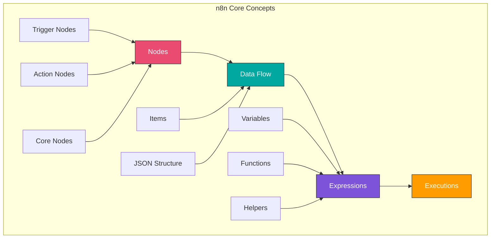

# Module 2: Core Concepts and Basic Workflows

## Overview

This module dives deep into n8n's core concepts, node types, and data flow mechanics. You'll master expressions, debugging, and build more sophisticated workflows.

**Duration:** 2 weeks (20-30 hours)

## Learning Objectives

- Master different types of nodes and their purposes
- Understand n8n's data structure and JSON
- Write and use expressions effectively
- Debug workflows like a pro
- Work with control flow nodes (IF, Switch, Merge, Split)
- Handle API authentication methods

## Module Contents

### [Week 2: Understanding Nodes and Data Flow](./week-2/README.md)
- Node types and categories
- Data structure in n8n
- Expressions and the Expression Editor
- Workflow execution modes
- Core nodes deep dive

### [Week 3: Working with APIs](./week-3/README.md)
- HTTP Request node mastery
- Authentication methods
- Handling API responses
- Error handling basics
- Working with webhooks

## Key Concepts

## Prerequisites

- Completed Module 1
- Basic understanding of JSON
- Familiarity with n8n interface

## Projects

By the end of this module, you'll build:

1. **Data Processing Pipeline** - Transform and filter data
2. **Multi-API Integration** - Combine data from multiple sources
3. **Conditional Workflow** - Branch based on conditions
4. **API Monitor** - Track API status with notifications

## Resources

- [n8n Expression Documentation](https://docs.n8n.io/code-examples/expressions/)
- [JSON Tutorial](https://www.json.org/)
- [REST API Basics](https://restfulapi.net/)

## Assessment

- [Week 2 Quiz](./week-2/assessment/quiz.md)
- [Week 3 Quiz](./week-3/assessment/quiz.md)
- [Module 2 Project](./final-project.md)

## Next Steps

After completing this module, proceed to [Module 3: Essential Integrations](../module-03-essential-integrations/README.md)
