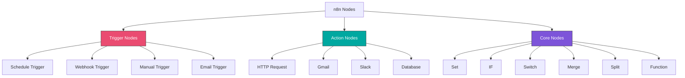
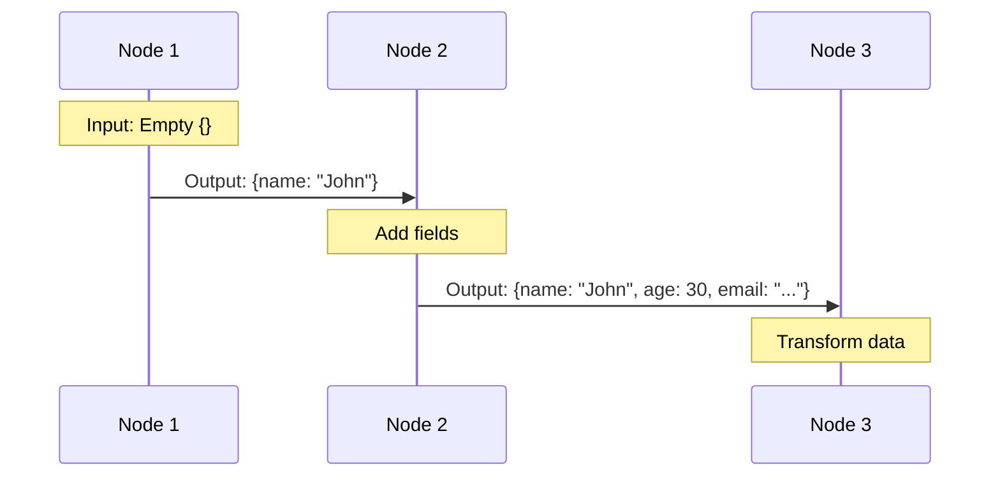
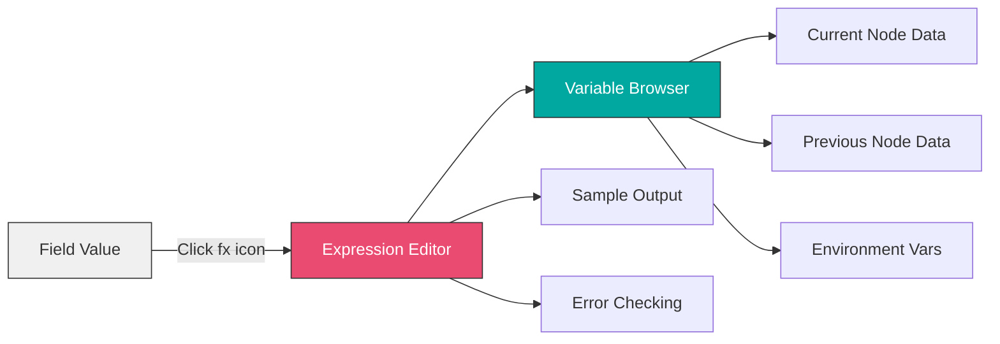
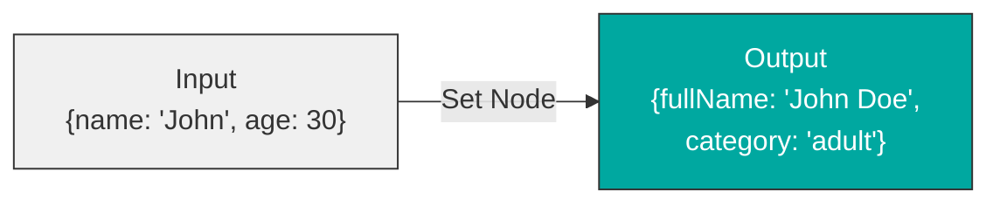
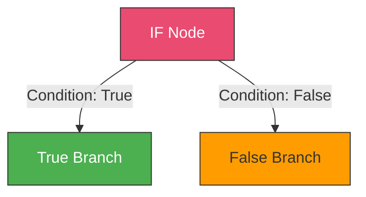
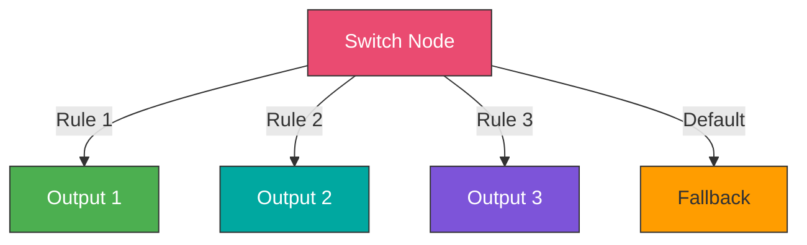
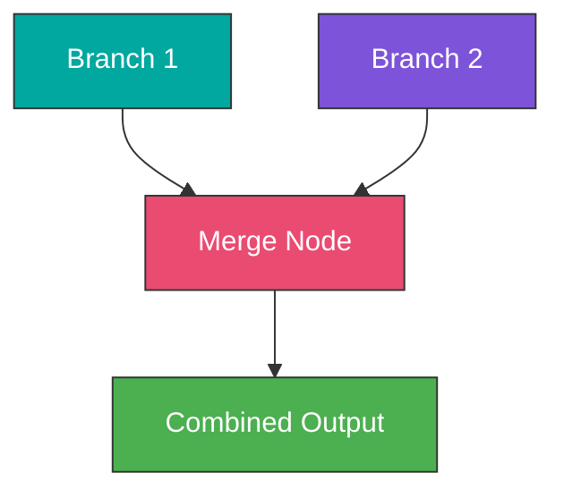
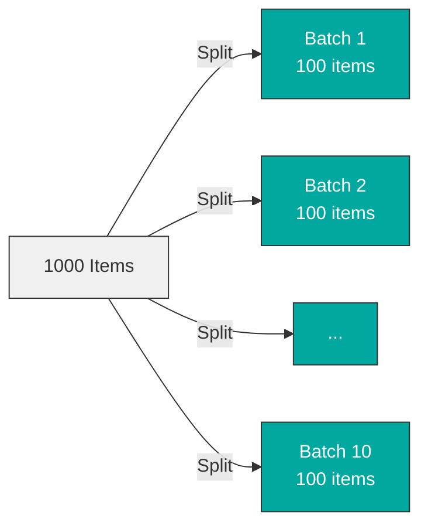
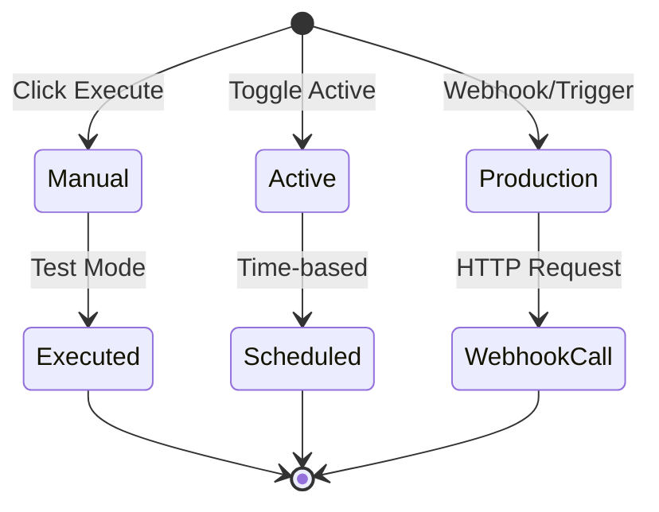
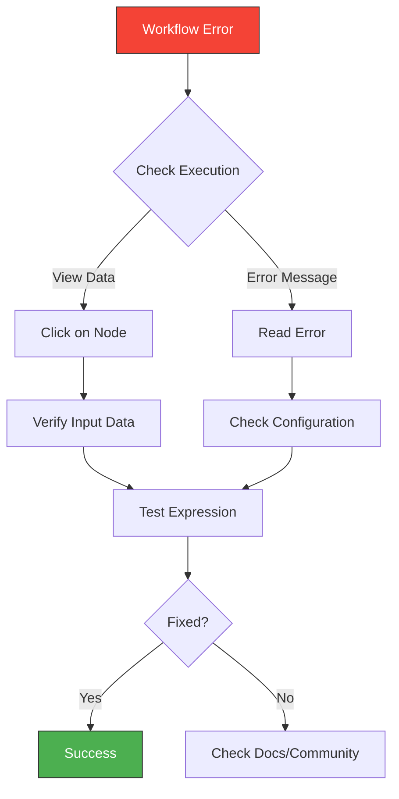

# Week 2: Understanding Nodes and Data Flow

## Learning Objectives

- Understand the different types of nodes in n8n
- Master JSON data structure
- Write effective expressions
- Use the Expression Editor
- Debug workflows efficiently
- Work with core nodes (Set, IF, Switch, Merge, Split)

---

## Topics

### 1. Node Types Overview



#### Trigger Nodes
Start workflow execution based on events:
- **Manual Trigger**: Start manually
- **Schedule Trigger**: Time-based execution
- **Webhook Trigger**: HTTP requests
- **Email Trigger**: Incoming emails
- **File Trigger**: File system changes

#### Action Nodes
Interact with external services:
- **HTTP Request**: Any REST API
- **Gmail**: Email operations
- **Slack**: Messaging
- **Database**: CRUD operations
- **File System**: File operations

#### Core Nodes
Control flow and data manipulation:
- **Set**: Modify data structure
- **IF**: Conditional branching
- **Switch**: Multiple conditions
- **Merge**: Combine data streams
- **Split**: Divide data
- **Function**: Custom JavaScript

---

### 2. Understanding JSON Data Structure

Every node in n8n works with JSON data.

#### Basic Structure

```json
{
  "name": "John Doe",
  "email": "john@example.com",
  "age": 30,
  "active": true,
  "tags": ["customer", "premium"],
  "address": {
    "city": "London",
    "country": "UK"
  }
}
```

#### Data Flow in n8n



#### Items Array

n8n processes data as an array of items:

```javascript
[
  { json: { name: "John", age: 30 } },
  { json: { name: "Jane", age: 25 } },
  { json: { name: "Bob", age: 35 } }
]
```

Each item contains:
- `json`: The actual data
- `binary`: Binary data (files, images)
- `pairedItem`: Tracking information

---

### 3. Expressions and Variables

Expressions allow dynamic data access and transformation.

#### Basic Syntax

```javascript
// Access current item data
{{$json.fieldName}}

// Access specific node output
{{$node["NodeName"].json.fieldName}}

// Access all items
{{$items}}

// Item index
{{$itemIndex}}

// Run index
{{$runIndex}}
```

#### Common Expression Patterns

**Accessing Nested Data:**
```javascript
{{$json.user.address.city}}
```

**Array Access:**
```javascript
{{$json.items[0].name}}
```

**String Operations:**
```javascript
{{$json.name.toUpperCase()}}
{{$json.email.toLowerCase()}}
{{$json.text.trim()}}
{{$json.message.substring(0, 10)}}
```

**Number Operations:**
```javascript
{{Number($json.price) * 1.2}}
{{Math.round($json.value)}}
{{Math.max($json.a, $json.b)}}
```

**Date/Time:**
```javascript
{{DateTime.now().toISO()}}
{{DateTime.now().toFormat('yyyy-MM-dd')}}
{{DateTime.fromISO($json.date).plus({days: 7})}}
```

**Conditional (Ternary):**
```javascript
{{$json.age > 18 ? 'adult' : 'minor'}}
{{$json.status === 'active' ? '✓' : '✗'}}
```

---

### 4. The Expression Editor



**Features:**
- Auto-completion
- Variable browser
- Live preview
- Error detection
- Sample data testing

**Tips:**
1. Always test expressions with sample data
2. Use the variable browser to explore available data
3. Check the sample output before saving
4. Use console.log() in Function nodes for debugging

---

### 5. Core Nodes Deep Dive

#### Set Node

Transform and restructure data.



**Use Cases:**
- Add new fields
- Rename fields
- Remove unnecessary fields
- Transform data types
- Create computed values

**Example Configuration:**
```
Keep Only Set: Yes (remove all other fields)

Fields:
- fullName: {{$json.name}}
- email: {{$json.email.toLowerCase()}}
- category: {{$json.age > 18 ? 'adult' : 'minor'}}
- processedAt: {{DateTime.now().toISO()}}
```

#### IF Node

Branch workflow based on conditions.



**Conditions:**
- String: equals, contains, starts with, regex
- Number: equals, greater than, less than
- Boolean: true/false
- Date: before, after

**Example:**
```
Condition: Number
Value 1: {{$json.age}}
Operation: Larger
Value 2: 18
```

#### Switch Node

Multiple conditional branches.



**Use Cases:**
- Route by status (pending, approved, rejected)
- Categorize by value ranges
- Handle multiple conditions
- Default fallback handling

#### Merge Node

Combine data from multiple branches.



**Modes:**
- **Append**: Stack items sequentially
- **Merge By Fields**: Combine based on matching fields
- **Multiplex**: Create combinations
- **Remove Duplicates**: Filter unique items

#### Split In Batches Node

Process large datasets in chunks.



**Use Cases:**
- Rate limit compliance
- Memory management
- Batch API calls
- Progress tracking

---

### 6. Workflow Execution Modes



**Execution Types:**

1. **Manual Execution** (Testing)
   - Click "Execute Workflow" button
   - All nodes execute
   - See full execution data
   - Doesn't count against quotas

2. **Active Execution** (Production)
   - Workflow must be activated
   - Triggered by schedule or webhook
   - Runs in background
   - Recorded in execution history

3. **Production Execution**
   - Optimized for performance
   - Limited debugging info
   - Automatic retries
   - Error notifications

---

## Hands-On Exercises

### [Exercise 1: Data Processing Pipeline](./exercises/exercise-1-data-processing.md)
Build a workflow that filters and transforms data using Set and IF nodes.

### [Exercise 2: Multi-Condition Router](./exercises/exercise-2-switch-router.md)
Use Switch node to route data based on multiple conditions.

### [Exercise 3: Data Merger](./exercises/exercise-3-merge-data.md)
Combine data from different sources using Merge node.

---

## Debugging Workflows



**Debugging Tips:**
1. Execute nodes individually
2. Check input/output data
3. Verify expressions in Expression Editor
4. Use console.log() in Function nodes
5. Check execution history
6. Enable "Save Execution Progress"

---

## Best Practices

1. **Name Your Nodes**: Use descriptive names
2. **Add Notes**: Document complex logic
3. **Keep It Simple**: Don't over-complicate workflows
4. **Test Incrementally**: Build and test node by node
5. **Use Set Nodes**: Simplify data structure early
6. **Handle Errors**: Always consider error cases

---

## Key Takeaways

- ✓ Three main node types: Triggers, Actions, Core
- ✓ Data flows as JSON items through nodes
- ✓ Expressions access and transform data dynamically
- ✓ Core nodes control workflow logic and data flow
- ✓ The Expression Editor helps build and test expressions
- ✓ Debug by checking node outputs and execution data

---

## Next Steps

**Continue to:** [Week 3: Working with APIs](../week-3/README.md)

**Practice More:**
- Build complex data transformations
- Experiment with all core nodes
- Create multi-branch workflows
- Try different expression patterns
