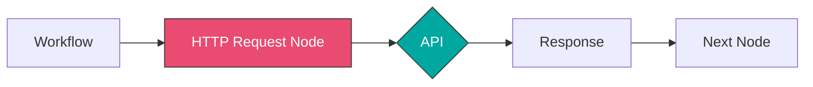
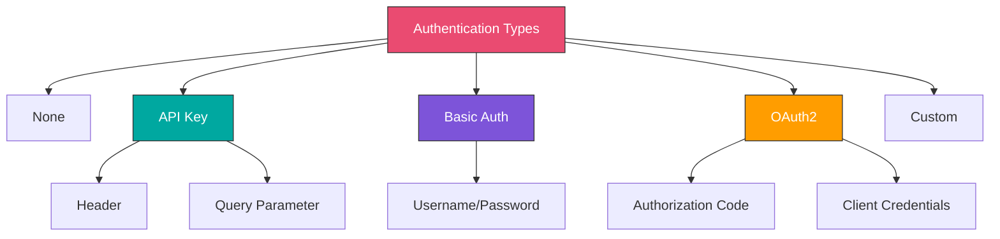
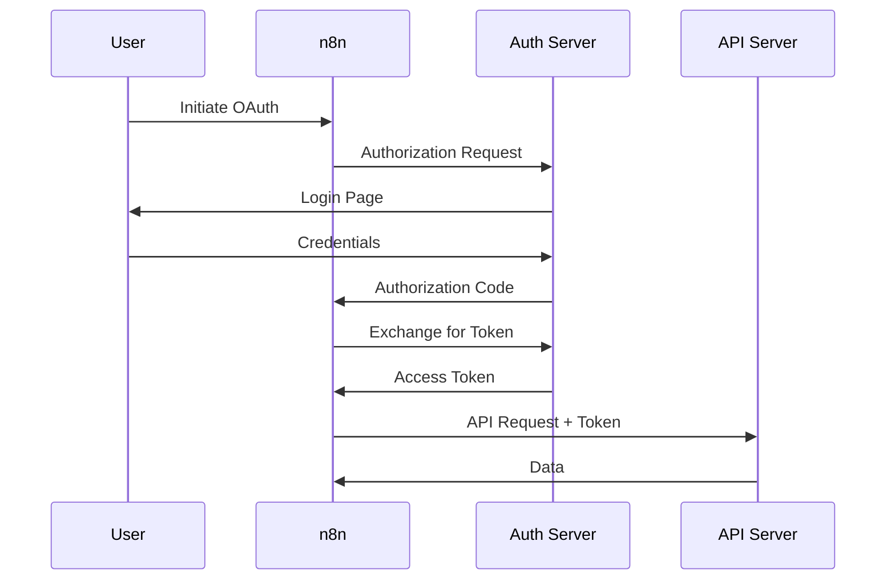
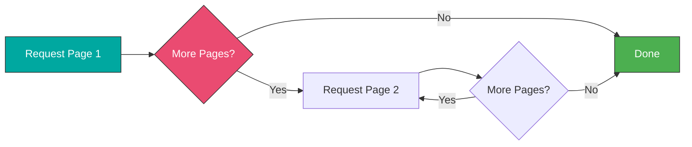
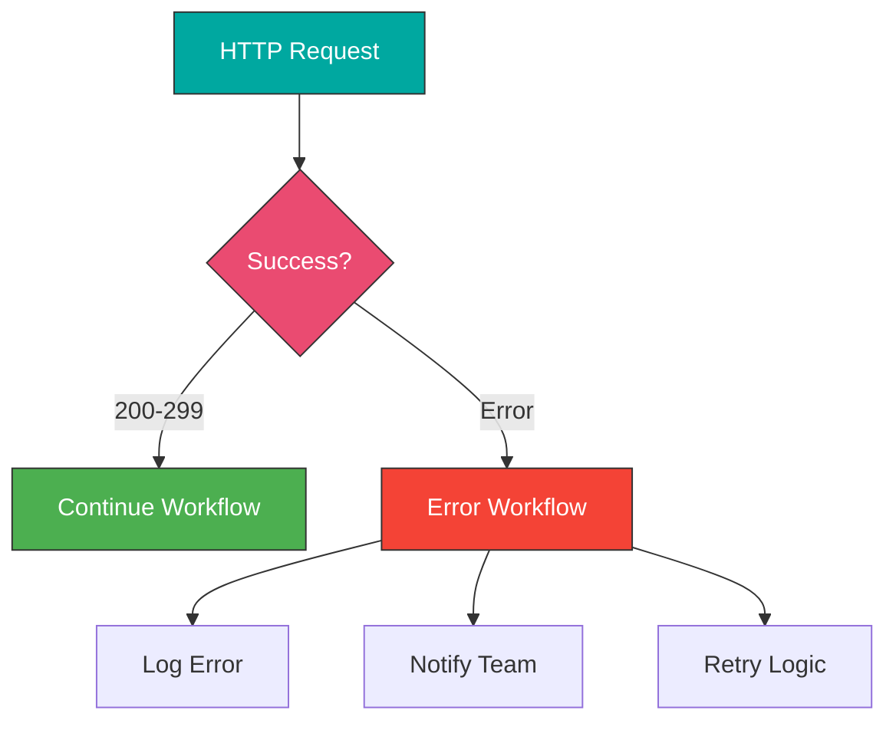
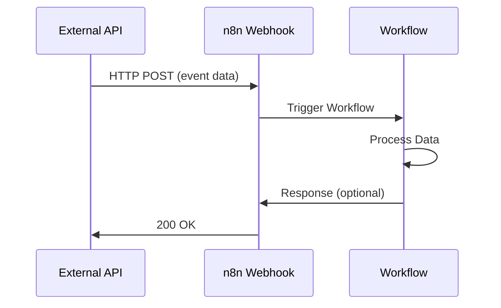
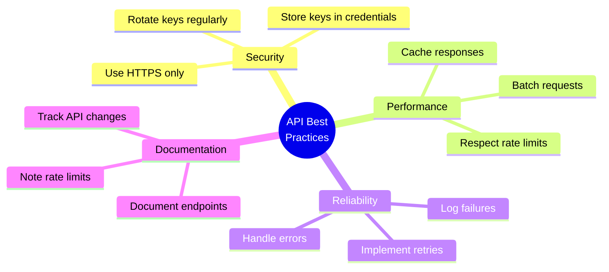
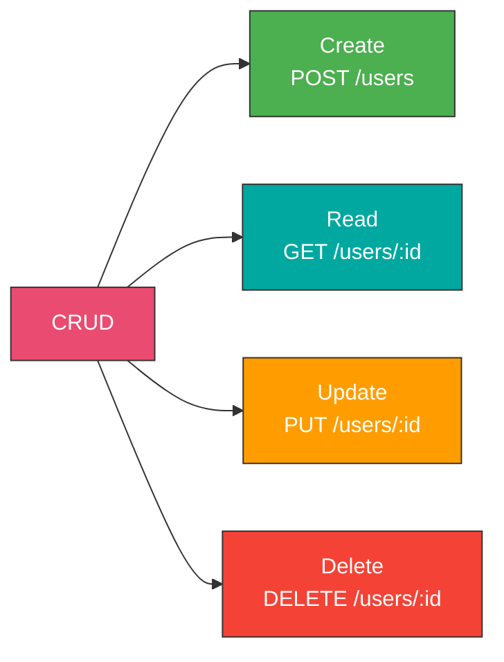

# Week 3: Working with APIs

## Learning Objectives

- Master the HTTP Request node
- Understand and implement different authentication methods
- Parse and transform API responses
- Handle errors gracefully
- Work with webhooks
- Test and debug API integrations

---

## Topics

### 1. HTTP Request Node Deep Dive

The HTTP Request node is your gateway to any REST API.



#### HTTP Methods

| Method | Purpose | Has Body |
|--------|---------|----------|
| GET | Retrieve data | No |
| POST | Create resource | Yes |
| PUT | Update (replace) | Yes |
| PATCH | Update (partial) | Yes |
| DELETE | Remove resource | No |

#### Configuration

```
Method: GET
URL: https://api.example.com/users
```

**Query Parameters:**
```
URL: https://api.example.com/search?q=n8n&limit=10
```

Or use the Query Parameters field:
```
Key: q | Value: n8n
Key: limit | Value: 10
```

**Headers:**
```
Content-Type: application/json
Accept: application/json
User-Agent: n8n-workflow
```

**Body (for POST/PUT/PATCH):**
```json
{
  "name": "{{$json.name}}",
  "email": "{{$json.email}}",
  "status": "active"
}
```

---

### 2. Authentication Methods



#### API Key Authentication

**Header Auth:**
```
Authentication: Generic Credential Type
Credential Type: Header Auth

Header:
Name: X-API-Key
Value: your_api_key_here
```

**Query Parameter:**
```
URL: https://api.example.com/data?api_key={{$credentials.apiKey}}
```

#### Basic Authentication

```
Authentication: Basic Auth
Username: your_username
Password: your_password
```

Sends header: `Authorization: Basic base64(username:password)`

#### OAuth 2.0

Most secure for user-specific actions.

```
Authentication: OAuth2
Grant Type: Authorization Code
Authorization URL: https://provider.com/oauth/authorize
Access Token URL: https://provider.com/oauth/token
Client ID: your_client_id
Client Secret: your_client_secret
Scope: read write
```

**OAuth Flow:**


---

### 3. Handling API Responses

#### JSON Response

```json
{
  "status": "success",
  "data": {
    "users": [
      {"id": 1, "name": "John"},
      {"id": 2, "name": "Jane"}
    ]
  },
  "meta": {
    "total": 2,
    "page": 1
  }
}
```

**Access Data:**
```javascript
{{$json.data.users[0].name}}  // "John"
{{$json.meta.total}}  // 2
```

#### XML Response

Configure node to handle XML:
```
Response Format: XML
```

Or use Function node to parse:
```javascript
const xml2js = require('xml2js');
const parser = new xml2js.Parser();
return await parser.parseStringPromise($input.item.json.body);
```

#### Paginated Responses



**Pagination Strategy:**
1. Check if `next_page` exists
2. Loop until no more pages
3. Collect all results
4. Process combined data

---

### 4. Error Handling Basics

#### HTTP Status Codes

| Code Range | Meaning | Action |
|------------|---------|--------|
| 200-299 | Success | Continue |
| 300-399 | Redirect | Follow |
| 400-499 | Client Error | Fix request |
| 500-599 | Server Error | Retry |

**Common Codes:**
- `200 OK` - Success
- `201 Created` - Resource created
- `400 Bad Request` - Invalid input
- `401 Unauthorized` - Auth required
- `403 Forbidden` - No permission
- `404 Not Found` - Resource doesn't exist
- `429 Too Many Requests` - Rate limited
- `500 Internal Server Error` - Server issue

#### Error Handling in n8n



**Configure Error Handling:**
```
Continue On Fail: true
```

This allows workflow to continue even if the node fails.

**Check for Errors:**
```javascript
{{$json.error ? 'Failed' : 'Success'}}
```

---

### 5. Working with Webhooks

Webhooks allow external services to trigger your workflows.



#### Webhook Trigger Node

```
Webhook URLs: Production URL
HTTP Method: POST
Path: /webhook/my-endpoint
Authentication: None (or Header Auth)
Response Mode: When Last Node Finishes
Response Data: First Entry JSON
```

**Test Webhook:**
```bash
curl -X POST https://your-n8n.com/webhook/my-endpoint \
  -H "Content-Type: application/json" \
  -d '{"event":"test","data":"hello"}'
```

**Access Webhook Data:**
```javascript
{{$json.body.event}}  // "test"
{{$json.body.data}}   // "hello"
{{$json.headers["content-type"]}}  // "application/json"
{{$json.query.param}}  // Query parameters
```

#### Responding to Webhooks


Use "Respond to Webhook" node:
```
Response Code: 200
Response Body: {"status": "received", "id": "{{$json.id}}"}
```

---

## Hands-On Exercises

### [Exercise 1: Public API Integration](./exercises/exercise-1-public-api.md)
Connect to GitHub API, fetch repository data, and format results.

### [Exercise 2: Authenticated API Calls](./exercises/exercise-2-auth-api.md)
Set up OAuth2 authentication and make authenticated requests.

### [Exercise 3: Webhook Receiver](./exercises/exercise-3-webhook.md)
Create a webhook endpoint that processes incoming data.

### [Exercise 4: API Error Handling](./exercises/exercise-4-error-handling.md)
Build robust error handling for API calls with retries.

---

## API Best Practices



### 1. Security
- **Never** hardcode API keys
- Use n8n credential system
- Enable HTTPS for webhooks
- Validate webhook signatures

### 2. Rate Limiting
```javascript
// Check rate limit headers
{{$json.headers["x-ratelimit-remaining"]}}
{{$json.headers["x-ratelimit-reset"]}}
```

**Handle Rate Limits:**
- Use Split In Batches node
- Add delays between requests
- Implement exponential backoff

### 3. Retry Logic
```
Number of Retries: 3
Retry On HTTP Codes: 429,500,502,503,504
Wait Between Tries (ms): 1000
```

### 4. Logging
```javascript
// Log API calls in Function node
console.log('API Request:', {
  url: $json.url,
  method: 'GET',
  timestamp: new Date().toISOString()
});
```

---

## Testing APIs

### Using Postman First
1. Test API in Postman
2. Verify authentication
3. Check response structure
4. Then replicate in n8n

### Debug Checklist
- [ ] Correct HTTP method
- [ ] Valid endpoint URL
- [ ] Proper authentication
- [ ] Required headers included
- [ ] Body format correct (JSON, form-data)
- [ ] Query parameters encoded
- [ ] SSL certificate valid

---

## Common API Patterns

### RESTful CRUD Operations



**Example Workflow:**
```
1. GET /users - List all users
2. POST /users - Create new user
3. GET /users/123 - Get specific user
4. PUT /users/123 - Update user
5. DELETE /users/123 - Remove user
```

---

## Key Takeaways

- ✓ HTTP Request node works with any REST API
- ✓ Multiple authentication methods supported
- ✓ Proper error handling is essential
- ✓ Webhooks enable event-driven workflows
- ✓ Always test APIs externally first
- ✓ Store credentials securely
- ✓ Respect rate limits and implement retries

---

## Next Steps

**Continue to:** [Module 3: Essential Integrations](../../module-03-essential-integrations/README.md)

**Complete:** [Week 3 Quiz](./assessment/quiz.md)

**Build:** [Module 2 Final Project](../final-project.md)
