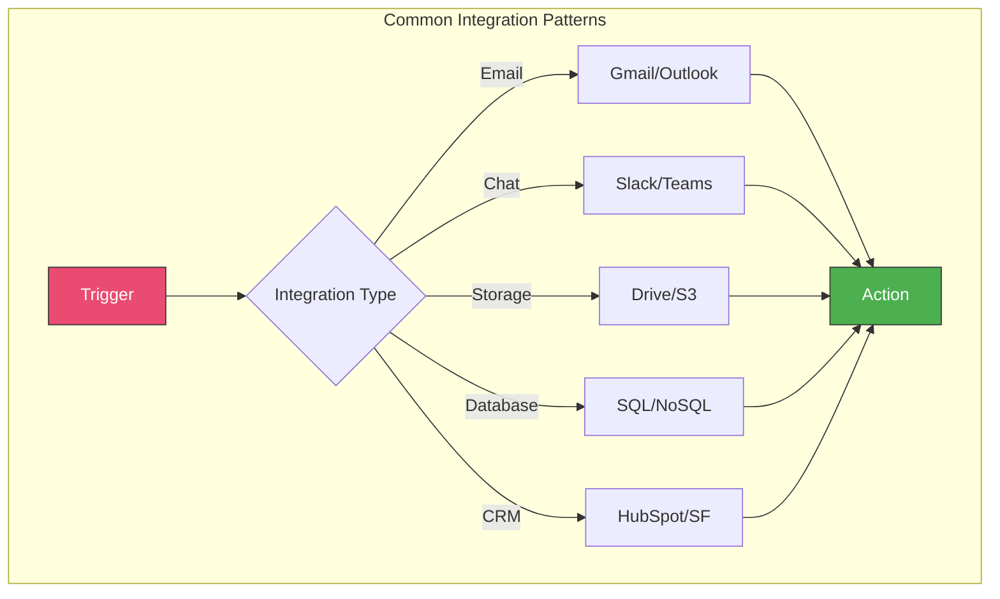

# Module 3: Essential Integrations

## Overview

Master the most popular n8n integrations including email services, databases, cloud storage, messaging platforms, and webhooks. Learn to build multi-app workflows that solve real business problems.

**Duration:** 2 weeks (20-30 hours)

## Learning Objectives

- Connect and configure popular business applications
- Manage credentials securely across multiple services
- Build multi-app integration workflows
- Work with databases (MySQL, PostgreSQL, MongoDB)
- Implement webhook integrations
- Handle file operations with cloud storage

## Module Contents

### [Week 4: Popular App Integrations](./week-4/README.md)
- Gmail and Google Workspace
- Slack messaging and interactions
- Database connections and CRUD operations
- Webhooks deep dive
- Credential management best practices

### [Week 5: Advanced Integrations](./week-5/README.md)
- Cloud storage (Google Drive, Dropbox, S3)
- CRM integrations (HubSpot, Salesforce)
- Payment processing (Stripe)
- Social media APIs

## Key Integration Patterns

## Sample Projects

1. **Email to Database Logger** - Save emails to PostgreSQL
2. **Slack Bot Responder** - Interactive Slack workflows
3. **File Backup System** - Automated cloud backup
4. **CRM Lead Sync** - Multi-system lead management
5. **Payment Webhook Handler** - Process Stripe events

## Prerequisites

- Completed Modules 1-2
- Access to services you want to integrate (Gmail, Slack, etc.)
- Basic SQL knowledge (helpful for database modules)

## Resources

- [n8n Integrations Library](https://n8n.io/integrations)
- [API Documentation Links](./resources/api-docs.md)
- [Credential Setup Guides](./resources/credential-guides.md)

## Next Steps

After completing this module, proceed to [Module 4: Data Transformation and Logic](../module-04-data-transformation/README.md)
