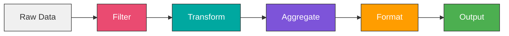

# Module 4: Data Transformation and Logic

## Overview

Master advanced data manipulation techniques using JavaScript, complex transformations, and sophisticated logic patterns. Learn to process, filter, aggregate, and transform data like a pro.

**Duration:** 2 weeks (20-30 hours)

## Learning Objectives

- Write JavaScript in Function and Function Item nodes
- Master array manipulation (map, filter, reduce)
- Perform complex data aggregations
- Work with dates, times, and timezones
- Use regular expressions for pattern matching
- Implement advanced conditional logic
- Optimize data processing workflows

## Module Contents

### [Week 6: Advanced Data Manipulation](./week-6/README.md)
- Function and Function Item nodes
- JavaScript essentials for n8n
- Array methods and data processing
- Data aggregation techniques
- Working with dates and times
- Regular expressions

### [Week 7: Advanced Logic and Flow Control](./week-7/README.md)
- Complex conditional patterns
- Loop nodes and iterations
- Error and Stop nodes
- Workflow optimization
- Rate limit handling
- Batch processing strategies

## Data Transformation Patterns

## Projects

1. **Data Cleaning Pipeline** - ETL workflow with validation
2. **Report Generator** - Multi-source data aggregation
3. **Custom Calculator** - Complex business logic
4. **Batch Processor** - Handle thousands of records
5. **Smart Retry System** - Resilient error handling

## Prerequisites

- Completed Modules 1-3
- Basic JavaScript knowledge (or willingness to learn)
- Understanding of data structures

## Key Topics

- JavaScript in n8n
- Array manipulation
- Data aggregation
- Loop patterns
- Performance optimization

## Next Steps

After completing this module, proceed to [Module 5: Error Handling and Monitoring](../module-05-error-handling/README.md)
