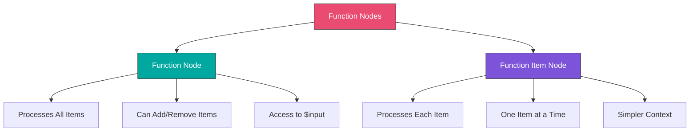
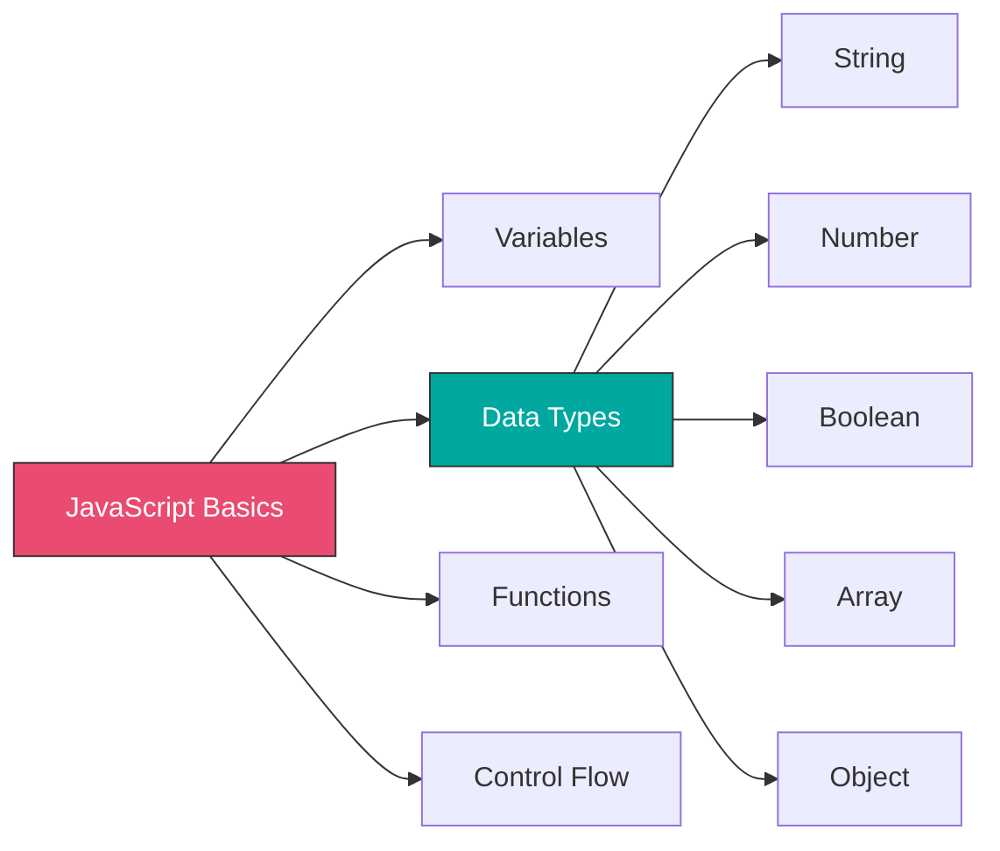
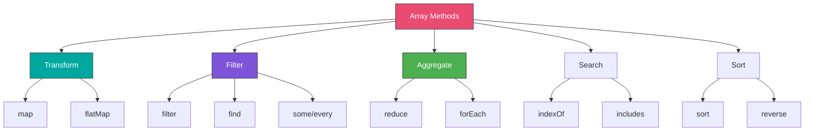
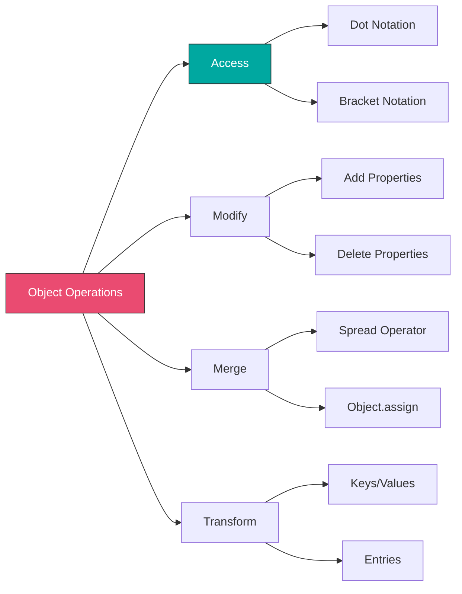
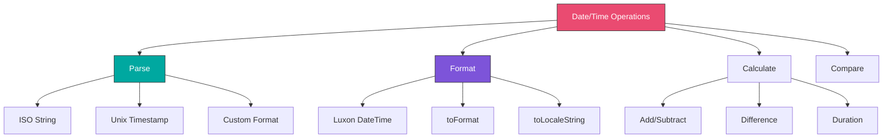
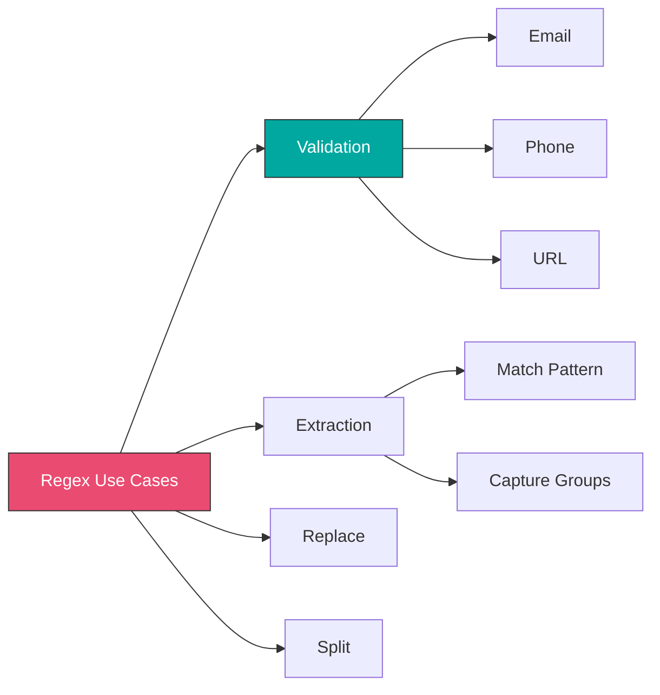
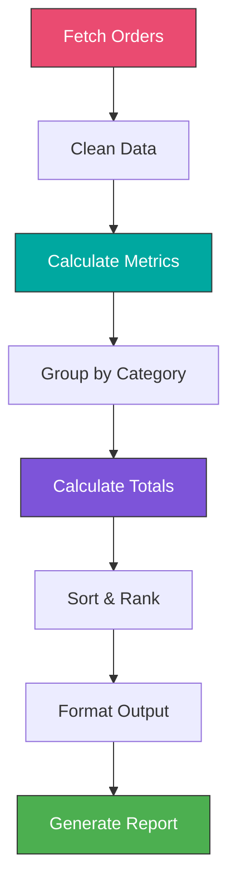

# Week 6: Advanced Data Manipulation

## Learning Objectives

- Master JavaScript in Function and Function Item nodes
- Transform complex data structures with arrays and objects
- Implement data aggregation and filtering techniques
- Work effectively with dates and times
- Use regular expressions for pattern matching
- Build efficient data transformation pipelines

---

## Topics

### 1. Function Nodes Overview



#### Function Node

Processes **all items** together. Best for:
- Aggregating data across items
- Filtering items based on conditions
- Adding or removing items from the array
- Complex transformations requiring access to all data

**Structure:**
```javascript
// Access all items
const items = $input.all();

// Process items
const results = items.map(item => {
  return {
    json: {
      // transformed data
    }
  };
});

// Return new items array
return results;
```

#### Function Item Node

Processes **one item at a time**. Best for:
- Simple transformations
- Item-by-item processing
- When you don't need to see other items
- Performance optimization with large datasets

**Structure:**
```javascript
// Current item data
const item = $input.item.json;

// Transform
const result = {
  // transformed data
};

// Return single item
return result;
```

---

### 2. JavaScript Fundamentals for n8n



#### Variables and Data Types

```javascript
// Variables (use const by default)
const name = "John Doe";
const age = 30;
const isActive = true;
const tags = ["customer", "premium"];
const user = { id: 1, email: "john@example.com" };

// Destructuring
const { email, id } = user;
const [firstTag, secondTag] = tags;

// Template literals
const message = `User ${name} (${age}) is ${isActive ? 'active' : 'inactive'}`;

// Nullish coalescing
const displayName = user.displayName ?? user.name ?? 'Unknown';

// Optional chaining
const city = user?.address?.city ?? 'Not specified';
```

#### Common Operations

```javascript
// String methods
const text = "  Hello World  ";
text.trim()                    // "Hello World"
text.toUpperCase()             // "  HELLO WORLD  "
text.toLowerCase()             // "  hello world  "
text.includes("World")         // true
text.startsWith("  Hello")     // true
text.endsWith("World  ")       // true
text.split(" ")                // ["", "", "Hello", "World", "", ""]
text.replace("World", "n8n")   // "  Hello n8n  "
text.substring(2, 7)           // "Hello"
text.length                    // 15

// Number methods
const num = 123.456;
num.toFixed(2)                 // "123.46"
Number(num.toFixed(0))         // 123
Math.round(num)                // 123
Math.floor(num)                // 123
Math.ceil(num)                 // 124
Math.max(1, 5, 3)              // 5
Math.min(1, 5, 3)              // 1
Math.abs(-5)                   // 5
Math.random()                  // 0.0 - 1.0

// Type conversion
String(123)                    // "123"
Number("123")                  // 123
parseInt("123.45")             // 123
parseFloat("123.45")           // 123.45
Boolean(1)                     // true
Boolean(0)                     // false
```

---

### 3. Array Methods Mastery



#### Map - Transform Each Item

```javascript
// Basic transformation
const items = $input.all();
const transformed = items.map(item => ({
  json: {
    id: item.json.id,
    fullName: `${item.json.firstName} ${item.json.lastName}`,
    email: item.json.email.toLowerCase(),
    age: item.json.age,
    isAdult: item.json.age >= 18
  }
}));

return transformed;
```

**Real-world Example: Prepare Order Data**
```javascript
const orders = $input.all();

return orders.map(item => {
  const order = item.json;

  return {
    json: {
      orderId: order.id,
      customerName: order.customer.name,
      customerEmail: order.customer.email,
      orderTotal: order.items.reduce((sum, item) => sum + (item.price * item.quantity), 0),
      itemCount: order.items.length,
      status: order.status,
      formattedDate: new Date(order.createdAt).toLocaleDateString('en-US'),
      taxAmount: order.total * 0.08,
      shippingFee: order.total > 50 ? 0 : 5.99
    }
  };
});
```

#### Filter - Select Specific Items

```javascript
// Filter items based on condition
const items = $input.all();
const filtered = items.filter(item => {
  const age = item.json.age;
  const status = item.json.status;

  return age >= 18 && status === 'active';
});

return filtered;
```

**Real-world Example: High-Value Orders**
```javascript
const orders = $input.all();

return orders.filter(item => {
  const order = item.json;
  const total = order.items.reduce((sum, i) => sum + (i.price * i.quantity), 0);

  return total >= 1000 &&                    // High value
         order.status === 'pending' &&       // Pending approval
         order.priority === 'high' &&        // High priority
         !order.approvedBy;                  // Not yet approved
});
```

**Multiple Conditions:**
```javascript
const data = $input.all();

return data.filter(item => {
  const json = item.json;

  // Date range
  const createdDate = new Date(json.createdAt);
  const startDate = new Date('2024-01-01');
  const endDate = new Date('2024-12-31');
  const inDateRange = createdDate >= startDate && createdDate <= endDate;

  // Status check
  const validStatus = ['active', 'pending', 'approved'].includes(json.status);

  // Value check
  const meetsMinimum = json.amount >= 100;

  return inDateRange && validStatus && meetsMinimum;
});
```

#### Reduce - Aggregate Data

```javascript
// Sum values
const items = $input.all();
const total = items.reduce((sum, item) => sum + item.json.amount, 0);

return [{
  json: {
    totalAmount: total,
    itemCount: items.length,
    averageAmount: total / items.length
  }
}];
```

**Real-world Example: Sales Report**
```javascript
const orders = $input.all();

const report = orders.reduce((acc, item) => {
  const order = item.json;
  const status = order.status;

  // Initialize status if not exists
  if (!acc[status]) {
    acc[status] = {
      count: 0,
      totalRevenue: 0,
      orders: []
    };
  }

  // Aggregate
  acc[status].count++;
  acc[status].totalRevenue += order.total;
  acc[status].orders.push(order.id);

  return acc;
}, {});

// Convert to array format
const summary = Object.entries(report).map(([status, data]) => ({
  json: {
    status,
    orderCount: data.count,
    totalRevenue: data.totalRevenue,
    averageOrderValue: data.totalRevenue / data.count,
    orderIds: data.orders
  }
}));

return summary;
```

**Group By Pattern:**
```javascript
const items = $input.all();

// Group by category
const grouped = items.reduce((acc, item) => {
  const category = item.json.category;

  if (!acc[category]) {
    acc[category] = [];
  }

  acc[category].push(item.json);
  return acc;
}, {});

// Transform to array
return Object.entries(grouped).map(([category, items]) => ({
  json: {
    category,
    items,
    count: items.length,
    totalValue: items.reduce((sum, i) => sum + i.value, 0)
  }
}));
```

#### Find - Locate Specific Item

```javascript
// Find first match
const items = $input.all();
const found = items.find(item => item.json.id === 123);

if (found) {
  return [found];
} else {
  throw new Error('Item not found');
}
```

```javascript
// Find index
const items = $input.all();
const index = items.findIndex(item => item.json.email === 'john@example.com');

if (index !== -1) {
  return [{
    json: {
      position: index,
      item: items[index].json
    }
  }];
}
```

#### Sort - Order Items

```javascript
// Numeric sort (ascending)
const items = $input.all();
const sorted = items.sort((a, b) => a.json.amount - b.json.amount);
return sorted;

// Numeric sort (descending)
const sorted = items.sort((a, b) => b.json.amount - a.json.amount);

// String sort (alphabetical)
const sorted = items.sort((a, b) =>
  a.json.name.localeCompare(b.json.name)
);

// Date sort
const sorted = items.sort((a, b) =>
  new Date(a.json.createdAt) - new Date(b.json.createdAt)
);

// Multi-level sort
const sorted = items.sort((a, b) => {
  // First by status
  if (a.json.status !== b.json.status) {
    return a.json.status.localeCompare(b.json.status);
  }
  // Then by amount (descending)
  return b.json.amount - a.json.amount;
});
```

#### Other Useful Array Methods

```javascript
// some - check if any item matches
const hasAdult = items.some(item => item.json.age >= 18);

// every - check if all items match
const allActive = items.every(item => item.json.status === 'active');

// slice - get subset
const firstTen = items.slice(0, 10);
const lastFive = items.slice(-5);

// concat - combine arrays
const combined = items1.concat(items2);

// flat - flatten nested arrays
const nested = [[1, 2], [3, 4]];
const flat = nested.flat(); // [1, 2, 3, 4]

// flatMap - map and flatten
const items = $input.all();
const tags = items.flatMap(item => item.json.tags);

// unique values
const unique = [...new Set(tags)];

// includes - check existence
const hasTag = tags.includes('premium');

// join - array to string
const tagString = tags.join(', ');
```

---

### 4. Object Manipulation



#### Accessing Properties

```javascript
const user = $input.item.json;

// Dot notation
const name = user.name;
const city = user.address.city;

// Bracket notation (dynamic keys)
const field = 'email';
const email = user[field];

// Optional chaining (safe access)
const zipCode = user?.address?.zipCode ?? 'N/A';

// Nested access
const firstOrderTotal = user.orders?.[0]?.total ?? 0;
```

#### Adding/Modifying Properties

```javascript
const item = $input.item.json;

// Create new object with additional properties
const enhanced = {
  ...item,
  fullName: `${item.firstName} ${item.lastName}`,
  processedAt: new Date().toISOString(),
  isVip: item.totalSpent > 10000
};

return enhanced;
```

#### Removing Properties

```javascript
const item = $input.item.json;

// Destructuring to remove properties
const { password, ssn, creditCard, ...safeData } = item;

return safeData;
```

#### Merging Objects

```javascript
const user = $input.item.json;
const additional = $node["EnrichmentAPI"].json;

// Merge objects
const merged = {
  ...user,
  ...additional,
  // Override specific fields
  updatedAt: new Date().toISOString()
};

return merged;

// Deep merge function
function deepMerge(target, source) {
  const result = { ...target };

  for (const key in source) {
    if (source[key] instanceof Object && key in target) {
      result[key] = deepMerge(target[key], source[key]);
    } else {
      result[key] = source[key];
    }
  }

  return result;
}
```

#### Object Transformation

```javascript
// Object.keys - get all keys
const user = $input.item.json;
const fields = Object.keys(user);
// ['id', 'name', 'email', 'age']

// Object.values - get all values
const values = Object.values(user);
// [1, 'John', 'john@example.com', 30]

// Object.entries - get key-value pairs
const entries = Object.entries(user);
// [['id', 1], ['name', 'John'], ...]

// Transform object
const transformed = Object.entries(user).reduce((acc, [key, value]) => {
  // Convert keys to uppercase
  acc[key.toUpperCase()] = value;
  return acc;
}, {});

// Filter object properties
const filtered = Object.fromEntries(
  Object.entries(user).filter(([key, value]) => value !== null && value !== '')
);

// Map object values
const normalized = Object.fromEntries(
  Object.entries(user).map(([key, value]) => {
    if (typeof value === 'string') {
      return [key, value.trim().toLowerCase()];
    }
    return [key, value];
  })
);
```

**Real-world Example: Clean API Response**
```javascript
const apiResponse = $input.item.json;

// Remove null/undefined values
const cleaned = Object.fromEntries(
  Object.entries(apiResponse).filter(([_, value]) => value != null)
);

// Flatten nested structure
const flattened = {
  userId: cleaned.user.id,
  userName: cleaned.user.name,
  userEmail: cleaned.user.email,
  companyId: cleaned.user.company.id,
  companyName: cleaned.user.company.name,
  orderCount: cleaned.orders.length,
  totalSpent: cleaned.orders.reduce((sum, o) => sum + o.total, 0)
};

return flattened;
```

---

### 5. Date and Time Manipulation



#### Luxon DateTime in n8n

n8n includes Luxon for date/time operations.

**Current Date/Time:**
```javascript
// In expressions
{{DateTime.now().toISO()}}
{{DateTime.now().toFormat('yyyy-MM-dd')}}

// In Function nodes
const { DateTime } = require('luxon');

const now = DateTime.now();
const utc = DateTime.utc();
const local = DateTime.local();
```

#### Parsing Dates

```javascript
const { DateTime } = require('luxon');

// From ISO string
const date1 = DateTime.fromISO('2024-01-15T10:30:00Z');

// From custom format
const date2 = DateTime.fromFormat('01/15/2024', 'MM/dd/yyyy');

// From Unix timestamp (seconds)
const date3 = DateTime.fromSeconds(1705315800);

// From Unix timestamp (milliseconds)
const date4 = DateTime.fromMillis(1705315800000);

// From JavaScript Date
const date5 = DateTime.fromJSDate(new Date());

// From SQL format
const date6 = DateTime.fromSQL('2024-01-15 10:30:00');
```

#### Formatting Dates

```javascript
const { DateTime } = require('luxon');
const date = DateTime.now();

// ISO format
date.toISO()                    // "2024-01-15T10:30:00.000-05:00"
date.toISODate()                // "2024-01-15"
date.toISOTime()                // "10:30:00.000-05:00"

// Custom format
date.toFormat('yyyy-MM-dd')     // "2024-01-15"
date.toFormat('MM/dd/yyyy')     // "01/15/2024"
date.toFormat('dd LLL yyyy')    // "15 Jan 2024"
date.toFormat('LLLL d, yyyy')   // "January 15, 2024"
date.toFormat('h:mm a')         // "10:30 AM"
date.toFormat('HH:mm:ss')       // "10:30:00"
date.toFormat('EEEE')           // "Monday"
date.toFormat('ccc')            // "Mon"

// Locale-specific
date.toLocaleString()           // "1/15/2024"
date.toLocaleString(DateTime.DATE_FULL)  // "January 15, 2024"
date.toLocaleString(DateTime.TIME_SIMPLE) // "10:30 AM"

// Relative
date.toRelative()               // "in 2 hours"
date.toRelativeCalendar()       // "today"

// Unix timestamp
date.toSeconds()                // 1705315800
date.toMillis()                 // 1705315800000
```

#### Date Calculations

```javascript
const { DateTime } = require('luxon');
const now = DateTime.now();

// Add time
const tomorrow = now.plus({ days: 1 });
const nextWeek = now.plus({ weeks: 1 });
const nextMonth = now.plus({ months: 1 });
const inTwoHours = now.plus({ hours: 2 });

// Subtract time
const yesterday = now.minus({ days: 1 });
const lastWeek = now.minus({ weeks: 1 });
const lastYear = now.minus({ years: 1 });

// Complex additions
const future = now.plus({
  years: 1,
  months: 2,
  days: 3,
  hours: 4,
  minutes: 5,
  seconds: 6
});

// Start/End of period
const startOfDay = now.startOf('day');
const endOfDay = now.endOf('day');
const startOfMonth = now.startOf('month');
const endOfMonth = now.endOf('month');
const startOfWeek = now.startOf('week');
const startOfYear = now.startOf('year');

// Set specific values
const modified = now.set({
  hour: 0,
  minute: 0,
  second: 0,
  millisecond: 0
});
```

#### Date Comparisons

```javascript
const { DateTime } = require('luxon');

const date1 = DateTime.fromISO('2024-01-15');
const date2 = DateTime.fromISO('2024-01-20');

// Compare
date1 < date2                   // true
date1 > date2                   // false
date1.equals(date2)             // false

// Difference
const diff = date2.diff(date1, ['days', 'hours']);
diff.days                       // 5
diff.hours                      // 120

// Different units
const diff2 = date2.diff(date1, 'days');
diff2.days                      // 5

const diff3 = date2.diff(date1, ['months', 'days']);
diff3.months                    // 0
diff3.days                      // 5

// Check if in range
function isInRange(date, start, end) {
  return date >= start && date <= end;
}

// Days until
const daysUntil = Math.floor(date2.diff(date1, 'days').days);
```

**Real-world Example: SLA Tracking**
```javascript
const { DateTime } = require('luxon');
const items = $input.all();

return items.map(item => {
  const ticket = item.json;
  const createdAt = DateTime.fromISO(ticket.createdAt);
  const now = DateTime.now();

  // SLA: 24 hours for response
  const slaDeadline = createdAt.plus({ hours: 24 });
  const timeRemaining = slaDeadline.diff(now, ['hours', 'minutes']);
  const isOverdue = now > slaDeadline;

  // Business hours calculation (9 AM - 5 PM, Mon-Fri)
  let businessHours = 0;
  let current = createdAt;

  while (current < now) {
    const hour = current.hour;
    const day = current.weekday;

    if (day >= 1 && day <= 5 && hour >= 9 && hour < 17) {
      businessHours++;
    }

    current = current.plus({ hours: 1 });
  }

  return {
    json: {
      ticketId: ticket.id,
      createdAt: createdAt.toISO(),
      age: now.diff(createdAt, ['days', 'hours']).toObject(),
      slaDeadline: slaDeadline.toISO(),
      timeRemaining: isOverdue ? null : timeRemaining.toObject(),
      isOverdue,
      businessHoursElapsed: businessHours,
      priority: isOverdue ? 'urgent' : (timeRemaining.hours < 4 ? 'high' : 'normal')
    }
  };
});
```

---

### 6. Regular Expressions



#### Basic Patterns

```javascript
// Email validation
const emailRegex = /^[^\s@]+@[^\s@]+\.[^\s@]+$/;
const isValid = emailRegex.test('user@example.com'); // true

// Phone number (US)
const phoneRegex = /^\d{3}-\d{3}-\d{4}$/;
const isValidPhone = phoneRegex.test('555-123-4567'); // true

// URL
const urlRegex = /^https?:\/\/.+/;
const isValidUrl = urlRegex.test('https://example.com'); // true

// Alphanumeric
const alphanumeric = /^[a-zA-Z0-9]+$/;

// Digits only
const digitsOnly = /^\d+$/;

// Date (YYYY-MM-DD)
const dateRegex = /^\d{4}-\d{2}-\d{2}$/;
```

#### Extraction

```javascript
// Extract email from text
const text = "Contact us at support@company.com for help";
const emailMatch = text.match(/[^\s@]+@[^\s@]+\.[^\s@]+/);
const email = emailMatch ? emailMatch[0] : null;
// "support@company.com"

// Extract all numbers
const text2 = "Order #12345 costs $99.99";
const numbers = text2.match(/\d+/g);
// ["12345", "99", "99"]

// Capture groups
const orderText = "Order #12345";
const match = orderText.match(/Order #(\d+)/);
if (match) {
  const orderId = match[1]; // "12345"
}

// Named capture groups
const regex = /(?<year>\d{4})-(?<month>\d{2})-(?<day>\d{2})/;
const match2 = '2024-01-15'.match(regex);
const { year, month, day } = match2.groups;
// year: "2024", month: "01", day: "15"
```

#### Replace

```javascript
// Simple replace
const text = "Hello World";
const replaced = text.replace(/World/, "n8n");
// "Hello n8n"

// Global replace
const text2 = "cat dog cat";
const replaced2 = text2.replace(/cat/g, "bird");
// "bird dog bird"

// Case insensitive
const text3 = "Hello WORLD";
const replaced3 = text3.replace(/world/i, "n8n");
// "Hello n8n"

// Using capture groups
const text4 = "John Doe";
const swapped = text4.replace(/(\w+) (\w+)/, "$2, $1");
// "Doe, John"

// Replace with function
const text5 = "price: $50";
const updated = text5.replace(/\$(\d+)/, (match, price) => {
  return `$${Number(price) * 1.1}`;
});
// "price: $55"
```

**Real-world Example: Data Cleaning**
```javascript
const items = $input.all();

return items.map(item => {
  const data = item.json;

  // Clean phone number
  const phone = data.phone.replace(/\D/g, ''); // Remove non-digits
  const formattedPhone = phone.replace(/(\d{3})(\d{3})(\d{4})/, '$1-$2-$3');

  // Extract domain from email
  const emailDomain = data.email.match(/@(.+)$/)?.[1];

  // Clean text (remove extra spaces)
  const cleanText = data.description
    .trim()
    .replace(/\s+/g, ' ')
    .replace(/[^\w\s.-]/g, ''); // Remove special chars

  // Extract tags from text
  const hashtagRegex = /#(\w+)/g;
  const tags = [...cleanText.matchAll(hashtagRegex)].map(m => m[1]);

  return {
    json: {
      ...data,
      phone: formattedPhone,
      phoneDigits: phone,
      emailDomain,
      description: cleanText,
      tags
    }
  };
});
```

---

### 7. Error Handling in Functions

```javascript
// Try-catch for error handling
try {
  const data = JSON.parse($input.item.json.rawData);

  return {
    success: true,
    data
  };
} catch (error) {
  return {
    success: false,
    error: error.message,
    originalData: $input.item.json.rawData
  };
}

// Validation
function validateOrder(order) {
  const errors = [];

  if (!order.customerId) {
    errors.push('Customer ID is required');
  }

  if (!order.items || order.items.length === 0) {
    errors.push('Order must have at least one item');
  }

  if (order.total < 0) {
    errors.push('Total cannot be negative');
  }

  if (errors.length > 0) {
    throw new Error(`Validation failed: ${errors.join(', ')}`);
  }

  return true;
}

// Use in workflow
const items = $input.all();

return items.map(item => {
  try {
    validateOrder(item.json);

    return {
      json: {
        ...item.json,
        validated: true,
        validatedAt: new Date().toISOString()
      }
    };
  } catch (error) {
    return {
      json: {
        ...item.json,
        validated: false,
        error: error.message
      }
    };
  }
});
```

---

## Hands-On Exercises

### [Exercise 1: Data Cleaning Pipeline](./exercises/exercise-1-data-cleaning.md)

Build a workflow that:
1. Receives raw customer data
2. Cleans and normalizes fields
3. Validates data quality
4. Enriches with calculated fields
5. Filters invalid records
6. Outputs clean data

**Learning Goals:**
- String manipulation
- Data validation
- Regular expressions
- Error handling
- Data transformation

---

### [Exercise 2: Report Generation](./exercises/exercise-2-report-generation.md)

Create a reporting workflow:
1. Fetches data from multiple sources
2. Aggregates by various dimensions
3. Calculates metrics (sum, average, count)
4. Groups and sorts results
5. Formats for presentation
6. Generates summary statistics

**Learning Goals:**
- Array reduce method
- Grouping and aggregation
- Multi-level sorting
- Statistical calculations
- Data formatting

---

### [Exercise 3: Custom Calculations](./exercises/exercise-3-calculations.md)

Build a calculation engine:
1. Processes financial data
2. Calculates taxes, fees, discounts
3. Applies business rules
4. Handles currency conversion
5. Rounds and formats numbers
6. Validates results

**Learning Goals:**
- Mathematical operations
- Conditional logic
- Number formatting
- Precision handling
- Business logic implementation

---

## Real-World Project: E-Commerce Analytics Dashboard



**Complete Implementation:**

```javascript
const { DateTime } = require('luxon');
const orders = $input.all();

// 1. Clean and enrich data
const cleanedOrders = orders.map(item => {
  const order = item.json;
  const createdAt = DateTime.fromISO(order.createdAt);

  return {
    orderId: order.id,
    customerId: order.customerId,
    customerEmail: order.customer.email.toLowerCase().trim(),
    category: order.items[0]?.category || 'uncategorized',
    subtotal: order.items.reduce((sum, i) => sum + (i.price * i.quantity), 0),
    tax: order.tax || 0,
    shipping: order.shipping || 0,
    discount: order.discount || 0,
    total: order.total,
    itemCount: order.items.length,
    status: order.status,
    createdAt: createdAt.toISO(),
    dayOfWeek: createdAt.toFormat('cccc'),
    hour: createdAt.hour,
    isWeekend: createdAt.weekday > 5
  };
});

// 2. Filter valid orders
const validOrders = cleanedOrders.filter(order =>
  order.total > 0 &&
  order.status === 'completed'
);

// 3. Calculate summary metrics
const summary = {
  totalOrders: validOrders.length,
  totalRevenue: validOrders.reduce((sum, o) => sum + o.total, 0),
  averageOrderValue: 0,
  totalItems: validOrders.reduce((sum, o) => sum + o.itemCount, 0),
  totalTax: validOrders.reduce((sum, o) => sum + o.tax, 0),
  totalShipping: validOrders.reduce((sum, o) => sum + o.shipping, 0),
  totalDiscounts: validOrders.reduce((sum, o) => sum + o.discount, 0)
};

summary.averageOrderValue = summary.totalRevenue / summary.totalOrders;

// 4. Group by category
const byCategory = validOrders.reduce((acc, order) => {
  const cat = order.category;

  if (!acc[cat]) {
    acc[cat] = {
      category: cat,
      orderCount: 0,
      revenue: 0,
      items: 0,
      orders: []
    };
  }

  acc[cat].orderCount++;
  acc[cat].revenue += order.total;
  acc[cat].items += order.itemCount;
  acc[cat].orders.push(order.orderId);

  return acc;
}, {});

// 5. Convert to array and sort
const categoryStats = Object.values(byCategory)
  .map(cat => ({
    ...cat,
    averageOrderValue: cat.revenue / cat.orderCount,
    revenuePercentage: (cat.revenue / summary.totalRevenue) * 100
  }))
  .sort((a, b) => b.revenue - a.revenue);

// 6. Time-based analysis
const byDayOfWeek = validOrders.reduce((acc, order) => {
  const day = order.dayOfWeek;

  if (!acc[day]) {
    acc[day] = { day, orders: 0, revenue: 0 };
  }

  acc[day].orders++;
  acc[day].revenue += order.total;

  return acc;
}, {});

// 7. Customer analysis
const customerStats = validOrders.reduce((acc, order) => {
  const customerId = order.customerId;

  if (!acc[customerId]) {
    acc[customerId] = {
      customerId,
      email: order.customerEmail,
      orderCount: 0,
      totalSpent: 0,
      averageOrder: 0
    };
  }

  acc[customerId].orderCount++;
  acc[customerId].totalSpent += order.total;

  return acc;
}, {});

// Calculate averages and find top customers
const topCustomers = Object.values(customerStats)
  .map(c => ({
    ...c,
    averageOrder: c.totalSpent / c.orderCount
  }))
  .sort((a, b) => b.totalSpent - a.totalSpent)
  .slice(0, 10);

// 8. Return comprehensive report
return [{
  json: {
    reportGeneratedAt: DateTime.now().toISO(),
    period: {
      start: validOrders[0]?.createdAt,
      end: validOrders[validOrders.length - 1]?.createdAt
    },
    summary,
    categoryBreakdown: categoryStats,
    dayOfWeekAnalysis: Object.values(byDayOfWeek),
    topCustomers,
    insights: {
      topCategory: categoryStats[0]?.category,
      busiestDay: Object.values(byDayOfWeek).sort((a, b) => b.revenue - a.revenue)[0]?.day,
      weekendVsWeekday: {
        weekend: validOrders.filter(o => o.isWeekend).length,
        weekday: validOrders.filter(o => !o.isWeekend).length
      }
    }
  }
}];
```

---

## Best Practices

### Performance

- ✓ Use Function Item node for simple transformations
- ✓ Use Function node when you need to aggregate or filter
- ✓ Avoid nested loops with large datasets
- ✓ Use array methods (map, filter, reduce) instead of for loops
- ✓ Cache calculated values instead of recalculating
- ✓ Break complex operations into multiple nodes

### Code Quality

- ✓ Use descriptive variable names
- ✓ Add comments for complex logic
- ✓ Extract reusable functions
- ✓ Validate data before processing
- ✓ Handle errors gracefully
- ✓ Use const/let instead of var

### Data Integrity

- ✓ Always validate input data
- ✓ Check for null/undefined values
- ✓ Normalize data formats
- ✓ Use try-catch for parsing
- ✓ Log errors for debugging
- ✓ Return meaningful error messages

---

## Key Takeaways

- ✓ Function nodes enable unlimited data transformation
- ✓ Array methods (map, filter, reduce) are powerful tools
- ✓ Luxon DateTime provides comprehensive date handling
- ✓ Regular expressions enable pattern matching and extraction
- ✓ Proper error handling ensures workflow reliability
- ✓ Clean, well-structured code is maintainable

---

## Additional Resources

**JavaScript:**
- [MDN JavaScript Guide](https://developer.mozilla.org/en-US/docs/Web/JavaScript/Guide)
- [Array Methods Reference](https://developer.mozilla.org/en-US/docs/Web/JavaScript/Reference/Global_Objects/Array)

**Date/Time:**
- [Luxon Documentation](https://moment.github.io/luxon/)
- [DateTime Formatting](https://moment.github.io/luxon/#/formatting)

**Regular Expressions:**
- [Regex101 Tester](https://regex101.com/)
- [MDN Regex Guide](https://developer.mozilla.org/en-US/docs/Web/JavaScript/Guide/Regular_Expressions)

**n8n Specific:**
- [Function Node Docs](https://docs.n8n.io/code-examples/methods-variables-reference/)
- [Expression Reference](https://docs.n8n.io/code-examples/expressions/)

---

## Next Steps

**Continue to:** [Week 7: Advanced Logic and Flow Control](../week-7/README.md)

**Practice More:**
- Transform real API responses
- Build data validation workflows
- Create custom calculation functions
- Practice with date/time scenarios
- Master array manipulation techniques
