# Week 7: Advanced Logic and Flow Control

## Learning Objectives

- Master complex conditional logic with IF and Switch nodes
- Implement loop patterns for batch processing
- Control workflow execution flow
- Handle rate limits and API throttling
- Optimize workflow performance
- Build retry mechanisms and error recovery patterns

---

## Topics

### 1. Advanced Conditional Logic

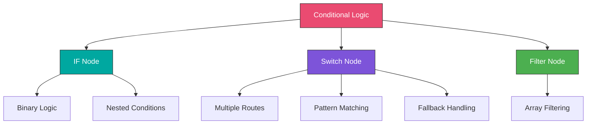

#### IF Node Advanced Patterns

**Multiple Conditions (AND Logic):**
```
Combine: ALL (AND)

Condition 1:
- Value 1: {{$json.amount}}
- Operation: Larger
- Value 2: 1000

Condition 2:
- Value 1: {{$json.status}}
- Operation: Equal
- Value 2: pending

Condition 3:
- Value 1: {{$json.priority}}
- Operation: Equal
- Value 2: high

Result: All three conditions must be true
```

**Multiple Conditions (OR Logic):**
```
Combine: ANY (OR)

Condition 1:
- Value 1: {{$json.status}}
- Operation: Equal
- Value 2: urgent

Condition 2:
- Value 1: {{$json.amount}}
- Operation: Larger
- Value 2: 10000

Condition 3:
- Value 1: {{$json.vipCustomer}}
- Operation: Equal
- Value 2: true

Result: At least one condition must be true
```

**Complex Expression-Based Conditions:**
```javascript
// Use Expression in IF condition
Value 1: {{
  $json.status === 'pending' &&
  $json.amount > 1000 &&
  DateTime.fromISO($json.createdAt).diffNow('hours').hours > -24
}}
Operation: Equal
Value 2: true

// Age calculation
Value 1: {{
  Math.floor(
    DateTime.now().diff(
      DateTime.fromISO($json.dateOfBirth),
      'years'
    ).years
  )
}}
Operation: Larger or Equal
Value 2: 18

// Business hours check
Value 1: {{
  const hour = DateTime.now().hour;
  const day = DateTime.now().weekday;
  day >= 1 && day <= 5 && hour >= 9 && hour < 17
}}
Operation: Equal
Value 2: true
```

**Nested IF Pattern:**
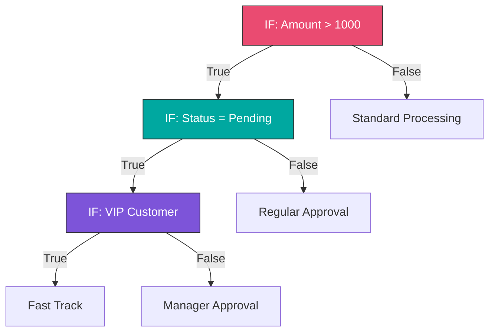

---

#### Switch Node Mastery

The Switch node routes data to different outputs based on rules.

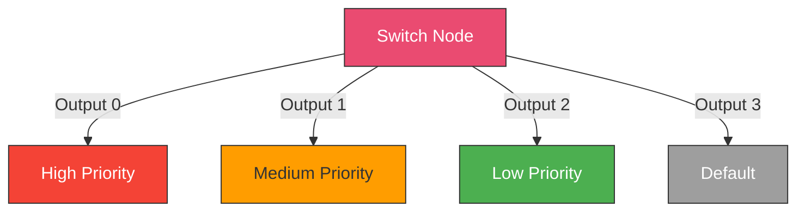

**Basic Switch Configuration:**
```
Mode: Rules

Output 0 (High Priority):
- Value 1: {{$json.priority}}
- Operation: Equal
- Value 2: urgent

Output 1 (Medium Priority):
- Value 1: {{$json.priority}}
- Operation: Equal
- Value 2: high

Output 2 (Low Priority):
- Value 1: {{$json.priority}}
- Operation: Equal
- Value 2: normal

Fallback Output: 3 (Default/Unknown)
```

**Amount-Based Routing:**
```javascript
// Route by order value
Output 0 (Large Orders):
- Value: {{$json.total}}
- Operation: Larger or Equal
- Value 2: 10000

Output 1 (Medium Orders):
- Value: {{$json.total >= 1000 && $json.total < 10000}}
- Operation: Equal
- Value 2: true

Output 2 (Small Orders):
- Value: {{$json.total < 1000}}
- Operation: Equal
- Value 2: true
```

**Status-Based Workflow:**
```javascript
// Order status routing
Output 0 (New Orders - Inventory Check):
- Status: new

Output 1 (Payment Pending - Payment Gateway):
- Status: payment_pending

Output 2 (Processing - Fulfillment):
- Status: processing

Output 3 (Shipped - Tracking Update):
- Status: shipped

Output 4 (Cancelled - Refund):
- Status: cancelled

Output 5 (Completed - Archive):
- Status: completed

Fallback Output: 6 (Error Handler)
```

**Geographic Routing:**
```javascript
// Route by region
Output 0 (North America):
- Value: {{['US', 'CA', 'MX'].includes($json.country)}}
- Operation: Equal
- Value 2: true

Output 1 (Europe):
- Value: {{['UK', 'DE', 'FR', 'ES', 'IT'].includes($json.country)}}
- Operation: Equal
- Value 2: true

Output 2 (Asia Pacific):
- Value: {{['JP', 'CN', 'AU', 'SG'].includes($json.country)}}
- Operation: Equal
- Value 2: true

Output 3 (Rest of World)
```

**Time-Based Routing:**
```javascript
// Route by time of day
const { DateTime } = require('luxon');
const hour = DateTime.now().hour;
const day = DateTime.now().weekday;

Output 0 (Business Hours):
- Value: {{
    const hour = DateTime.now().hour;
    const day = DateTime.now().weekday;
    day >= 1 && day <= 5 && hour >= 9 && hour < 17
  }}
- Operation: Equal
- Value 2: true

Output 1 (After Hours):
- Value: {{
    const hour = DateTime.now().hour;
    const day = DateTime.now().weekday;
    day >= 1 && day <= 5 && (hour < 9 || hour >= 17)
  }}
- Operation: Equal
- Value 2: true

Output 2 (Weekend):
- Value: {{DateTime.now().weekday > 5}}
- Operation: Equal
- Value 2: true
```

---

### 2. Loop Patterns

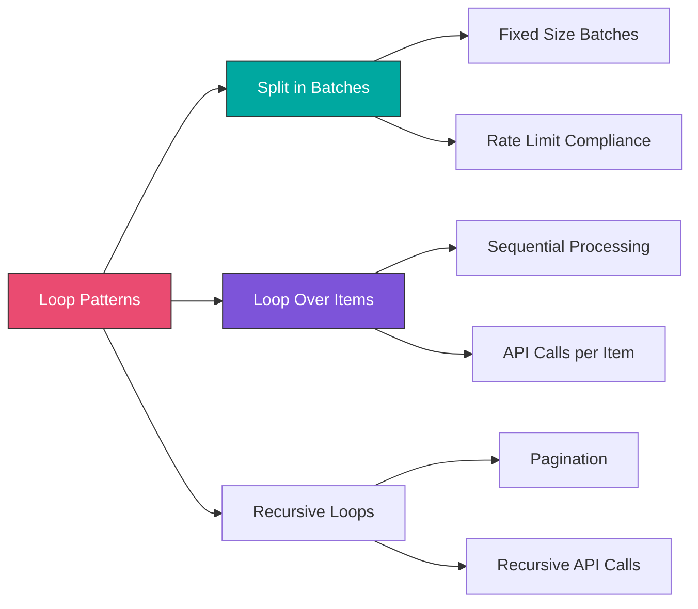

#### Split in Batches Node

Process large datasets in chunks to handle rate limits and memory constraints.

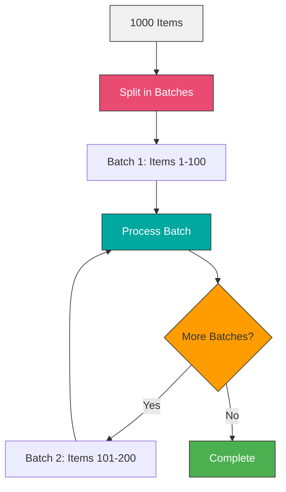

**Basic Configuration:**
```
Batch Size: 100
Options:
- Reset: false (continue from where left off)
```

**Use Cases:**

**1. Bulk Email Sending (Rate Limited):**
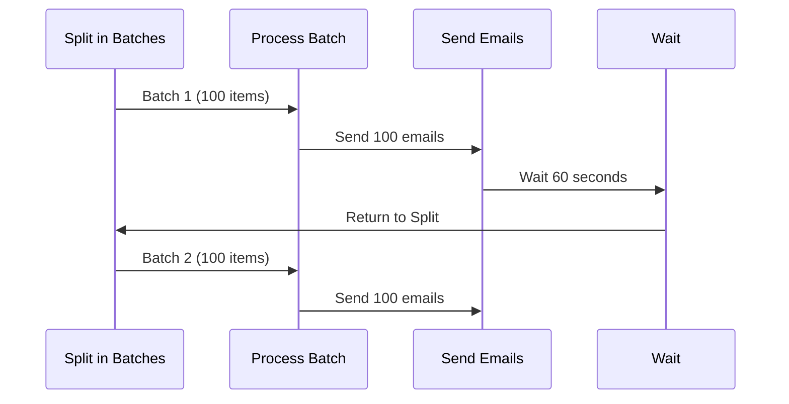

**Workflow Structure:**
```
1. Split in Batches (100 items)
2. Loop Over Items (each item in batch)
3. Send Email
4. Wait Node (60 seconds) - after batch completes
5. Loop back to Split in Batches
```

**2. API Pagination:**
```javascript
// Function node to track progress
const batchNumber = $input.context.currentBatch || 0;
const itemsProcessed = batchNumber * 100;

return {
  json: {
    batchNumber,
    itemsProcessed,
    progress: (itemsProcessed / totalItems) * 100
  }
};
```

**3. Database Bulk Insert:**
```
1. Fetch Data (10,000 records)
2. Split in Batches (500 records)
3. Transform for Database
4. Bulk Insert to Database
5. Log Progress
6. Loop back
```

#### Loop Over Items Node

Executes the same sequence for each item individually.

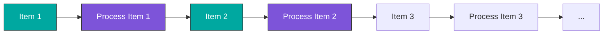

**When to Use:**
- Each item requires separate API call
- Sequential processing needed
- Need to handle errors per item
- Rate limiting between items

**Example: Enrich Each Contact:**
```
1. Get Contacts (100 items)
2. Loop Over Items
3. HTTP Request (Enrichment API for current item)
4. Update Contact in CRM
5. Loop back
6. After loop completes → Send Summary Email
```

**With Error Handling:**
```
Loop Over Items
  ├─ Try Processing
  │   ├─ HTTP Request
  │   ├─ Transform Data
  │   └─ Update Database
  ├─ On Error
  │   ├─ Log Error
  │   ├─ Add to Failed Items
  │   └─ Continue
  └─ Loop Back

After Loop:
  ├─ Count Success/Failures
  └─ Send Report
```

---

### 3. Rate Limiting Strategies

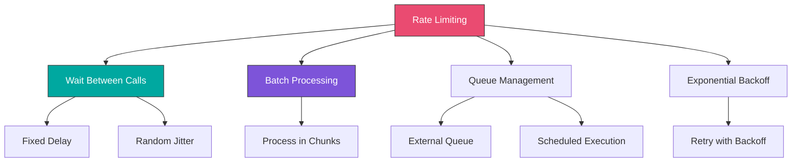

#### Wait Node Strategies

**Fixed Delay:**
```
Wait Node Configuration:
Amount: 1
Unit: Seconds

Use: Between each API call
```

**Variable Delay Based on Response:**
```javascript
// Function node to calculate wait time
const remainingCalls = parseInt($json.headers['x-ratelimit-remaining']);
const resetTime = parseInt($json.headers['x-ratelimit-reset']);
const now = Math.floor(Date.now() / 1000);

let waitSeconds = 0;

if (remainingCalls < 10) {
  // Close to limit, wait longer
  waitSeconds = (resetTime - now) / remainingCalls;
} else if (remainingCalls < 100) {
  // Some buffer
  waitSeconds = 1;
} else {
  // Plenty of calls remaining
  waitSeconds = 0.1;
}

return {
  json: {
    ...json,
    waitSeconds: Math.max(waitSeconds, 0)
  }
};

// Next node: Wait ({{$json.waitSeconds}} seconds)
```

**Random Jitter:**
```javascript
// Avoid thundering herd
const baseDelay = 1; // 1 second
const jitter = Math.random() * 0.5; // 0-0.5 seconds
const totalDelay = baseDelay + jitter;

// Wait node: {{$json.totalDelay}} seconds
```

#### Batch with Delays

```
1. Split in Batches (100 items)
2. Process Batch
3. Wait (60 seconds)
4. Loop back to Split
```

**Calculate Optimal Batch Size:**
```javascript
// Given: 10,000 API calls per hour limit
const callsPerHour = 10000;
const totalItems = $input.all().length;
const hoursAvailable = 1;

const maxCallsPerBatch = Math.floor(callsPerHour / (3600 / 60)); // Calls per minute
const optimalBatchSize = Math.min(maxCallsPerBatch, 100);
const delayBetweenBatches = 60; // seconds

return {
  json: {
    totalItems,
    batchSize: optimalBatchSize,
    estimatedBatches: Math.ceil(totalItems / optimalBatchSize),
    delayBetweenBatches,
    estimatedDuration: Math.ceil(totalItems / optimalBatchSize) * delayBetweenBatches
  }
};
```

#### Exponential Backoff for Retries

```javascript
// Function node for retry logic
const maxRetries = 5;
const attempt = $json.retryCount || 0;

if (attempt >= maxRetries) {
  throw new Error('Max retries exceeded');
}

// Exponential backoff: 2^attempt seconds
const delaySeconds = Math.pow(2, attempt); // 1, 2, 4, 8, 16 seconds

return {
  json: {
    ...json,
    retryCount: attempt + 1,
    delaySeconds
  }
};
```

**Complete Retry Pattern:**
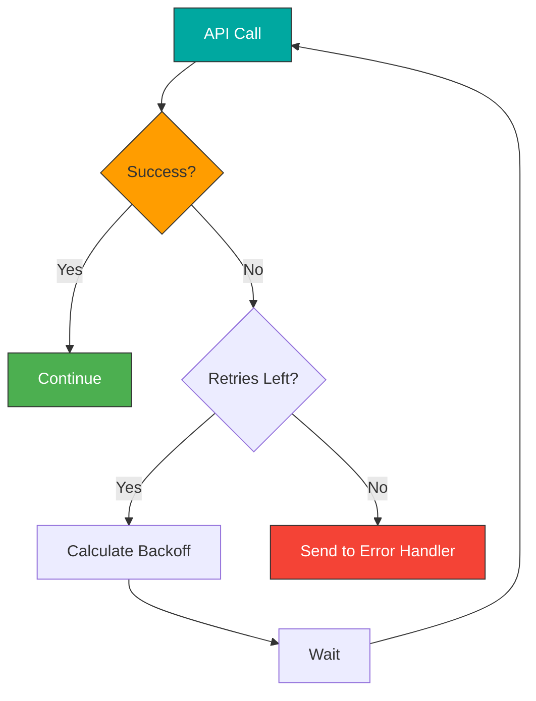

---

### 4. Advanced Flow Control

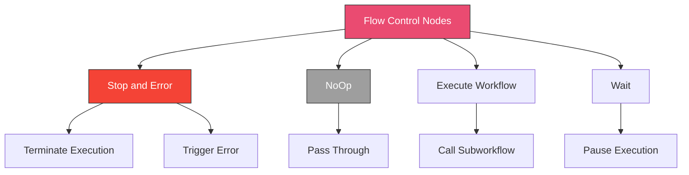

#### Stop and Error Node

**Stop Execution (Graceful):**
```
Stop and Error Node
Mode: Stop Execution
```

Use when:
- Data doesn't meet criteria
- Nothing to process
- Workflow should exit early

**Example: No New Orders**
```
1. Get New Orders
2. IF: Count > 0
   ├─ True → Process Orders
   └─ False → Stop and Error (graceful stop)
```

**Trigger Error (Force Failure):**
```
Stop and Error Node
Mode: Continue on Fail
Error Message: {{$json.errorMessage}}
```

Use when:
- Validation fails
- Critical error occurred
- Need to trigger error workflow

**Example: Validation Failure**
```javascript
// Function node
const order = $json;
const errors = [];

if (!order.customerId) errors.push('Missing customer ID');
if (order.total <= 0) errors.push('Invalid total amount');
if (!order.items || order.items.length === 0) errors.push('No items in order');

if (errors.length > 0) {
  return {
    json: {
      valid: false,
      errorMessage: errors.join('; ')
    }
  };
}

return {
  json: {
    valid: true,
    order
  }
};

// Next: IF node
// If valid === false → Stop and Error
// If valid === true → Continue processing
```

#### Execute Workflow Node

Call other workflows as subworkflows.

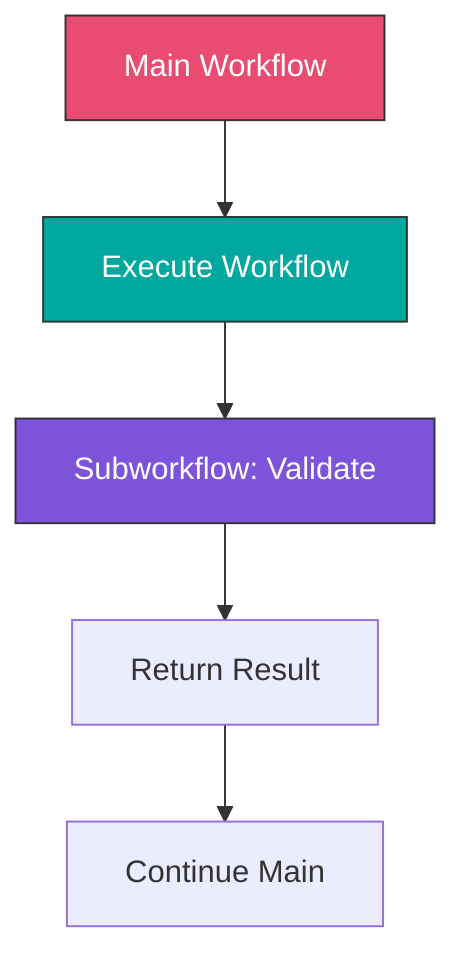

**Configuration:**
```
Source: Database
Workflow: Order Validation
Mode: Run Once for All Items (or Run Once for Each Item)
```

**Pass Data:**
```javascript
// Data passed to subworkflow
{
  orderId: {{$json.orderId}},
  customerId: {{$json.customerId}},
  total: {{$json.total}}
}
```

**Receive Results:**
```javascript
// Access subworkflow output
const validationResult = $json;

if (validationResult.isValid) {
  // Continue processing
} else {
  // Handle validation failure
}
```

**Use Cases:**
- Reusable validation logic
- Complex calculations
- Multi-step data enrichment
- Modular workflow design

---

### 5. Performance Optimization

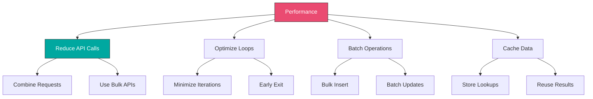

#### Reduce API Calls

**Before (Inefficient):**
```
For each of 1000 customers:
  → API Call: Get Customer Details
  → API Call: Get Customer Orders
  → API Call: Update Customer
Total: 3,000 API calls
```

**After (Optimized):**
```
1. Bulk API: Get All Customer Details (1 call)
2. Bulk API: Get All Orders (1 call)
3. Function: Merge Data
4. Bulk API: Update Customers (1 call)
Total: 3 API calls
```

#### Optimize Loops

**Before (Inefficient):**
```javascript
// Process each item separately
const items = $input.all();

return items.map(item => {
  // Heavy calculation repeated 1000 times
  const taxRate = lookupTaxRate(item.json.state);
  const discount = calculateDiscount(item.json.customer);

  return {
    json: {
      ...item.json,
      taxRate,
      discount
    }
  };
});
```

**After (Optimized):**
```javascript
// Cache lookups
const items = $input.all();
const taxRateCache = {};
const discountCache = {};

return items.map(item => {
  const state = item.json.state;
  const customerId = item.json.customerId;

  // Use cache
  if (!taxRateCache[state]) {
    taxRateCache[state] = lookupTaxRate(state);
  }

  if (!discountCache[customerId]) {
    discountCache[customerId] = calculateDiscount(item.json.customer);
  }

  return {
    json: {
      ...item.json,
      taxRate: taxRateCache[state],
      discount: discountCache[customerId]
    }
  };
});
```

#### Batch Database Operations

**Before (Inefficient):**
```
Loop Over Items (1000 items):
  → Insert into Database (1 row)
Total: 1000 database queries
```

**After (Optimized):**
```
Split in Batches (100 items):
  → Bulk Insert into Database (100 rows)
Total: 10 database queries
```

**Bulk Insert Example:**
```sql
INSERT INTO orders (customer_id, total, status, created_at)
VALUES
  ({{$json.items[0].customerId}}, {{$json.items[0].total}}, 'pending', NOW()),
  ({{$json.items[1].customerId}}, {{$json.items[1].total}}, 'pending', NOW()),
  ...
  ({{$json.items[99].customerId}}, {{$json.items[99].total}}, 'pending', NOW())
```

**Dynamic Bulk Insert:**
```javascript
// Function node
const items = $input.all();
const batchSize = 100;
const batches = [];

for (let i = 0; i < items.length; i += batchSize) {
  const batch = items.slice(i, i + batchSize);

  const values = batch
    .map(item => `(${item.json.customerId}, ${item.json.total}, 'pending', NOW())`)
    .join(',\n');

  const sql = `
    INSERT INTO orders (customer_id, total, status, created_at)
    VALUES ${values}
  `;

  batches.push({ json: { sql } });
}

return batches;
```

#### Early Exit Pattern

```javascript
// Exit loop early if condition met
const items = $input.all();

for (const item of items) {
  if (item.json.status === 'cancelled') {
    // Found what we need, stop processing
    return [{
      json: {
        found: true,
        item: item.json
      }
    }];
  }
}

return [{
  json: {
    found: false
  }
}];
```

---

## Hands-On Exercises

### [Exercise 1: Multi-Condition Approval Workflow](./exercises/exercise-1-approval-workflow.md)

Build an intelligent approval routing system:
1. Receive order data
2. Apply multiple business rules
3. Route to appropriate approver
4. Handle escalations
5. Track approval status

**Rules:**
- Orders < $1,000: Auto-approve
- Orders $1,000-$10,000: Manager approval
- Orders > $10,000: Director approval
- VIP customers: Fast track
- International orders: Compliance check

**Learning Goals:**
- Complex IF conditions
- Switch node routing
- Nested conditionals
- Business rule implementation

---

### [Exercise 2: Batch Processing with Loops](./exercises/exercise-2-batch-processing.md)

Create a high-volume data processing workflow:
1. Fetch 10,000 customer records
2. Process in batches of 500
3. Enrich each customer (API call)
4. Update database in bulk
5. Handle rate limits
6. Track progress
7. Send completion report

**Learning Goals:**
- Split in Batches node
- Rate limit handling
- Progress tracking
- Bulk operations
- Error handling in loops

---

### [Exercise 3: Smart Retry Mechanism](./exercises/exercise-3-retry-mechanism.md)

Implement robust retry logic:
1. Make API call
2. Detect failures
3. Implement exponential backoff
4. Track retry attempts
5. Handle different error types
6. Send to dead letter queue after max retries

**Error Handling:**
- 429 Rate Limit: Wait and retry
- 500 Server Error: Exponential backoff
- 400 Client Error: Don't retry, log
- Network timeout: Retry with backoff

**Learning Goals:**
- Error detection
- Conditional retry logic
- Exponential backoff
- Error categorization
- Dead letter queue pattern

---

## Real-World Project: Order Processing System

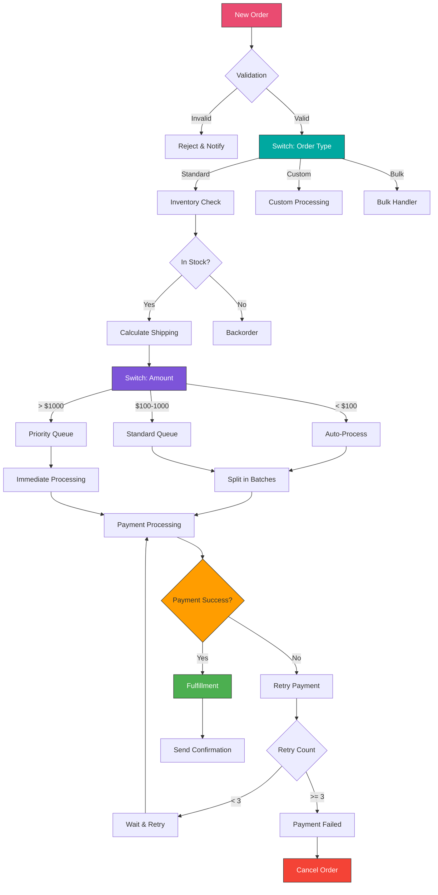

**Implementation Highlights:**

**1. Validation with Early Exit:**
```javascript
// Validation Function
const order = $json;
const errors = [];

if (!order.customerId) errors.push('Missing customer ID');
if (!order.items?.length) errors.push('No items');
if (order.total <= 0) errors.push('Invalid total');

if (errors.length > 0) {
  return {
    json: {
      valid: false,
      errors,
      order
    }
  };
}

// Additional validation
const customer = await getCustomer(order.customerId);
if (!customer) {
  errors.push('Customer not found');
}

if (customer.status === 'suspended') {
  errors.push('Customer account suspended');
}

return {
  json: {
    valid: errors.length === 0,
    errors,
    order,
    customer
  }
};
```

**2. Multi-Level Routing:**
```
Switch Node (Order Type):
  Output 0: order.type === 'standard'
  Output 1: order.type === 'custom'
  Output 2: order.type === 'bulk'

Each route leads to:
  → Switch Node (Amount)
      Output 0: amount < 100
      Output 1: 100 <= amount < 1000
      Output 2: amount >= 1000
```

**3. Batch Payment Processing:**
```
Standard Queue Orders:
1. Aggregate Orders (batch every 5 minutes)
2. Split in Batches (50 orders)
3. Loop Over Items
   → Process Payment
   → IF Success → Fulfillment
   → IF Failure → Retry Logic
4. Wait (2 seconds between items)
5. After Batch → Wait (60 seconds)
6. Next Batch
```

**4. Retry Logic:**
```javascript
// Payment Retry Function
const maxRetries = 3;
const retryCount = $json.retryCount || 0;
const errorCode = $json.paymentError?.code;

// Don't retry client errors
if (errorCode >= 400 && errorCode < 500) {
  return {
    json: {
      shouldRetry: false,
      finalStatus: 'failed',
      reason: 'Client error - no retry'
    }
  };
}

// Check retry limit
if (retryCount >= maxRetries) {
  return {
    json: {
      shouldRetry: false,
      finalStatus: 'failed',
      reason: 'Max retries exceeded'
    }
  };
}

// Calculate backoff
const backoffSeconds = Math.pow(2, retryCount);

return {
  json: {
    shouldRetry: true,
    retryCount: retryCount + 1,
    waitSeconds: backoffSeconds
  }
};
```

---

## Best Practices

### Logic Design

- ✓ Keep conditions simple and readable
- ✓ Use Switch for multiple routes (> 2 outputs)
- ✓ Use IF for binary decisions
- ✓ Document complex logic with notes
- ✓ Test all branches of conditionals
- ✓ Handle default/fallback cases

### Loop Optimization

- ✓ Use appropriate batch sizes
- ✓ Implement progress tracking
- ✓ Add error handling in loops
- ✓ Consider memory constraints
- ✓ Monitor execution time
- ✓ Log batch completion

### Rate Limiting

- ✓ Respect API limits
- ✓ Implement delays between calls
- ✓ Use exponential backoff for retries
- ✓ Monitor rate limit headers
- ✓ Queue operations when needed
- ✓ Handle 429 responses gracefully

### Error Handling

- ✓ Categorize errors (client vs server)
- ✓ Implement appropriate retry logic
- ✓ Set maximum retry limits
- ✓ Log failures for debugging
- ✓ Send to dead letter queue
- ✓ Alert on critical failures

---

## Key Takeaways

- ✓ IF nodes handle binary decisions, Switch handles multiple routes
- ✓ Loops enable batch processing and rate limit compliance
- ✓ Proper error handling prevents workflow failures
- ✓ Retry mechanisms increase reliability
- ✓ Performance optimization reduces execution time and costs
- ✓ Flow control nodes provide fine-grained execution management

---

## Additional Resources

**n8n Documentation:**
- [IF Node](https://docs.n8n.io/integrations/builtin/core-nodes/n8n-nodes-base.if/)
- [Switch Node](https://docs.n8n.io/integrations/builtin/core-nodes/n8n-nodes-base.switch/)
- [Split in Batches](https://docs.n8n.io/integrations/builtin/core-nodes/n8n-nodes-base.splitinbatches/)
- [Execute Workflow](https://docs.n8n.io/integrations/builtin/core-nodes/n8n-nodes-base.executeworkflow/)

**Patterns & Best Practices:**
- [Error Handling Patterns](https://docs.n8n.io/flow-logic/error-handling/)
- [Looping](https://docs.n8n.io/flow-logic/looping/)
- [Performance Tips](https://docs.n8n.io/hosting/scaling/performance/)

---

## Next Steps

**Continue to:** [Module 5: Error Handling and Monitoring](../../module-05-error-handling/README.md)

**Practice More:**
- Build complex approval workflows
- Implement batch processing systems
- Create retry mechanisms
- Optimize slow workflows
- Design multi-path routing logic
- Handle edge cases and errors
