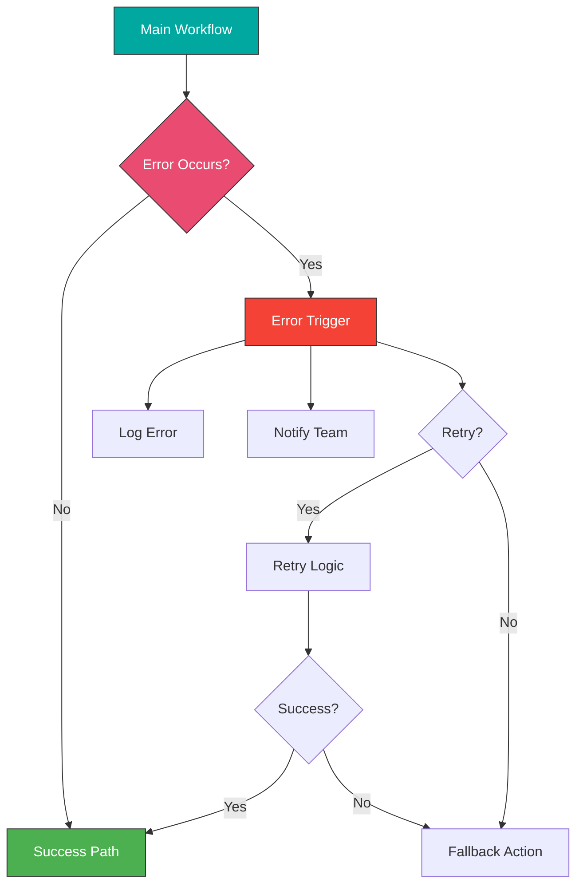

# Module 5: Error Handling and Monitoring

## Overview

Build robust, production-ready workflows with comprehensive error handling, monitoring, and debugging strategies. Learn to create self-healing workflows that gracefully handle failures.

**Duration:** 1 week (15-20 hours)

## Learning Objectives

- Implement comprehensive error handling strategies
- Use Error Trigger nodes effectively
- Build self-healing workflows with automatic retries
- Set up monitoring and alerting systems
- Debug complex workflow issues
- Implement logging best practices
- Ensure workflow reliability and resilience

## Module Contents

### [Week 8: Robust Workflow Design](./week-8/README.md)
- Error Trigger nodes
- Try-catch patterns in workflows
- Logging strategies
- Health check implementations
- Workflow versioning and backups
- Execution history analysis
- Performance monitoring

## Error Handling Architecture

## Projects

1. **Self-Healing Workflow** - Automatic retry and recovery
2. **Monitoring Dashboard** - Track workflow health
3. **Comprehensive Error System** - Multi-channel notifications
4. **Execution Analyzer** - Parse and analyze workflow runs
5. **Circuit Breaker Pattern** - Prevent cascading failures

## Key Topics

- Error Trigger nodes
- Retry strategies
- Logging systems
- Monitoring patterns
- Debugging techniques
- Resilience patterns

## Prerequisites

- Completed Modules 1-4
- Understanding of error handling concepts
- Experience with n8n workflow execution

## Next Steps

After completing this module, proceed to [Module 6: Advanced Features and Techniques](../module-06-advanced-features/README.md)
