# Week 8: Robust Workflow Design

## Learning Objectives

- Implement comprehensive error handling strategies
- Set up monitoring and alerting systems
- Debug complex workflow issues effectively
- Ensure workflow reliability and resilience
- Design self-healing workflows
- Implement logging and audit trails
- Create workflow versioning and backup strategies

---

## Topics

### 1. Error Handling Fundamentals

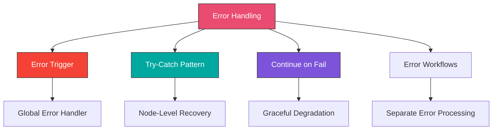

#### Error Trigger Node

Catches errors from any workflow and processes them in a dedicated error workflow.

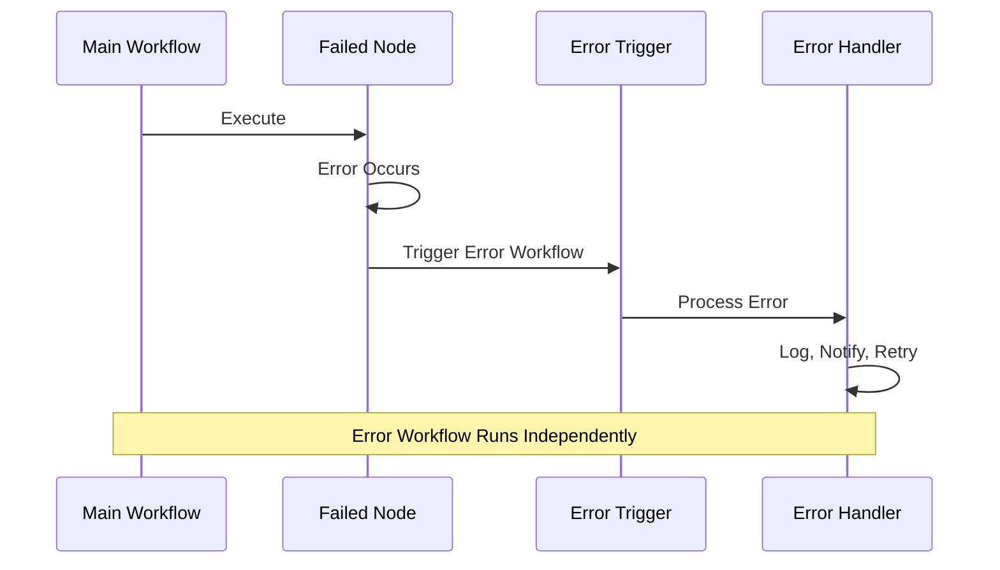

**Setup Error Workflow:**
```
1. Create new workflow: "Global Error Handler"
2. Add Error Trigger node as first node
3. Build error processing logic
4. Activate workflow
```

**Error Trigger Configuration:**
```
Trigger On: Workflow Errors
```

**Access Error Data:**
```javascript
// Error Trigger provides:
{
  "execution": {
    "id": "execution_id",
    "mode": "trigger",
    "startedAt": "2024-01-15T10:30:00.000Z",
    "stoppedAt": "2024-01-15T10:30:05.000Z",
    "workflowId": "workflow_id",
    "status": "error"
  },
  "workflow": {
    "id": "workflow_id",
    "name": "Order Processing",
    "active": true
  },
  "node": {
    "name": "HTTP Request",
    "type": "n8n-nodes-base.httpRequest"
  },
  "error": {
    "message": "Request failed with status code 500",
    "stack": "Error stack trace...",
    "description": "Internal Server Error"
  }
}
```

**Error Handler Workflow:**
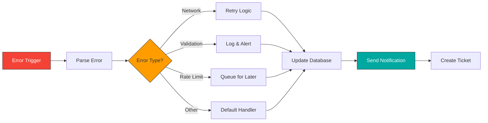

**Example Error Handler:**
```javascript
// Function node in Error Handler workflow
const { DateTime } = require('luxon');
const error = $input.item.json;

// Categorize error
let category = 'unknown';
let severity = 'medium';
let shouldRetry = false;

if (error.error.message.includes('ECONNREFUSED')) {
  category = 'network';
  severity = 'high';
  shouldRetry = true;
} else if (error.error.message.includes('429')) {
  category = 'rate_limit';
  severity = 'low';
  shouldRetry = true;
} else if (error.error.message.includes('401') || error.error.message.includes('403')) {
  category = 'authentication';
  severity = 'high';
  shouldRetry = false;
} else if (error.error.message.includes('400')) {
  category = 'validation';
  severity = 'medium';
  shouldRetry = false;
} else if (error.error.message.includes('500')) {
  category = 'server_error';
  severity = 'high';
  shouldRetry = true;
}

return {
  json: {
    ...error,
    errorAnalysis: {
      category,
      severity,
      shouldRetry,
      occurredAt: DateTime.now().toISO(),
      workflowName: error.workflow.name,
      nodeName: error.node.name,
      errorMessage: error.error.message
    }
  }
};
```

---

#### Continue on Fail

Allow nodes to fail gracefully without stopping the workflow.

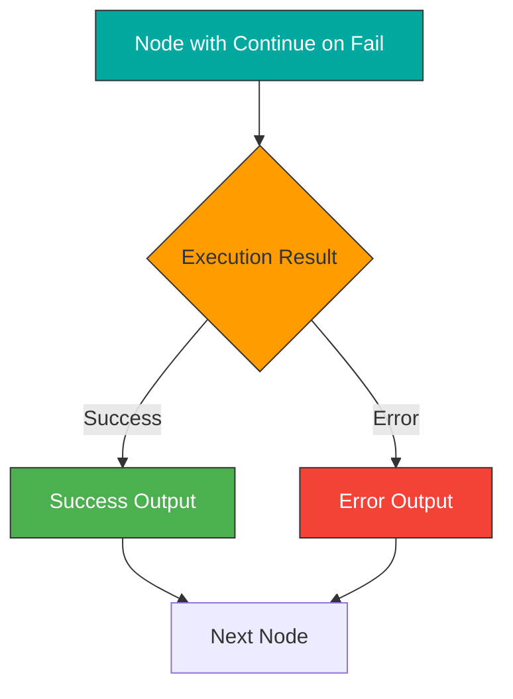

**Node Settings:**
```
Settings → Continue on Fail: ON
```

**Check for Errors:**
```javascript
// Function node after a "Continue on Fail" node
const item = $input.item;

if (item.error) {
  // Node failed
  return {
    json: {
      status: 'failed',
      error: item.error.message,
      originalData: item.json
    }
  };
} else {
  // Node succeeded
  return {
    json: {
      status: 'success',
      data: item.json
    }
  };
}
```

**Use Cases:**
- Optional enrichment (if fails, continue without enrichment)
- Best-effort delivery
- Fallback to alternative service
- Partial success scenarios

**Example: Try Primary, Fallback to Secondary:**
```
1. HTTP Request (Primary API)
   Settings: Continue on Fail = ON

2. Function: Check Success
   Code:
   if ($input.item.error) {
     return { json: { useFallback: true } };
   } else {
     return { json: { useFallback: false, data: $input.item.json } };
   }

3. IF: useFallback === true
   True → HTTP Request (Fallback API)
   False → Continue with data

4. Merge: Combine results
```

---

#### Try-Catch Pattern

Implement try-catch logic using IF nodes and error detection.

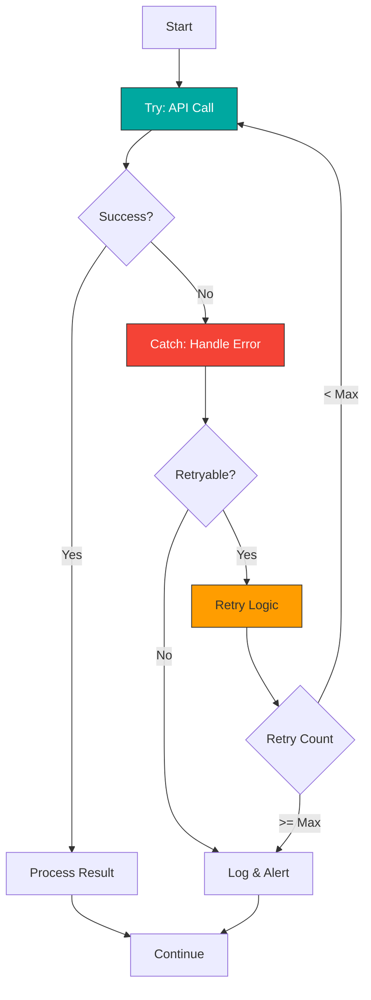

**Implementation:**
```
1. Set Node: Initialize
   {
     "retryCount": 0,
     "maxRetries": 3,
     "data": {{$json}}
   }

2. HTTP Request (or any node)
   Settings: Continue on Fail = ON

3. Function: Check & Categorize Error
   (See code below)

4. IF: shouldRetry === true
   True → Wait → Increment Retry → Loop Back
   False → Error Handler

5. IF: retryCount >= maxRetries
   True → Final Error Handler
   False → Continue Retry Loop
```

**Error Check Function:**
```javascript
const item = $input.item;
const retryCount = item.json.retryCount || 0;
const maxRetries = item.json.maxRetries || 3;

if (item.error) {
  // Failed
  const errorMessage = item.error.message;
  let shouldRetry = false;

  // Determine if retryable
  if (errorMessage.includes('ETIMEDOUT') ||
      errorMessage.includes('ECONNREFUSED') ||
      errorMessage.includes('500') ||
      errorMessage.includes('502') ||
      errorMessage.includes('503') ||
      errorMessage.includes('504')) {
    shouldRetry = retryCount < maxRetries;
  }

  return {
    json: {
      success: false,
      error: errorMessage,
      shouldRetry,
      retryCount,
      maxRetries,
      originalData: item.json.data
    }
  };
} else {
  // Success
  return {
    json: {
      success: true,
      data: item.json,
      retryCount: 0
    }
  };
}
```

---

### 2. Logging Best Practices

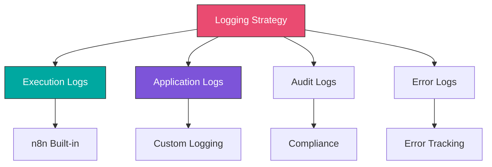

#### Structured Logging

**Log to Database:**
```sql
INSERT INTO workflow_logs (
  workflow_id,
  workflow_name,
  execution_id,
  node_name,
  log_level,
  message,
  metadata,
  created_at
) VALUES (
  '{{$workflow.id}}',
  '{{$workflow.name}}',
  '{{$execution.id}}',
  '{{$node.name}}',
  '{{$json.logLevel}}',
  '{{$json.message}}',
  '{{JSON.stringify($json.metadata)}}',
  NOW()
)
```

**Log Function:**
```javascript
// Reusable logging function
function createLog(level, message, metadata = {}) {
  const { DateTime } = require('luxon');

  return {
    json: {
      timestamp: DateTime.now().toISO(),
      workflowId: $workflow.id,
      workflowName: $workflow.name,
      executionId: $execution.id,
      executionMode: $execution.mode,
      nodeName: $node.name,
      logLevel: level, // debug, info, warn, error
      message: message,
      metadata: {
        ...metadata,
        environment: $env.NODE_ENV || 'production'
      }
    }
  };
}

// Usage
return createLog('info', 'Order processed successfully', {
  orderId: $json.orderId,
  customerId: $json.customerId,
  total: $json.total
});
```

**Log Levels:**
```javascript
// DEBUG: Detailed information for diagnosing problems
createLog('debug', 'API request payload', { payload: apiPayload });

// INFO: General informational messages
createLog('info', 'Order created', { orderId: 12345 });

// WARN: Warning messages for potentially harmful situations
createLog('warn', 'Low inventory detected', { productId: 'ABC', quantity: 5 });

// ERROR: Error events that still allow workflow to continue
createLog('error', 'Email delivery failed', { email: 'user@example.com', error: err.message });

// CRITICAL: Critical issues requiring immediate attention
createLog('critical', 'Payment gateway down', { gateway: 'stripe', attempts: 5 });
```

#### Sensitive Data Handling

**Redact Sensitive Information:**
```javascript
function sanitizeForLogging(data) {
  const sanitized = { ...data };

  // Redact credit card numbers
  if (sanitized.creditCard) {
    sanitized.creditCard = '****-****-****-' + sanitized.creditCard.slice(-4);
  }

  // Redact passwords
  if (sanitized.password) {
    sanitized.password = '***REDACTED***';
  }

  // Redact API keys
  if (sanitized.apiKey) {
    sanitized.apiKey = sanitized.apiKey.substring(0, 8) + '...' + sanitized.apiKey.slice(-4);
  }

  // Redact SSN
  if (sanitized.ssn) {
    sanitized.ssn = '***-**-' + sanitized.ssn.slice(-4);
  }

  // Redact email (partial)
  if (sanitized.email) {
    const [name, domain] = sanitized.email.split('@');
    sanitized.email = name.charAt(0) + '***@' + domain;
  }

  return sanitized;
}

// Usage
const logData = sanitizeForLogging($json);
return createLog('info', 'Payment processed', logData);
```

---

### 3. Monitoring and Alerting

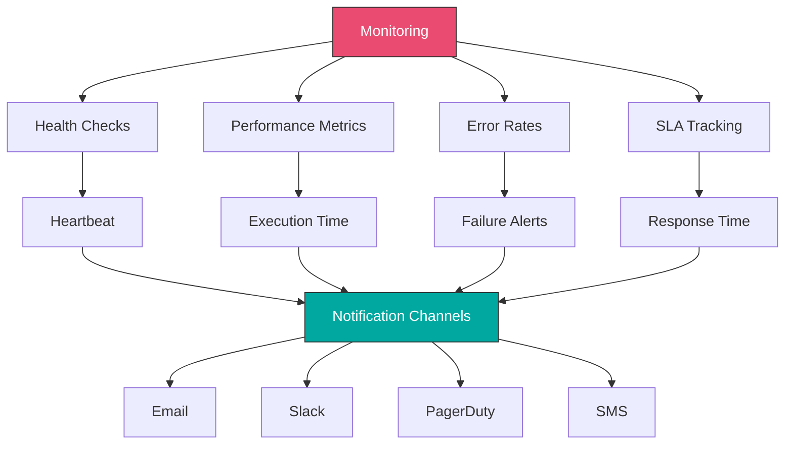

#### Health Check Workflow

**Heartbeat Monitor:**
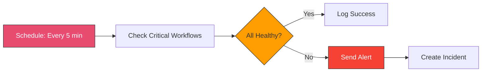

**Implementation:**
```javascript
// Function: Check Workflow Health
const { DateTime } = require('luxon');

// Get execution history from n8n API
const workflowsToCheck = [
  { id: 'workflow_1', name: 'Order Processing', maxAge: 10 }, // Should run every 10 min
  { id: 'workflow_2', name: 'Inventory Sync', maxAge: 60 },   // Should run hourly
  { id: 'workflow_3', name: 'Customer Emails', maxAge: 5 }    // Should run every 5 min
];

const now = DateTime.now();
const alerts = [];

for (const workflow of workflowsToCheck) {
  // Query last execution (via n8n API or database)
  const lastExecution = await getLastExecution(workflow.id);

  if (!lastExecution) {
    alerts.push({
      severity: 'high',
      workflow: workflow.name,
      issue: 'No execution found',
      action: 'Verify workflow is active'
    });
    continue;
  }

  const executionTime = DateTime.fromISO(lastExecution.stoppedAt);
  const ageMinutes = now.diff(executionTime, 'minutes').minutes;

  if (ageMinutes > workflow.maxAge) {
    alerts.push({
      severity: 'high',
      workflow: workflow.name,
      issue: `Last execution ${Math.floor(ageMinutes)} minutes ago`,
      expected: `Should run every ${workflow.maxAge} minutes`,
      lastExecution: lastExecution.id
    });
  }

  if (lastExecution.status === 'error') {
    alerts.push({
      severity: 'critical',
      workflow: workflow.name,
      issue: 'Last execution failed',
      error: lastExecution.error,
      executionId: lastExecution.id
    });
  }
}

return {
  json: {
    timestamp: now.toISO(),
    healthy: alerts.length === 0,
    alertCount: alerts.length,
    alerts
  }
};
```

#### Performance Monitoring

**Track Execution Metrics:**
```javascript
// Function: Calculate Performance Metrics
const { DateTime } = require('luxon');

const startTime = DateTime.fromISO($json.executionStartTime);
const endTime = DateTime.now();
const durationSeconds = endTime.diff(startTime, 'seconds').seconds;

// Define SLA thresholds
const SLA = {
  target: 5,      // Target: 5 seconds
  warning: 8,     // Warning: 8 seconds
  critical: 10    // Critical: 10 seconds
};

let status = 'good';
if (durationSeconds > SLA.critical) {
  status = 'critical';
} else if (durationSeconds > SLA.warning) {
  status = 'warning';
} else if (durationSeconds > SLA.target) {
  status = 'acceptable';
}

return {
  json: {
    executionId: $execution.id,
    workflowName: $workflow.name,
    startTime: startTime.toISO(),
    endTime: endTime.toISO(),
    durationSeconds: Math.round(durationSeconds * 100) / 100,
    status,
    sla: SLA,
    meetsTargetSLA: durationSeconds <= SLA.target,
    meetsAcceptableSLA: durationSeconds <= SLA.critical,
    itemsProcessed: $json.itemCount || 0,
    itemsPerSecond: ($json.itemCount || 0) / durationSeconds
  }
};
```

**Store Metrics:**
```sql
INSERT INTO workflow_metrics (
  execution_id,
  workflow_name,
  duration_seconds,
  items_processed,
  items_per_second,
  status,
  meets_sla,
  created_at
) VALUES (
  '{{$json.executionId}}',
  '{{$json.workflowName}}',
  {{$json.durationSeconds}},
  {{$json.itemsProcessed}},
  {{$json.itemsPerSecond}},
  '{{$json.status}}',
  {{$json.meetsTargetSLA}},
  NOW()
)
```

#### Alert Thresholds

**Error Rate Monitoring:**
```javascript
// Function: Check Error Rate
// Runs every 15 minutes

const { DateTime } = require('luxon');

// Query execution history from last 15 minutes
const since = DateTime.now().minus({ minutes: 15 }).toISO();
const executions = await queryExecutions(since);

const total = executions.length;
const failed = executions.filter(e => e.status === 'error').length;
const errorRate = total > 0 ? (failed / total) * 100 : 0;

// Alert thresholds
const thresholds = {
  warning: 5,    // 5% error rate
  critical: 10   // 10% error rate
};

let alertLevel = null;
if (errorRate >= thresholds.critical) {
  alertLevel = 'critical';
} else if (errorRate >= thresholds.warning) {
  alertLevel = 'warning';
}

return {
  json: {
    timestamp: DateTime.now().toISO(),
    period: '15 minutes',
    totalExecutions: total,
    failedExecutions: failed,
    errorRate: Math.round(errorRate * 100) / 100,
    alertLevel,
    shouldAlert: alertLevel !== null,
    message: alertLevel
      ? `Error rate at ${errorRate.toFixed(2)}% (${failed}/${total} executions failed)`
      : 'All systems normal'
  }
};
```

---

### 4. Self-Healing Workflows

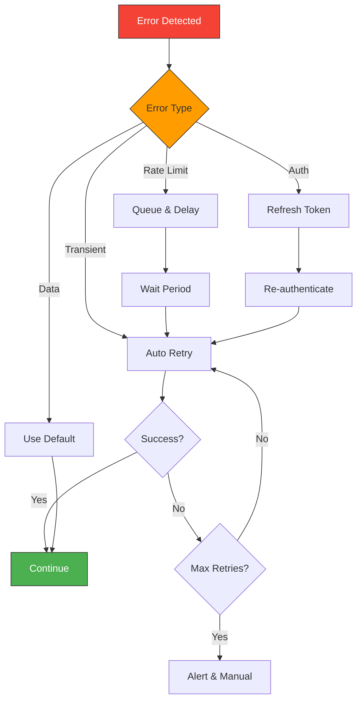

#### Automatic Retry Logic

**Smart Retry Pattern:**
```javascript
// Function: Retry Decision Engine
const error = $json.error;
const attempt = $json.attemptNumber || 1;
const maxAttempts = 5;

// Categorize error
const errorAnalysis = {
  isRetryable: false,
  strategy: null,
  waitSeconds: 0,
  shouldAlert: false
};

// Network errors - retry with exponential backoff
if (error.message.includes('ETIMEDOUT') ||
    error.message.includes('ECONNREFUSED') ||
    error.message.includes('ENOTFOUND')) {
  errorAnalysis.isRetryable = true;
  errorAnalysis.strategy = 'exponential_backoff';
  errorAnalysis.waitSeconds = Math.min(Math.pow(2, attempt), 300); // Max 5 min
}

// Rate limit - wait and retry
else if (error.message.includes('429')) {
  errorAnalysis.isRetryable = true;
  errorAnalysis.strategy = 'rate_limit';

  // Try to extract retry-after header
  const retryAfter = parseInt(error.headers?.['retry-after']) || 60;
  errorAnalysis.waitSeconds = retryAfter;
}

// Server errors - retry with delay
else if (error.message.match(/50[0-9]/)) {
  errorAnalysis.isRetryable = true;
  errorAnalysis.strategy = 'server_error';
  errorAnalysis.waitSeconds = Math.pow(2, attempt);
}

// Auth errors - try to refresh token
else if (error.message.includes('401') || error.message.includes('403')) {
  errorAnalysis.isRetryable = attempt === 1; // Only try once
  errorAnalysis.strategy = 'refresh_auth';
  errorAnalysis.waitSeconds = 1;
}

// Client errors - don't retry
else if (error.message.match(/40[0-9]/)) {
  errorAnalysis.isRetryable = false;
  errorAnalysis.strategy = 'client_error';
  errorAnalysis.shouldAlert = true;
}

// Check max attempts
if (attempt >= maxAttempts) {
  errorAnalysis.isRetryable = false;
  errorAnalysis.shouldAlert = true;
}

return {
  json: {
    ...json,
    errorAnalysis,
    attemptNumber: attempt,
    maxAttempts,
    willRetry: errorAnalysis.isRetryable
  }
};
```

#### Token Refresh Pattern

**Auto-Refresh OAuth Token:**
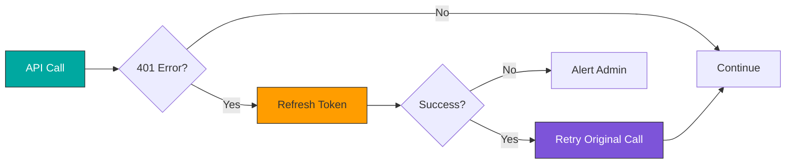

**Implementation:**
```javascript
// Function: Check for Auth Error
const response = $input.item;

if (response.error?.message.includes('401')) {
  // Token expired, refresh it
  return {
    json: {
      needsTokenRefresh: true,
      originalRequest: response.json.originalRequest
    }
  };
}

return {
  json: {
    needsTokenRefresh: false,
    data: response.json
  }
};
```

#### Fallback Strategies

**Primary + Fallback Pattern:**
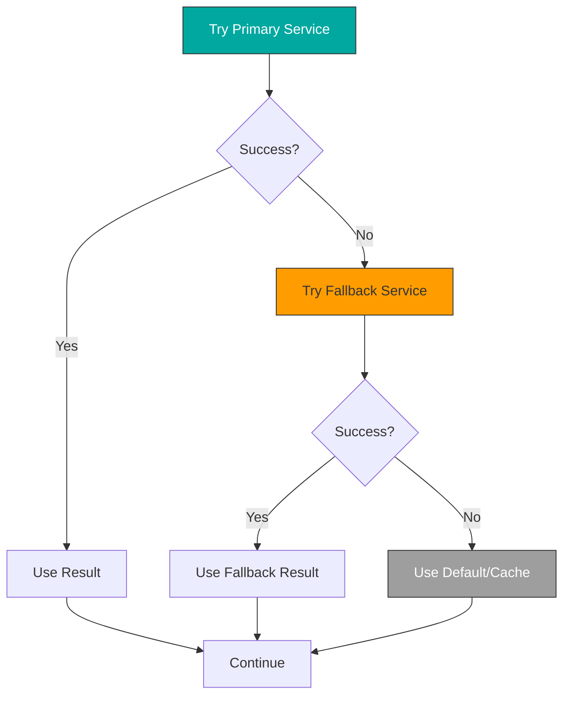

**Example: Email Service with Fallback:**
```
1. Send Email (Primary: SendGrid)
   Settings: Continue on Fail = ON

2. Function: Check Email Result
   if (error) { useFallback = true }

3. IF: useFallback === true
   True Path:
     → Send Email (Fallback: AWS SES)
     Settings: Continue on Fail = ON

4. Function: Check Both Results
   if (both failed) { log error, alert admin }

5. Continue workflow
```

---

### 5. Debugging Complex Workflows

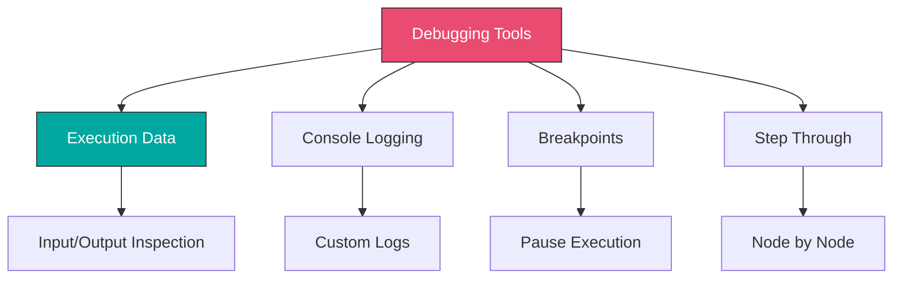

#### Debug Logging

**Console.log in Function Nodes:**
```javascript
// Function node
const items = $input.all();

console.log('Items received:', items.length);
console.log('First item:', JSON.stringify(items[0], null, 2));

const processed = items.map(item => {
  const data = item.json;
  console.log('Processing item:', data.id);

  const result = {
    id: data.id,
    processed: true
  };

  console.log('Result:', result);
  return { json: result };
});

console.log('Total processed:', processed.length);
return processed;
```

**Conditional Logging:**
```javascript
// Only log in development
const isDev = $env.NODE_ENV === 'development';

if (isDev) {
  console.log('Debug: Processing order', $json.orderId);
  console.log('Debug: Customer data', $json.customer);
}
```

#### Temporary Debug Nodes

**Add Debug Checkpoints:**
```
Main Flow:
  Node 1
  → Set Node (Debug Checkpoint 1)
      Keep only set: No
      Add field: debugCheckpoint = "after_node1"
  Node 2
  → Set Node (Debug Checkpoint 2)
      Keep only set: No
      Add field: debugCheckpoint = "after_node2"
  Node 3
```

**Inspect Node:**
```javascript
// Function node for detailed inspection
const item = $input.item.json;

return {
  json: {
    // Original data
    original: item,

    // Type information
    types: {
      id: typeof item.id,
      amount: typeof item.amount,
      items: Array.isArray(item.items)
    },

    // Validation
    validation: {
      hasId: !!item.id,
      hasAmount: !!item.amount,
      amountIsNumber: typeof item.amount === 'number',
      itemsIsArray: Array.isArray(item.items),
      itemCount: item.items?.length || 0
    },

    // Computed
    computed: {
      totalItems: item.items?.length || 0,
      formattedAmount: item.amount?.toFixed(2)
    }
  }
};
```

#### Testing with Sample Data

**Create Test Data Node:**
```javascript
// Set node or Code node
const testData = [
  {
    id: 1,
    customerId: 'CUST001',
    amount: 150.50,
    status: 'pending',
    items: [
      { productId: 'PROD1', quantity: 2, price: 50.25 },
      { productId: 'PROD2', quantity: 1, price: 50.00 }
    ]
  },
  {
    id: 2,
    customerId: 'CUST002',
    amount: 299.99,
    status: 'completed',
    items: [
      { productId: 'PROD3', quantity: 1, price: 299.99 }
    ]
  },
  // Add edge cases
  {
    id: 3,
    customerId: 'CUST003',
    amount: 0, // Edge case: zero amount
    status: 'cancelled',
    items: []  // Edge case: no items
  }
];

return testData.map(data => ({ json: data }));
```

---

### 6. Workflow Versioning and Backups

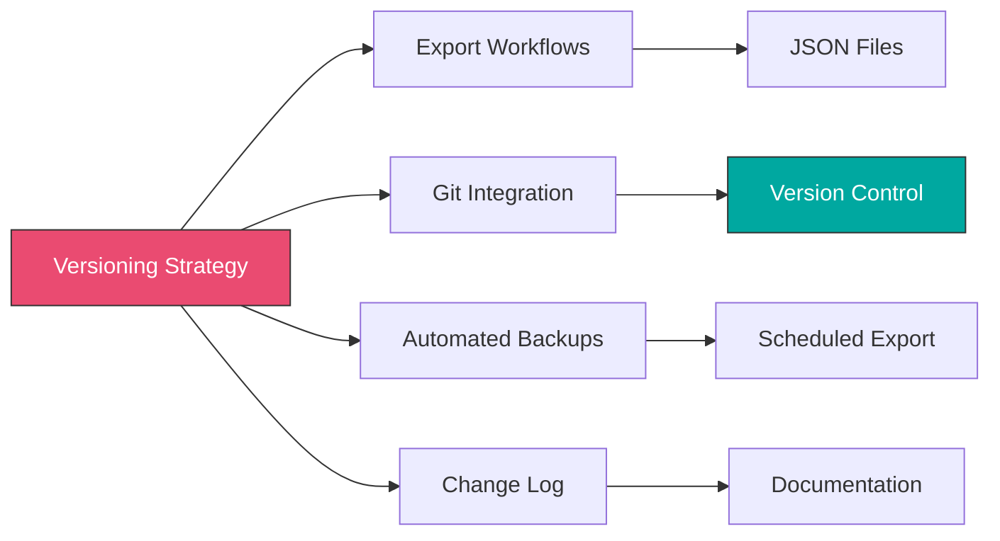

#### Automated Backup Workflow

**Daily Workflow Backup:**


**Implementation:**
```javascript
// Function: Export Workflows
const { DateTime } = require('luxon');

// Get all workflows via n8n API
const workflows = await n8nApi.getWorkflows();

const exported = [];

for (const workflow of workflows) {
  const workflowData = await n8nApi.getWorkflow(workflow.id);

  // Create filename
  const filename = `${workflow.name.replace(/[^a-z0-9]/gi, '_')}_${workflow.id}.json`;
  const filepath = `backups/${DateTime.now().toFormat('yyyy-MM-dd')}/${filename}`;

  // Save to file system or Git
  await saveFile(filepath, JSON.stringify(workflowData, null, 2));

  exported.push({
    id: workflow.id,
    name: workflow.name,
    filepath,
    active: workflow.active
  });
}

return {
  json: {
    timestamp: DateTime.now().toISO(),
    workflowCount: exported.length,
    workflows: exported
  }
};
```

#### Version Control Integration

**Git Commit Message Template:**
```javascript
// Function: Create Commit Message
const { DateTime } = require('luxon');

const changes = $json.workflows;
const message = `
Automated workflow backup - ${DateTime.now().toFormat('yyyy-MM-dd HH:mm')}

Workflows backed up: ${changes.length}

Changes:
${changes.map(w => `- ${w.name} (${w.active ? 'active' : 'inactive'})`).join('\n')}

Environment: ${$env.NODE_ENV || 'production'}
n8n Version: ${$env.N8N_VERSION || 'unknown'}
`.trim();

return {
  json: {
    message,
    timestamp: DateTime.now().toISO()
  }
};
```

---

## Hands-On Exercises

### [Exercise 1: Self-Healing Workflow](./exercises/exercise-1-self-healing.md)

Build a resilient workflow with automatic recovery:
1. API call with retry logic
2. Exponential backoff implementation
3. Automatic token refresh
4. Fallback to alternative service
5. Error categorization
6. Automatic alerting on critical failures

**Learning Goals:**
- Retry mechanisms
- Error categorization
- Auto-recovery patterns
- Fallback strategies

---

### [Exercise 2: Monitoring Dashboard](./exercises/exercise-2-monitoring.md)

Create a comprehensive monitoring system:
1. Health check workflow
2. Performance metric collection
3. Error rate tracking
4. SLA monitoring
5. Alert threshold configuration
6. Dashboard data aggregation
7. Daily/weekly reports

**Learning Goals:**
- Health monitoring
- Metric collection
- Alert configuration
- Report generation

---

### [Exercise 3: Error Notification System](./exercises/exercise-3-error-notifications.md)

Implement intelligent error notifications:
1. Global error handler workflow
2. Error categorization and severity
3. Smart routing (email, Slack, PagerDuty)
4. Alert deduplication
5. Escalation logic
6. Error statistics and trends

**Learning Goals:**
- Error handling
- Multi-channel notifications
- Alert management
- Incident response

---

## Real-World Project: Production-Grade Order Processing

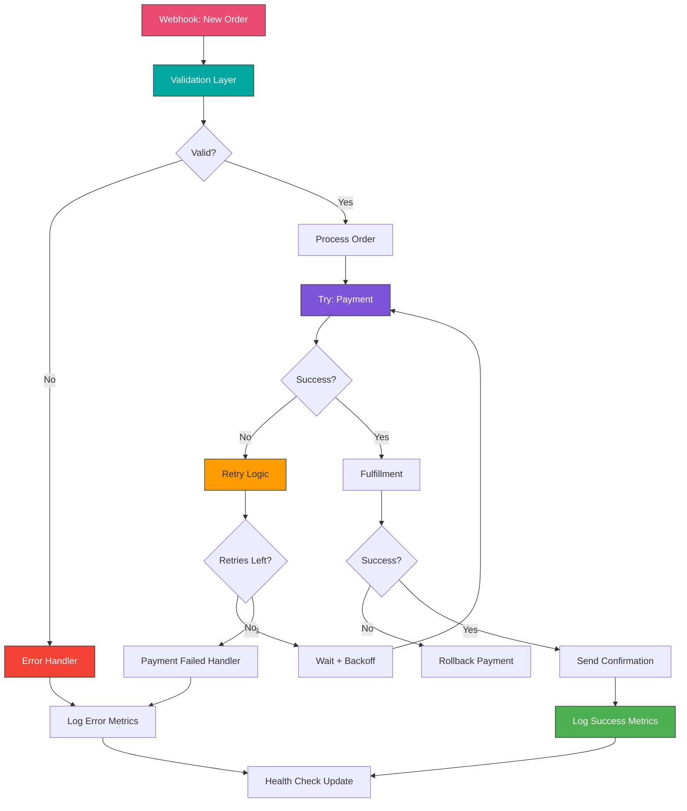

**Key Features:**

1. **Multi-Layer Validation**
2. **Retry with Exponential Backoff**
3. **Transaction Rollback on Failure**
4. **Comprehensive Logging**
5. **Real-time Monitoring**
6. **Error Categorization**
7. **Auto-recovery Mechanisms**
8. **Performance Tracking**

---

## Best Practices Summary

### Error Handling
- ✓ Use Error Trigger for global error handling
- ✓ Enable Continue on Fail for graceful degradation
- ✓ Categorize errors (network, auth, validation, etc.)
- ✓ Implement retry logic for transient failures
- ✓ Set maximum retry limits
- ✓ Log all errors with context

### Logging
- ✓ Use structured logging with consistent format
- ✓ Include timestamps, execution IDs, workflow names
- ✓ Redact sensitive data (passwords, API keys, PII)
- ✓ Use appropriate log levels (debug, info, warn, error)
- ✓ Store logs in searchable database
- ✓ Implement log rotation and retention

### Monitoring
- ✓ Set up health checks for critical workflows
- ✓ Monitor execution frequency and duration
- ✓ Track error rates and set thresholds
- ✓ Measure against SLA targets
- ✓ Create automated alerts
- ✓ Generate regular reports

### Reliability
- ✓ Design for failure (assume things will break)
- ✓ Implement circuit breakers
- ✓ Use fallback services
- ✓ Enable auto-recovery where possible
- ✓ Test error scenarios
- ✓ Document incident response procedures

### Maintenance
- ✓ Version control workflows
- ✓ Automated daily backups
- ✓ Document changes
- ✓ Test before deploying to production
- ✓ Monitor after deployments
- ✓ Keep workflows organized and documented

---

## Key Takeaways

- ✓ Error Trigger enables centralized error handling across all workflows
- ✓ Continue on Fail allows graceful degradation
- ✓ Proper logging is essential for debugging and auditing
- ✓ Monitoring prevents issues before they become critical
- ✓ Self-healing workflows reduce manual intervention
- ✓ Versioning and backups protect against data loss
- ✓ Structured error handling improves reliability

---

## Additional Resources

**n8n Documentation:**
- [Error Handling](https://docs.n8n.io/flow-logic/error-handling/)
- [Error Trigger](https://docs.n8n.io/integrations/builtin/core-nodes/n8n-nodes-base.errortrigger/)
- [Workflow Settings](https://docs.n8n.io/workflows/settings/)
- [Debugging](https://docs.n8n.io/integrations/builtin/core-nodes/n8n-nodes-base.debughelper/)

**Best Practices:**
- [Production Best Practices](https://docs.n8n.io/hosting/configuration/)
- [Security](https://docs.n8n.io/hosting/security/)
- [Scaling](https://docs.n8n.io/hosting/scaling/)

**Monitoring Tools:**
- Sentry (error tracking)
- Datadog (APM)
- Grafana (dashboards)
- PagerDuty (incident management)

---

## Next Steps

**Continue to:** [Module 6: Advanced Features and Techniques](../../module-06-advanced-features/README.md)

**Practice More:**
- Build error handler workflows
- Implement comprehensive logging
- Set up monitoring dashboards
- Create self-healing patterns
- Test failure scenarios
- Document your error handling strategy
