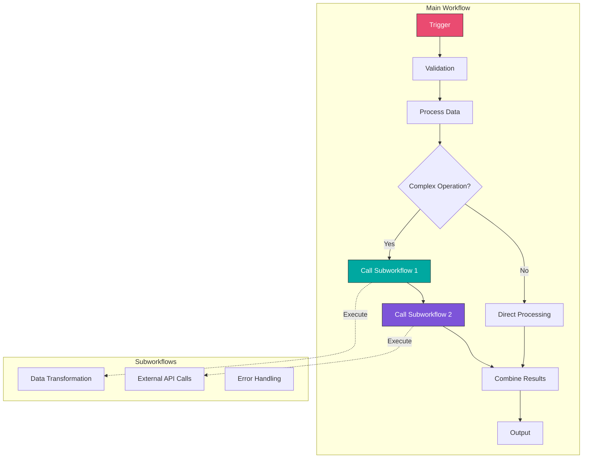

# Module 6: Advanced Features and Techniques

## Overview

Learn advanced n8n features including subworkflows, modularity, performance optimization, and scalability patterns. Build enterprise-grade workflow architectures.

**Duration:** 2 weeks (20-30 hours)

## Learning Objectives

- Create and use subworkflows effectively
- Build reusable workflow components
- Implement workflow templates and libraries
- Optimize workflow performance
- Handle large datasets efficiently
- Implement queuing and batching strategies
- Scale workflows for production use

## Module Contents

### [Week 9: Subworkflows and Modularity](./week-9/README.md)
- Execute Workflow node
- When to use subworkflows
- Parameter passing between workflows
- Building workflow libraries
- Documentation best practices
- Version control for workflows

### [Week 10: Performance and Scalability](./week-10/README.md)
- Performance profiling and optimization
- Batch processing strategies
- Queue management
- Memory optimization
- Concurrent execution patterns
- Database connection pooling
- Caching strategies

## Workflow Architecture Patterns

## Projects

1. **Multi-Workflow Application** - Modular system with shared components
2. **Reusable Validation Library** - Centralized data validation
3. **High-Volume Pipeline** - Process thousands of items efficiently
4. **Template Library** - Common workflow patterns
5. **Rate-Limited Integration** - Queue management system

## Key Topics

- Subworkflow patterns
- Workflow modularity
- Performance optimization
- Batch processing
- Memory management
- Scalability strategies

## Prerequisites

- Completed Modules 1-5
- Experience building complex workflows
- Understanding of performance concepts

## Next Steps

After completing this module, proceed to [Module 7: Enterprise Features and Self-Hosting](../module-07-enterprise/README.md)
