# Week 10: Performance and Scalability

## Learning Objectives

- Optimize workflow execution performance
- Handle large datasets efficiently
- Implement queuing and batching strategies
- Scale workflows for production environments
- Monitor and profile workflow performance
- Optimize database connections and API calls
- Implement caching strategies
- Design for high-volume processing

---

## Topics

### 1. Performance Profiling and Analysis

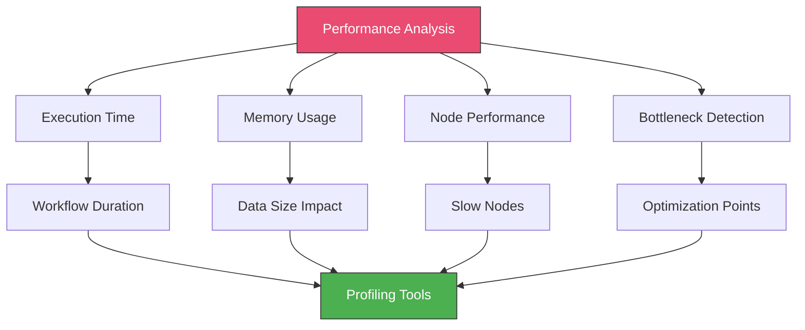

#### Understanding Execution Metrics

**Key Performance Indicators:**
```javascript
// Function: Calculate Performance Metrics
const { DateTime } = require('luxon');

// Get execution start time (from first node or Set node)
const startTime = DateTime.fromISO($('Start').first().json.startTime);
const endTime = DateTime.now();

// Calculate duration
const durationMs = endTime.diff(startTime, 'milliseconds').milliseconds;
const durationSeconds = durationMs / 1000;

// Get item counts
const inputItems = $('Start').all().length;
const outputItems = $input.all().length;

// Calculate throughput
const itemsPerSecond = outputItems / durationSeconds;

return {
  json: {
    performance: {
      // Timing
      startTime: startTime.toISO(),
      endTime: endTime.toISO(),
      durationMs: Math.round(durationMs),
      durationSeconds: Math.round(durationSeconds * 100) / 100,

      // Throughput
      inputItems,
      outputItems,
      itemsPerSecond: Math.round(itemsPerSecond * 100) / 100,

      // Efficiency
      itemsProcessedPercentage: Math.round((outputItems / inputItems) * 100),

      // Status
      status: durationSeconds < 5 ? 'fast' :
              durationSeconds < 30 ? 'acceptable' :
              durationSeconds < 60 ? 'slow' : 'critical'
    }
  }
};
```

**Measuring Node Performance:**
```javascript
// Function: Profile Node Execution
const nodeMetrics = [];

// You can track performance by adding timestamps before/after critical nodes
const nodes = [
  { name: 'Database Query', start: $json.dbQueryStart, end: $json.dbQueryEnd },
  { name: 'API Call', start: $json.apiCallStart, end: $json.apiCallEnd },
  { name: 'Data Transform', start: $json.transformStart, end: $json.transformEnd }
];

for (const node of nodes) {
  if (node.start && node.end) {
    const duration = new Date(node.end) - new Date(node.start);
    nodeMetrics.push({
      node: node.name,
      durationMs: duration,
      percentage: 0 // Calculate after totals
    });
  }
}

// Calculate percentages
const totalDuration = nodeMetrics.reduce((sum, m) => sum + m.durationMs, 0);
nodeMetrics.forEach(m => {
  m.percentage = Math.round((m.durationMs / totalDuration) * 100);
});

// Sort by duration (slowest first)
nodeMetrics.sort((a, b) => b.durationMs - a.durationMs);

return {
  json: {
    metrics: nodeMetrics,
    totalDurationMs: totalDuration,
    slowestNode: nodeMetrics[0]
  }
};
```

**Adding Timestamps to Track Performance:**
```javascript
// Add this pattern throughout your workflow

// Before expensive operation
const beforeOperation = {
  ...json,
  timestamps: {
    ...$json.timestamps,
    operationStart: new Date().toISOString()
  }
};

// After expensive operation
const afterOperation = {
  ...json,
  timestamps: {
    ...$json.timestamps,
    operationEnd: new Date().toISOString()
  }
};

// Calculate duration
const start = new Date($json.timestamps.operationStart);
const end = new Date($json.timestamps.operationEnd);
const durationMs = end - start;

console.log(`Operation took ${durationMs}ms`);
```

---

### 2. Optimizing Data Processing

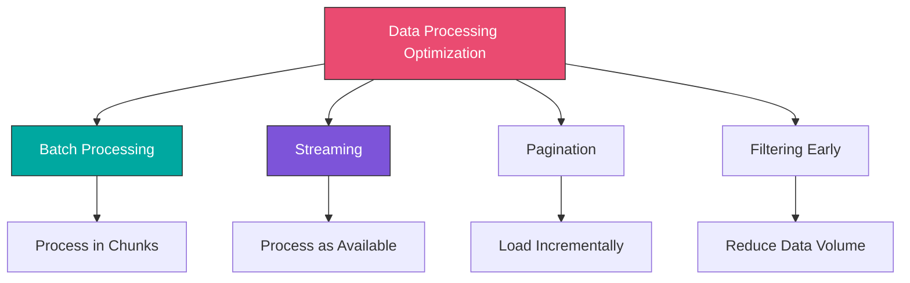

#### Batch Processing Pattern

**Problem:** Processing 10,000 items at once overwhelms memory

**Solution:** Process in batches of manageable size


**Implementation:**
```javascript
// Node 1: HTTP Request or Database Query - Get Total Count
// Example: SELECT COUNT(*) FROM orders WHERE status = 'pending'

// Node 2: Function - Calculate Batches
const totalItems = $json.count;
const batchSize = 100; // Process 100 items at a time
const totalBatches = Math.ceil(totalItems / batchSize);

const batches = [];
for (let i = 0; i < totalBatches; i++) {
  batches.push({
    json: {
      batchNumber: i + 1,
      offset: i * batchSize,
      limit: batchSize,
      totalBatches
    }
  });
}

return batches;

// Node 3: Loop Over Items (from batches array)

// Node 4: Database Query - Fetch Batch
// SELECT * FROM orders WHERE status = 'pending'
// LIMIT {{$json.limit}} OFFSET {{$json.offset}}

// Node 5: Function - Process Batch
const items = $input.all();
const batchNumber = $('Loop Over Items').item.json.batchNumber;
const totalBatches = $('Loop Over Items').item.json.totalBatches;

console.log(`Processing batch ${batchNumber} of ${totalBatches} (${items.length} items)`);

// Process each item in the batch
const processed = items.map(item => {
  const data = item.json;

  // Your processing logic here
  return {
    json: {
      id: data.id,
      processed: true,
      processedAt: new Date().toISOString()
    }
  };
});

return processed;

// Node 6: Database - Update Batch
// Bulk update the processed items

// Node 7: Function - Log Progress
const batchNumber = $('Loop Over Items').item.json.batchNumber;
const totalBatches = $('Loop Over Items').item.json.totalBatches;
const progress = Math.round((batchNumber / totalBatches) * 100);

console.log(`Progress: ${progress}% (Batch ${batchNumber}/${totalBatches})`);

return {
  json: {
    batchNumber,
    totalBatches,
    progress,
    completed: batchNumber === totalBatches
  }
};

// Loop back to step 3 until all batches processed
```

**Optimized Batch with Split In Batches Node:**
```
1. Database Query: Get all items (or use pagination)
2. Split In Batches Node:
   - Batch Size: 100
   - Options:
     - Reset: No (process all batches)
3. Function: Process Batch Items
4. Database/API: Save Results
5. Loop back until done
```

---

#### Pagination Pattern

**Efficient API Pagination:**
```javascript
// Pattern: Paginated API Calls

// Node 1: Set - Initialize
return {
  json: {
    page: 1,
    perPage: 100,
    hasMore: true,
    allResults: []
  }
};

// Node 2: HTTP Request - Fetch Page
// GET /api/items?page={{$json.page}}&per_page={{$json.perPage}}

// Node 3: Function - Process Page and Check for More
const response = $input.first().json;
const currentState = $('Set').item.json;

// Add results to accumulated data
const allResults = [
  ...currentState.allResults,
  ...response.items
];

// Check if there are more pages
const hasMore = response.items.length === currentState.perPage;

console.log(`Fetched page ${currentState.page}: ${response.items.length} items`);
console.log(`Total items so far: ${allResults.length}`);

return {
  json: {
    page: currentState.page + 1,
    perPage: currentState.perPage,
    hasMore,
    allResults,
    currentPageCount: response.items.length,
    totalCount: allResults.length
  }
};

// Node 4: IF - Has More Pages?
// Condition: {{$json.hasMore}} === true
// True: Loop back to Node 2
// False: Continue to final processing

// Node 5: Function - Final Results
return {
  json: {
    totalItems: $json.allResults.length,
    items: $json.allResults
  }
};
```

**Cursor-Based Pagination (more efficient):**
```javascript
// Node 1: Set - Initialize
return {
  json: {
    cursor: null,
    hasMore: true,
    allResults: []
  }
};

// Node 2: HTTP Request - Fetch Page
// GET /api/items?cursor={{$json.cursor}}&limit=100

// Node 3: Function - Process and Update Cursor
const response = $input.first().json;
const currentState = $('Set').item.json;

const allResults = [
  ...currentState.allResults,
  ...response.data
];

return {
  json: {
    cursor: response.nextCursor, // Next page cursor from API
    hasMore: !!response.nextCursor,
    allResults,
    currentPageCount: response.data.length,
    totalCount: allResults.length
  }
};

// Node 4: IF - Has More
// Loop if hasMore === true
```

---

#### Early Filtering

**Anti-pattern (Slow):**
```javascript
// ✗ Bad: Fetch all data, then filter
1. Database Query: SELECT * FROM orders (returns 100,000 rows)
2. Function: Filter where status = 'pending' (process 100,000 items)
3. Result: 500 pending orders
```

**Optimized Pattern (Fast):**
```javascript
// ✓ Good: Filter at the source
1. Database Query: SELECT * FROM orders WHERE status = 'pending' (returns 500 rows)
2. Function: Process 500 items
3. Result: 500 orders

// Reduces:
// - Database transfer: 100,000 rows → 500 rows (200x faster)
// - Memory usage: 99.5% reduction
// - Processing time: 200x faster
```

**Filter Early in Workflows:**
```javascript
// After HTTP Request or Database Query
// Add IF node to filter immediately

// IF Node: Filter Criteria
{{$json.status}} === "active" AND {{$json.amount}} > 100

// Only process items that match criteria
// Discard others early
```

---

### 3. Database Optimization

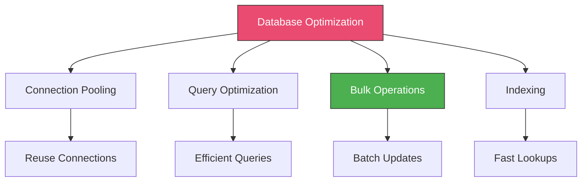

#### Connection Pooling

**n8n Database Configuration:**
```bash
# Environment variables for connection pooling
N8N_DB_POSTGRESDB_POOL_SIZE=10
N8N_DB_POSTGRESDB_POOL_SIZE_MIN=2
N8N_DB_POSTGRESDB_POOL_SIZE_MAX=20
```

**Reuse Database Credentials:**
```
✓ Create one credential object for each database
✓ Reference the same credential in all nodes
✓ n8n automatically manages connection pooling
✗ Don't create new credentials for each workflow
```

#### Query Optimization

**Inefficient Query:**
```sql
-- ✗ Bad: Returns all columns, no indexes used
SELECT * FROM orders
WHERE customer_email = 'user@example.com'
ORDER BY created_at DESC;

-- Problems:
-- - SELECT * returns unnecessary data
-- - No index on customer_email (full table scan)
-- - Sorting large dataset
```

**Optimized Query:**
```sql
-- ✓ Good: Specific columns, indexed fields, limited results
SELECT id, order_number, total, created_at
FROM orders
WHERE customer_id = 12345  -- Use indexed foreign key, not email
ORDER BY created_at DESC
LIMIT 100;

-- Benefits:
-- - Only necessary columns
-- - Uses index on customer_id
-- - Limits results
```

**Use Indexes:**
```sql
-- Create indexes on frequently queried fields
CREATE INDEX idx_orders_customer_id ON orders(customer_id);
CREATE INDEX idx_orders_status ON orders(status);
CREATE INDEX idx_orders_created_at ON orders(created_at);

-- Composite index for common query patterns
CREATE INDEX idx_orders_status_created ON orders(status, created_at);
```

**Explain Query Performance:**
```sql
-- Analyze query performance
EXPLAIN ANALYZE
SELECT id, order_number, total
FROM orders
WHERE status = 'pending'
AND created_at > NOW() - INTERVAL '7 days';

-- Look for:
-- - "Seq Scan" (bad) vs "Index Scan" (good)
-- - Execution time
-- - Rows scanned vs rows returned
```

#### Bulk Operations

**Anti-pattern (Slow):**
```javascript
// ✗ Bad: Individual updates in a loop
// Processing 1000 items = 1000 database queries

// Loop over 1000 items
for (const item of items) {
  await db.query(
    'UPDATE orders SET status = $1 WHERE id = $2',
    ['processed', item.id]
  );
}

// Total time: 1000 queries × 10ms = 10 seconds
```

**Optimized Pattern (Fast):**
```javascript
// ✓ Good: Bulk update in one query
// Processing 1000 items = 1 database query

const ids = items.map(item => item.id);

await db.query(`
  UPDATE orders
  SET status = 'processed',
      updated_at = NOW()
  WHERE id = ANY($1)
`, [ids]);

// Total time: 1 query × 50ms = 50ms (200x faster!)
```

**Bulk Insert:**
```javascript
// Function: Prepare Bulk Insert
const items = $input.all();

// Create values array for bulk insert
const values = items.map((item, index) => {
  const data = item.json;
  const paramOffset = index * 4; // 4 columns
  return `($${paramOffset + 1}, $${paramOffset + 2}, $${paramOffset + 3}, $${paramOffset + 4})`;
}).join(',\n');

// Flatten all parameters
const params = items.flatMap(item => [
  item.json.customer_id,
  item.json.order_number,
  item.json.total,
  item.json.status
]);

const query = `
  INSERT INTO orders (customer_id, order_number, total, status)
  VALUES ${values}
  ON CONFLICT (order_number) DO UPDATE
  SET total = EXCLUDED.total,
      status = EXCLUDED.status
`;

return {
  json: {
    query,
    params,
    itemCount: items.length
  }
};

// Next Node: PostgreSQL node
// Operation: Execute Query
// Query: {{$json.query}}
// Query Parameters: {{$json.params}}
```

---

### 4. API Call Optimization

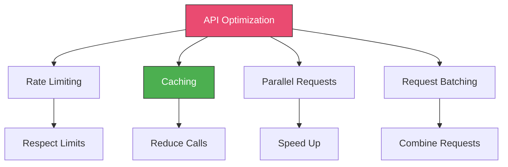

#### Rate Limit Handling

**Problem:** API allows 100 requests/minute, need to process 1000 items

**Solution 1: Queue with Delays**
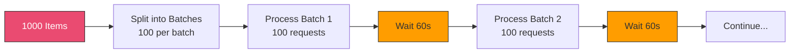

**Implementation:**
```javascript
// Node 1: Function - Calculate Rate Limit Batches
const items = $input.all();
const rateLimit = 100; // 100 requests per minute
const timePeriod = 60; // seconds

const batches = [];
for (let i = 0; i < items.length; i += rateLimit) {
  batches.push({
    json: {
      batchNumber: batches.length + 1,
      items: items.slice(i, i + rateLimit),
      itemCount: Math.min(rateLimit, items.length - i),
      totalItems: items.length,
      waitAfter: i + rateLimit < items.length // Wait after batch if more exist
    }
  });
}

return batches;

// Node 2: Loop Over Items (batches)

// Node 3: Function - Process Batch
const batch = $json;
console.log(`Processing batch ${batch.batchNumber}: ${batch.itemCount} items`);

return batch.items;

// Node 4: Split In Batches - Process items

// Node 5: HTTP Request - API Call
// Process each item

// Node 6: Function - Check if Wait Needed
const shouldWait = $('Loop Over Items').item.json.waitAfter;

return {
  json: {
    shouldWait,
    waitSeconds: 60
  }
};

// Node 7: IF - Should Wait?
// True: Wait Node (60 seconds)
// False: Continue

// Node 8: Loop back to process next batch
```

**Solution 2: Token Bucket Algorithm**
```javascript
// Function: Token Bucket Rate Limiter
const STATE_KEY = 'rate_limiter_tokens';

// Rate limit config
const maxTokens = 100;      // Max requests per period
const refillRate = 100;     // Tokens per minute
const refillInterval = 60;  // seconds

// Get current state (from database or global variable)
let state = await getState(STATE_KEY) || {
  tokens: maxTokens,
  lastRefill: Date.now()
};

// Refill tokens based on time passed
const now = Date.now();
const secondsPassed = (now - state.lastRefill) / 1000;
const tokensToAdd = Math.floor((secondsPassed / refillInterval) * refillRate);

if (tokensToAdd > 0) {
  state.tokens = Math.min(maxTokens, state.tokens + tokensToAdd);
  state.lastRefill = now;
}

// Check if we have tokens available
const itemsToProcess = $input.all();
const requestsNeeded = itemsToProcess.length;

if (state.tokens >= requestsNeeded) {
  // Process now
  state.tokens -= requestsNeeded;
  await setState(STATE_KEY, state);

  return {
    json: {
      canProcess: true,
      items: itemsToProcess,
      tokensRemaining: state.tokens
    }
  };
} else {
  // Need to wait
  const waitSeconds = Math.ceil(
    ((requestsNeeded - state.tokens) / refillRate) * refillInterval
  );

  return {
    json: {
      canProcess: false,
      waitSeconds,
      tokensAvailable: state.tokens,
      tokensNeeded: requestsNeeded
    }
  };
}
```

#### Caching Strategy

**Cache Frequently Accessed Data:**
```javascript
// Function: Get Data with Cache
const cacheKey = `customer_${$json.customerId}`;
const cacheDuration = 300; // 5 minutes in seconds

// Check cache first (Redis, database, or in-memory)
const cached = await getCache(cacheKey);

if (cached && cached.timestamp > Date.now() - (cacheDuration * 1000)) {
  console.log('Cache hit:', cacheKey);
  return {
    json: {
      ...cached.data,
      fromCache: true
    }
  };
}

// Cache miss - fetch from source
console.log('Cache miss:', cacheKey);

// Continue to API call...
// After getting data, cache it:
await setCache(cacheKey, {
  data: apiResponse,
  timestamp: Date.now()
});

return {
  json: {
    ...apiResponse,
    fromCache: false
  }
};
```

**Cache Pattern Workflow:**
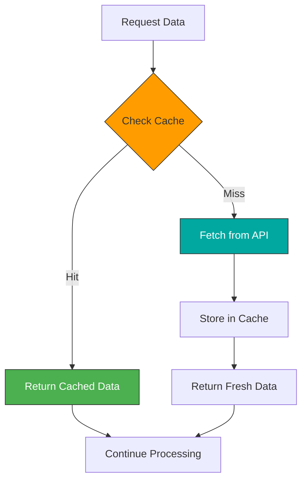

**Cache Implementation with Redis:**
```javascript
// Node 1: Redis - Get Cached Data
// Command: GET
// Key: customer_{{$json.customerId}}

// Node 2: IF - Cache Exists
// Condition: {{$json}} !== null

// True Path: Use cached data
// Node 3: Function - Parse Cached Data
const cached = JSON.parse($json);
return {
  json: {
    ...cached,
    fromCache: true
  }
};

// False Path: Fetch fresh data
// Node 4: HTTP Request - Fetch from API

// Node 5: Redis - Store in Cache
// Command: SETEX (set with expiration)
// Key: customer_{{$json.customerId}}
// Value: {{JSON.stringify($json)}}
// TTL: 300 (5 minutes)

// Node 6: Return fresh data
```

#### Parallel API Requests

**Sequential (Slow):**
```javascript
// ✗ Bad: Sequential API calls
// Total time: 3 × 1 second = 3 seconds

Request 1 → Wait 1s →
Request 2 → Wait 1s →
Request 3 → Wait 1s →
Done (3s total)
```

**Parallel (Fast):**
```javascript
// ✓ Good: Parallel API calls
// Total time: 1 second (max of all requests)

Request 1 ↘
Request 2 → Wait 1s → Done (1s total)
Request 3 ↗
```

**Implementation:**
```
1. Function: Create parallel requests
   Return array of requests:
   [
     { url: '/api/customer/123' },
     { url: '/api/orders/123' },
     { url: '/api/preferences/123' }
   ]

2. Split In Batches (Split Into Items)

3. HTTP Request: {{$json.url}}
   (All requests execute in parallel)

4. Wait / Merge: Combine results
```

**Parallel with Limit:**
```javascript
// Function: Batch parallel requests
// Limit to 10 concurrent requests to avoid overwhelming server

const items = $input.all();
const concurrencyLimit = 10;
const batches = [];

for (let i = 0; i < items.length; i += concurrencyLimit) {
  batches.push({
    json: {
      batchNumber: batches.length + 1,
      items: items.slice(i, i + concurrencyLimit)
    }
  });
}

return batches;

// Process each batch in parallel (10 at a time)
```

---

### 5. Memory Optimization

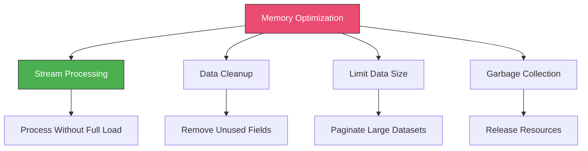

#### Remove Unnecessary Data

**Anti-pattern:**
```javascript
// ✗ Bad: Carry all data through workflow
return {
  json: {
    ...allOriginalData,        // 100 fields
    ...intermediateCalculations, // 50 fields
    ...debugInformation,        // 30 fields
    result: finalResult         // 5 fields
  }
};

// Memory usage grows with each node
```

**Optimized:**
```javascript
// ✓ Good: Keep only necessary data
return {
  json: {
    id: $json.id,           // Keep identifier
    result: finalResult,    // Keep result
    metadata: {             // Keep minimal metadata
      processedAt: new Date().toISOString()
    }
  }
};

// Memory usage stays minimal
```

**Clean Data Between Stages:**
```javascript
// After expensive processing, clean up
const result = performExpensiveOperation($json);

// Return only what's needed for next steps
return {
  json: {
    id: $json.id,
    result: result,
    // Don't include intermediate data
  }
};
```

#### Stream Processing Pattern

**Problem:** Loading 1GB file into memory

**Solution:** Process file in chunks
```javascript
// Instead of loading entire file:
// ✗ const allData = await readFile('large.json'); // 1GB in memory

// Stream and process chunks:
// ✓ Read → Process → Write → Release
// Only ~10MB in memory at a time

// Implementation with pagination/batching (shown earlier)
```

---

### 6. Queue Management

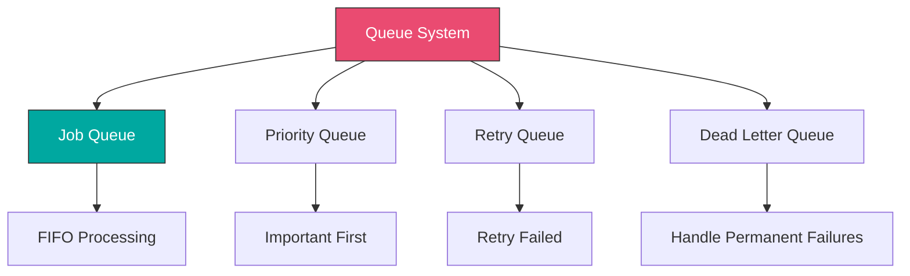

#### Simple Queue Pattern

**Use Case:** Handle variable load without overwhelming system

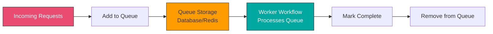

**Queue Writer Workflow:**
```javascript
// Webhook receives requests

// Node 1: Webhook Trigger

// Node 2: Function - Create Queue Item
return {
  json: {
    queueId: `job_${Date.now()}_${Math.random().toString(36).substr(2, 9)}`,
    payload: $json,
    priority: $json.priority || 'normal',
    status: 'pending',
    createdAt: new Date().toISOString(),
    attempts: 0,
    maxAttempts: 3
  }
};

// Node 3: Database - Insert into Queue
// INSERT INTO job_queue (queue_id, payload, priority, status, created_at, attempts)
// VALUES (...)

// Node 4: Return Response
return {
  json: {
    success: true,
    queueId: $json.queueId,
    message: 'Job queued for processing'
  }
};
```

**Queue Worker Workflow:**
```javascript
// Runs on schedule (e.g., every 30 seconds)

// Node 1: Schedule Trigger - Every 30 seconds

// Node 2: Database - Get Pending Jobs
// SELECT * FROM job_queue
// WHERE status = 'pending'
// AND attempts < max_attempts
// ORDER BY
//   CASE priority
//     WHEN 'high' THEN 1
//     WHEN 'normal' THEN 2
//     WHEN 'low' THEN 3
//   END,
//   created_at ASC
// LIMIT 10; -- Process 10 jobs per run

// Node 3: IF - Has Jobs
// {{$json.length}} > 0

// Node 4: Loop Over Items

// Node 5: Database - Mark as Processing
// UPDATE job_queue
// SET status = 'processing',
//     started_at = NOW(),
//     attempts = attempts + 1
// WHERE queue_id = '{{$json.queueId}}'

// Node 6: Function - Process Job
const job = $json;

try {
  // Your processing logic here
  const result = await processJob(job.payload);

  return {
    json: {
      queueId: job.queueId,
      status: 'completed',
      result: result,
      completedAt: new Date().toISOString()
    }
  };
} catch (error) {
  return {
    json: {
      queueId: job.queueId,
      status: job.attempts >= job.maxAttempts ? 'failed' : 'pending',
      error: error.message,
      failedAt: new Date().toISOString()
    }
  };
}

// Node 7: Database - Update Status
// UPDATE job_queue
// SET status = '{{$json.status}}',
//     result = '{{JSON.stringify($json.result)}}',
//     error = '{{$json.error}}',
//     completed_at = '{{$json.completedAt}}'
// WHERE queue_id = '{{$json.queueId}}'

// Node 8: Loop back for next job
```

**Queue Table Schema:**
```sql
CREATE TABLE job_queue (
  queue_id VARCHAR(255) PRIMARY KEY,
  payload JSONB NOT NULL,
  priority VARCHAR(20) DEFAULT 'normal',
  status VARCHAR(20) DEFAULT 'pending',
  created_at TIMESTAMP DEFAULT NOW(),
  started_at TIMESTAMP,
  completed_at TIMESTAMP,
  attempts INTEGER DEFAULT 0,
  max_attempts INTEGER DEFAULT 3,
  result JSONB,
  error TEXT
);

-- Indexes for performance
CREATE INDEX idx_queue_status ON job_queue(status);
CREATE INDEX idx_queue_priority ON job_queue(priority, created_at);
CREATE INDEX idx_queue_created ON job_queue(created_at);
```

---

### 7. n8n Queue Mode (Production Scaling)

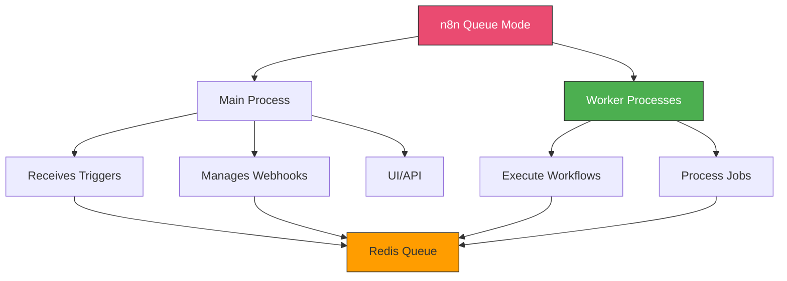

#### Enable Queue Mode

**Docker Compose Configuration:**
```yaml
version: '3.8'

services:
  # Redis for queue
  redis:
    image: redis:7-alpine
    restart: unless-stopped
    ports:
      - "6379:6379"

  # n8n main process
  n8n-main:
    image: n8nio/n8n
    restart: unless-stopped
    ports:
      - "5678:5678"
    environment:
      - N8N_HOST=0.0.0.0
      - N8N_PORT=5678
      - N8N_PROTOCOL=https
      - NODE_ENV=production
      # Queue mode configuration
      - EXECUTIONS_MODE=queue
      - QUEUE_BULL_REDIS_HOST=redis
      - QUEUE_BULL_REDIS_PORT=6379
      - QUEUE_BULL_REDIS_DB=0
      - QUEUE_HEALTH_CHECK_ACTIVE=true
    volumes:
      - n8n_data:/home/node/.n8n
    depends_on:
      - redis

  # n8n worker process 1
  n8n-worker-1:
    image: n8nio/n8n
    restart: unless-stopped
    command: worker
    environment:
      - NODE_ENV=production
      - EXECUTIONS_MODE=queue
      - QUEUE_BULL_REDIS_HOST=redis
      - QUEUE_BULL_REDIS_PORT=6379
      - QUEUE_BULL_REDIS_DB=0
    volumes:
      - n8n_data:/home/node/.n8n
    depends_on:
      - redis

  # n8n worker process 2
  n8n-worker-2:
    image: n8nio/n8n
    restart: unless-stopped
    command: worker
    environment:
      - NODE_ENV=production
      - EXECUTIONS_MODE=queue
      - QUEUE_BULL_REDIS_HOST=redis
      - QUEUE_BULL_REDIS_PORT=6379
      - QUEUE_BULL_REDIS_DB=0
    volumes:
      - n8n_data:/home/node/.n8n
    depends_on:
      - redis

  # Add more workers as needed
  # n8n-worker-3, n8n-worker-4, etc.

volumes:
  n8n_data:
```

**Benefits:**
- Separate triggers/webhooks from execution
- Scale workers independently
- Better resource utilization
- Improved reliability
- Handle high load

**Environment Variables:**
```bash
# Queue Configuration
EXECUTIONS_MODE=queue
QUEUE_BULL_REDIS_HOST=localhost
QUEUE_BULL_REDIS_PORT=6379
QUEUE_BULL_REDIS_DB=0
QUEUE_BULL_REDIS_PASSWORD=your_password
QUEUE_BULL_REDIS_TIMEOUT_THRESHOLD=10000

# Health Check
QUEUE_HEALTH_CHECK_ACTIVE=true
QUEUE_HEALTH_CHECK_PORT=5678

# Worker Configuration
EXECUTIONS_PROCESS=main  # For main process
EXECUTIONS_PROCESS=own   # For worker processes
```

---

## Hands-On Exercises

### [Exercise 1: Batch Processing System](./exercises/exercise-1-batch-processing.md)

Build an efficient batch processing workflow:
1. Load 10,000 records from database
2. Process in batches of 100
3. Track progress and timing
4. Handle errors gracefully
5. Generate performance report

**Learning Goals:**
- Implement batching
- Measure performance
- Optimize memory usage
- Progress tracking

---

### [Exercise 2: API Rate Limiter](./exercises/exercise-2-rate-limiter.md)

Create a rate-limited API integration:
1. Process 1000 API requests
2. Respect 100 requests/minute limit
3. Implement token bucket algorithm
4. Handle rate limit errors
5. Queue overflow handling

**Learning Goals:**
- Rate limiting
- Queue management
- Error handling
- Efficient scheduling

---

### [Exercise 3: Performance Optimization](./exercises/exercise-3-optimization.md)

Optimize an existing slow workflow:
1. Profile existing workflow
2. Identify bottlenecks
3. Implement caching
4. Optimize database queries
5. Add parallel processing
6. Measure improvements

**Learning Goals:**
- Performance profiling
- Bottleneck identification
- Optimization techniques
- Measuring improvements

---

## Real-World Project: High-Volume Order Processing

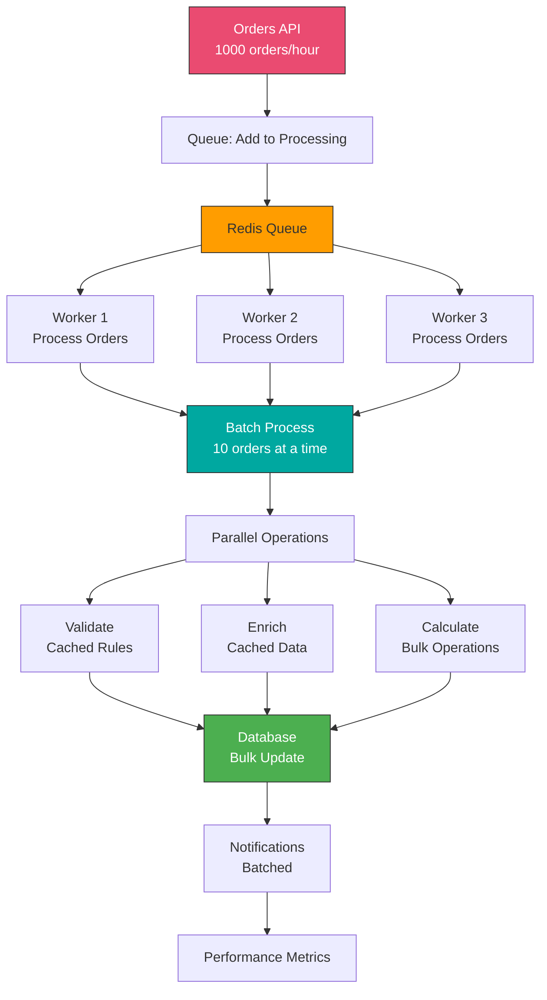

**Architecture Components:**

1. **Input Queue**: Redis-based queue for incoming orders
2. **Multiple Workers**: 3+ worker processes for parallel execution
3. **Batch Processing**: Process 10 orders at a time
4. **Caching Layer**: Cache validation rules and customer data
5. **Bulk Database Operations**: Update 10 orders in single query
6. **Performance Monitoring**: Track throughput and timing

**Performance Targets:**
- Process 1000 orders/hour (16-17 per minute)
- Average processing time: < 5 seconds per order
- Memory usage: < 500MB per worker
- Error rate: < 0.1%
- 99th percentile latency: < 10 seconds

**Key Optimizations:**
- Queue-based architecture
- Batch processing (10x faster than individual)
- Caching (100x faster for repeated data)
- Bulk database operations (50x faster)
- Parallel workers (3x throughput)
- Connection pooling (reuse connections)

---

## Best Practices Summary

### Performance
- ✓ Profile before optimizing
- ✓ Measure everything
- ✓ Process data in batches
- ✓ Use pagination for large datasets
- ✓ Filter data as early as possible
- ✓ Remove unnecessary data between nodes
- ✓ Use parallel processing when possible
- ✓ Set realistic performance targets

### Database
- ✓ Use connection pooling
- ✓ Optimize queries with indexes
- ✓ Use bulk operations (INSERT/UPDATE many rows)
- ✓ Fetch only needed columns
- ✓ Limit result sets
- ✓ Use EXPLAIN to analyze queries
- ✓ Cache frequently accessed data

### API Calls
- ✓ Respect rate limits
- ✓ Implement caching
- ✓ Use parallel requests (with limits)
- ✓ Batch API calls when possible
- ✓ Handle rate limit errors gracefully
- ✓ Use cursor-based pagination
- ✓ Monitor API usage

### Scalability
- ✓ Use queue mode in production
- ✓ Implement job queues for variable load
- ✓ Scale workers horizontally
- ✓ Monitor resource usage
- ✓ Plan for peak load
- ✓ Implement circuit breakers
- ✓ Set up auto-scaling

### Memory
- ✓ Process data in streams/batches
- ✓ Clean up unnecessary data
- ✓ Limit concurrent operations
- ✓ Monitor memory usage
- ✓ Avoid loading large files fully
- ✓ Use pagination for large datasets

---

## Key Takeaways

- ✓ Profile workflows to identify bottlenecks before optimizing
- ✓ Batch processing dramatically improves performance for large datasets
- ✓ Database optimization (indexes, bulk operations) has huge impact
- ✓ Caching reduces API calls and improves response time
- ✓ Queue mode enables horizontal scaling in production
- ✓ Rate limiting prevents overwhelming external services
- ✓ Parallel processing speeds up independent operations
- ✓ Memory management is critical for large-scale workflows

---

## Additional Resources

**n8n Documentation:**
- [Scaling n8n](https://docs.n8n.io/hosting/scaling/)
- [Queue Mode](https://docs.n8n.io/hosting/scaling/queue-mode/)
- [Performance Tips](https://docs.n8n.io/workflows/best-practices/)
- [Environment Variables](https://docs.n8n.io/hosting/configuration/)

**Database Optimization:**
- PostgreSQL Performance Tuning
- MySQL Query Optimization
- MongoDB Indexing Guide

**Caching:**
- Redis Documentation
- Cache Invalidation Strategies
- Cache-Aside Pattern

**Monitoring:**
- n8n Execution Logs
- Performance Metrics
- APM Tools (Datadog, New Relic)

---

## Next Steps

**Continue to:** [Module 7: Enterprise Features and Self-Hosting](../../module-07-enterprise/README.md)

**Practice More:**
- Profile existing workflows
- Implement batch processing
- Set up queue mode
- Add caching layers
- Optimize database queries
- Load test your workflows
- Monitor performance metrics
- Scale horizontally

---

_Remember: Premature optimization is the root of all evil. Always profile first, then optimize the bottlenecks that matter. Focus on scalability patterns from the start for production systems._
