# Week 9: Subworkflows and Modularity

## Learning Objectives

- Create reusable workflow components
- Implement and optimize subworkflows
- Build workflow template libraries
- Organize complex multi-workflow projects
- Master parameter passing between workflows
- Design modular workflow architectures
- Document workflows effectively

---

## Topics

### 1. Introduction to Subworkflows

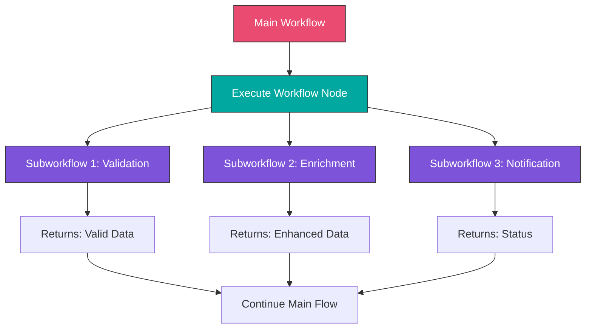

#### Why Use Subworkflows?

**Benefits:**
- **Reusability**: Write once, use everywhere
- **Maintainability**: Update logic in one place
- **Testability**: Test components independently
- **Organization**: Break complex workflows into manageable pieces
- **Collaboration**: Team members work on separate components
- **Versioning**: Manage component versions independently

**When to Use Subworkflows:**
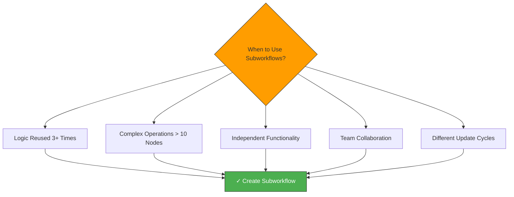

**Anti-patterns (Don't Use Subworkflows When):**
- Simple 2-3 node operations
- Logic used only once
- Tight coupling required
- Real-time performance critical
- Minimal complexity

---

### 2. Execute Workflow Node

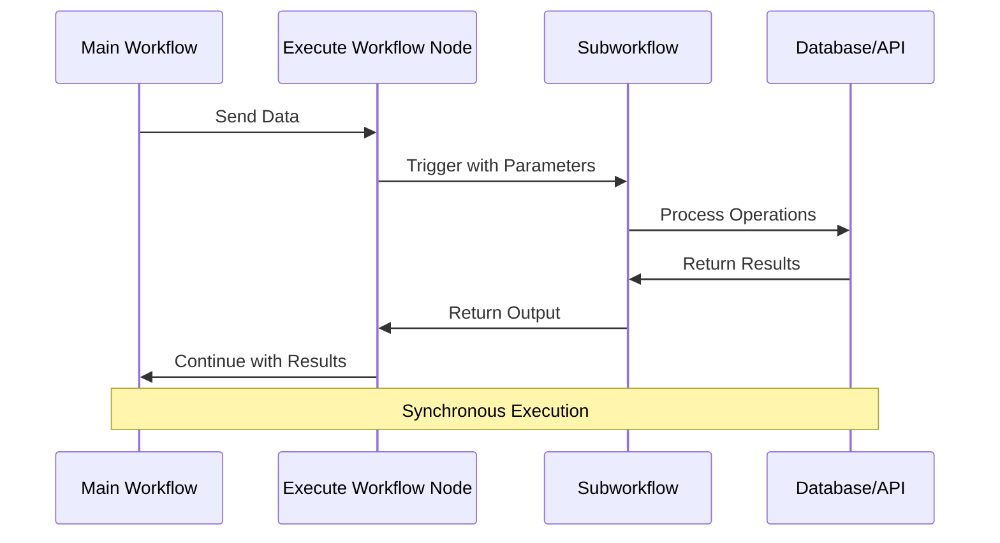

#### Execute Workflow Node Configuration

**Basic Setup:**
```
Execute Workflow Node Settings:
├── Source: Database (workflow stored in n8n)
├── Workflow: Select from list
├── Mode: Run workflow once
└── Options:
    ├── Wait for Sub-Workflow: Yes (default)
    └── Pass Input Data: Yes (default)
```

**Execution Modes:**

1. **Run Once (Default)**
```javascript
// Main workflow sends one item
{
  "customerId": "CUST001",
  "orderId": "ORD123"
}

// Subworkflow executes once with this data
// Returns one result
```

2. **Run Once for Each Item**
```javascript
// Main workflow sends multiple items
[
  { "customerId": "CUST001" },
  { "customerId": "CUST002" },
  { "customerId": "CUST003" }
]

// Subworkflow executes 3 times (once per item)
// Returns 3 results
```

3. **Run Once for All Items**
```javascript
// Main workflow sends multiple items
[
  { "customerId": "CUST001" },
  { "customerId": "CUST002" }
]

// Subworkflow receives all items at once
// Processes batch
// Returns aggregated result
```

---

#### Parameter Passing

**Passing Data to Subworkflow:**

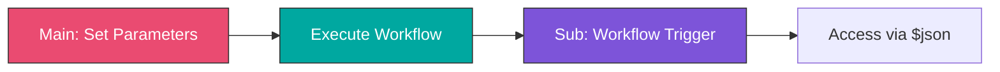

**Main Workflow - Prepare Data:**
```javascript
// Function node before Execute Workflow
return {
  json: {
    // Parameters for subworkflow
    customerId: $json.customerId,
    action: 'validate',
    options: {
      strict: true,
      includeHistory: true
    },
    // Any data structure you need
    metadata: {
      source: 'order_processing',
      timestamp: new Date().toISOString(),
      requestId: $execution.id
    }
  }
};
```

**Subworkflow - Receive Data:**
```javascript
// Function node in subworkflow (after trigger)
// Access data passed from main workflow
const params = $json;

console.log('Received params:', {
  customerId: params.customerId,
  action: params.action,
  strict: params.options?.strict
});

// Use the parameters
return {
  json: {
    customerId: params.customerId,
    action: params.action,
    // Process based on parameters...
  }
};
```

**Return Data to Main Workflow:**
```javascript
// Last node in subworkflow
// This data returns to main workflow
return {
  json: {
    // Return status
    success: true,

    // Return processed data
    result: {
      customerId: $json.customerId,
      validated: true,
      score: 95
    },

    // Return metadata
    metadata: {
      processedAt: new Date().toISOString(),
      executionId: $execution.id,
      duration: $json.duration
    }
  }
};
```

**Main Workflow - Use Returned Data:**
```javascript
// Function node after Execute Workflow
const result = $json;

if (result.success) {
  console.log('Subworkflow succeeded');
  console.log('Validation score:', result.result.score);

  return {
    json: {
      customerId: result.result.customerId,
      status: 'validated',
      score: result.result.score
    }
  };
} else {
  console.log('Subworkflow failed');
  // Handle error
}
```

---

### 3. Common Subworkflow Patterns

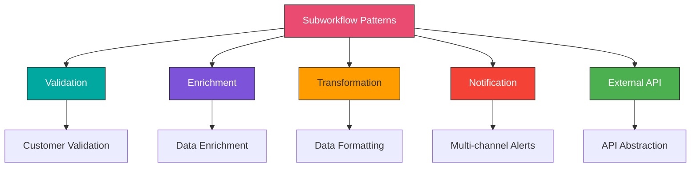

---

#### Pattern 1: Data Validation Subworkflow

**Purpose:** Centralize validation logic for reuse across multiple workflows

**Subworkflow: "Validate Customer Data"**

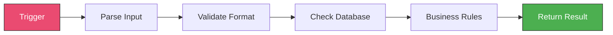

**Implementation:**
```javascript
// Node 1: Workflow Trigger (receives data from main workflow)

// Node 2: Function - Validate Format
const customer = $json;
const errors = [];
const warnings = [];

// Email validation
const emailRegex = /^[^\s@]+@[^\s@]+\.[^\s@]+$/;
if (!customer.email) {
  errors.push({ field: 'email', message: 'Email is required' });
} else if (!emailRegex.test(customer.email)) {
  errors.push({ field: 'email', message: 'Invalid email format' });
}

// Phone validation
const phoneRegex = /^\+?[1-9]\d{1,14}$/;
if (!customer.phone) {
  warnings.push({ field: 'phone', message: 'Phone number recommended' });
} else if (!phoneRegex.test(customer.phone)) {
  errors.push({ field: 'phone', message: 'Invalid phone format' });
}

// Required fields
const requiredFields = ['firstName', 'lastName', 'email'];
for (const field of requiredFields) {
  if (!customer[field] || customer[field].trim() === '') {
    errors.push({ field, message: `${field} is required` });
  }
}

return {
  json: {
    customer,
    validation: {
      formatValid: errors.length === 0,
      errors,
      warnings
    }
  }
};

// Node 3: IF - Format Valid?
// True path → Continue to database check
// False path → Return validation errors

// Node 4: Database Query - Check if customer exists
// Query: SELECT * FROM customers WHERE email = $json.customer.email

// Node 5: Function - Check Database Result
const dbResult = $input.first();
const customer = $json.customer;

if (dbResult?.json) {
  // Customer exists
  return {
    json: {
      customer,
      validation: {
        formatValid: true,
        exists: true,
        customerId: dbResult.json.id,
        errors: [],
        warnings: []
      }
    }
  };
} else {
  // New customer
  return {
    json: {
      customer,
      validation: {
        formatValid: true,
        exists: false,
        errors: [],
        warnings: []
      }
    }
  };
}

// Node 6: Function - Business Rules Validation
const customer = $json.customer;
const validation = $json.validation;

// Business rule: Check age
if (customer.age && customer.age < 18) {
  validation.errors.push({
    field: 'age',
    message: 'Customer must be 18 or older'
  });
}

// Business rule: Check country support
const supportedCountries = ['US', 'CA', 'UK', 'AU'];
if (customer.country && !supportedCountries.includes(customer.country)) {
  validation.warnings.push({
    field: 'country',
    message: `Country ${customer.country} has limited support`
  });
}

validation.isValid = validation.errors.length === 0;
validation.validatedAt = new Date().toISOString();

return {
  json: {
    customer,
    validation
  }
};

// Node 7: Return - Final validation result
```

**Usage in Main Workflow:**
```javascript
// Prepare data for validation subworkflow
return {
  json: {
    firstName: $json.first_name,
    lastName: $json.last_name,
    email: $json.email,
    phone: $json.phone,
    age: $json.age,
    country: $json.country
  }
};

// Execute Workflow: "Validate Customer Data"

// Check result
const validation = $json.validation;

if (validation.isValid) {
  console.log('✓ Customer validated');
  // Continue with order processing
} else {
  console.log('✗ Validation failed:', validation.errors);
  // Handle validation errors
}
```

---

#### Pattern 2: Data Enrichment Subworkflow

**Purpose:** Enhance data with information from multiple sources

**Subworkflow: "Enrich Customer Data"**

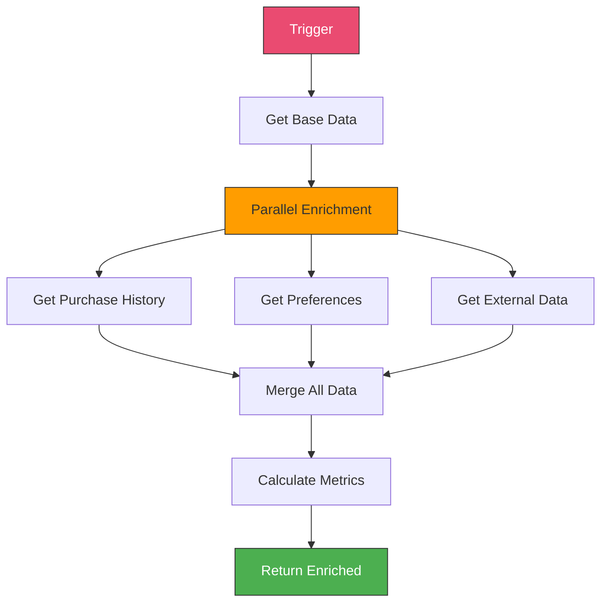

**Implementation:**
```javascript
// Node 1: Workflow Trigger

// Node 2: Function - Prepare Queries
const customerId = $json.customerId;

return [
  { json: { type: 'purchases', customerId } },
  { json: { type: 'preferences', customerId } },
  { json: { type: 'external', customerId } }
];

// Node 3: Split In Batches (Mode: Split Into Items)

// Node 4: Switch - Route by Type
// Route 0 (purchases): Get Purchase History
// Route 1 (preferences): Get Preferences
// Route 2 (external): Get External Data

// Branch 1: HTTP Request - Get Purchase History
// GET /api/customers/{{$json.customerId}}/purchases

// Branch 2: Database Query - Get Preferences
// SELECT * FROM preferences WHERE customer_id = {{$json.customerId}}

// Branch 3: HTTP Request - Get External Enrichment
// Third-party data enrichment API

// Node 5: Merge (Mode: Merge By Position)

// Node 6: Function - Combine All Data
const items = $input.all();
const customerId = $('Workflow Trigger').item.json.customerId;

const enrichedData = {
  customerId,

  // Purchase history
  purchases: items[0]?.json || [],
  purchaseMetrics: {
    totalPurchases: items[0]?.json?.length || 0,
    totalSpent: items[0]?.json?.reduce((sum, p) => sum + p.amount, 0) || 0,
    avgOrderValue: 0,
    lastPurchase: items[0]?.json?.[0]?.date || null
  },

  // Preferences
  preferences: items[1]?.json || {},

  // External data
  enrichment: items[2]?.json || {}
};

// Calculate metrics
if (enrichedData.purchaseMetrics.totalPurchases > 0) {
  enrichedData.purchaseMetrics.avgOrderValue =
    enrichedData.purchaseMetrics.totalSpent /
    enrichedData.purchaseMetrics.totalPurchases;
}

// Customer segment
enrichedData.segment = 'regular';
if (enrichedData.purchaseMetrics.totalSpent > 10000) {
  enrichedData.segment = 'vip';
} else if (enrichedData.purchaseMetrics.totalSpent > 1000) {
  enrichedData.segment = 'premium';
}

// Lifetime value score
enrichedData.ltv_score = Math.min(
  Math.floor(enrichedData.purchaseMetrics.totalSpent / 100),
  100
);

enrichedData.enrichedAt = new Date().toISOString();

return { json: enrichedData };
```

---

#### Pattern 3: Multi-Channel Notification Subworkflow

**Purpose:** Send notifications through multiple channels from one workflow

**Subworkflow: "Send Notification"**

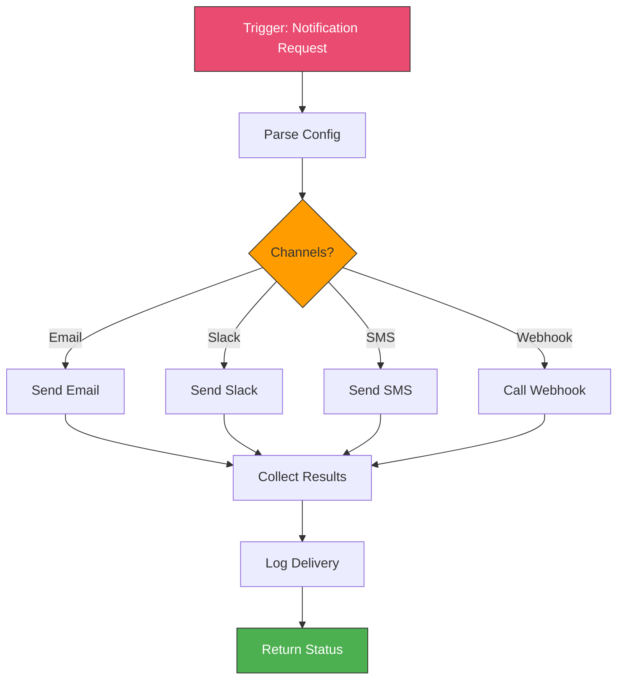

**Implementation:**
```javascript
// Node 1: Workflow Trigger

// Node 2: Function - Parse Notification Config
const config = $json;

// Create output for each enabled channel
const outputs = [];

if (config.channels.includes('email')) {
  outputs.push({
    json: {
      channel: 'email',
      to: config.email?.to || config.recipient,
      subject: config.subject,
      body: config.message,
      template: config.template
    }
  });
}

if (config.channels.includes('slack')) {
  outputs.push({
    json: {
      channel: 'slack',
      workspace: config.slack?.workspace,
      channel: config.slack?.channel || '#notifications',
      message: config.message,
      attachments: config.attachments
    }
  });
}

if (config.channels.includes('sms')) {
  outputs.push({
    json: {
      channel: 'sms',
      to: config.sms?.to || config.recipient,
      message: config.message.substring(0, 160) // SMS limit
    }
  });
}

if (config.channels.includes('webhook')) {
  outputs.push({
    json: {
      channel: 'webhook',
      url: config.webhook?.url,
      method: config.webhook?.method || 'POST',
      payload: {
        subject: config.subject,
        message: config.message,
        priority: config.priority
      }
    }
  });
}

return outputs;

// Node 3: Switch - Route by Channel
// Route by $json.channel

// Route 0 (email): Send Email
// Use Gmail/SendGrid node
// Settings: Continue on Fail = ON

// Route 1 (slack): Send Slack Message
// Use Slack node
// Settings: Continue on Fail = ON

// Route 2 (sms): Send SMS
// Use Twilio/SNS node
// Settings: Continue on Fail = ON

// Route 3 (webhook): Call Webhook
// Use HTTP Request node
// Settings: Continue on Fail = ON

// Node 4: Merge (wait for all branches)

// Node 5: Function - Collect Results
const results = $input.all();
const deliveryStatus = {
  sent: [],
  failed: [],
  timestamp: new Date().toISOString()
};

for (const result of results) {
  const item = result.json;

  if (result.error) {
    deliveryStatus.failed.push({
      channel: item.channel,
      error: result.error.message
    });
  } else {
    deliveryStatus.sent.push({
      channel: item.channel,
      status: 'delivered'
    });
  }
}

deliveryStatus.success = deliveryStatus.failed.length === 0;
deliveryStatus.partialSuccess =
  deliveryStatus.sent.length > 0 &&
  deliveryStatus.failed.length > 0;

return { json: deliveryStatus };

// Node 6: Database - Log Notification
// INSERT INTO notifications ...

// Node 7: Return final status
```

**Usage:**
```javascript
// In any workflow, call notification subworkflow
return {
  json: {
    channels: ['email', 'slack'],
    recipient: 'user@example.com',
    subject: 'Order Confirmation',
    message: 'Your order #12345 has been confirmed',
    priority: 'high',
    template: 'order_confirmation',
    slack: {
      channel: '#orders'
    },
    attachments: [
      { name: 'invoice.pdf', url: '...' }
    ]
  }
};

// Execute Workflow: "Send Notification"

// Check result
if ($json.success) {
  console.log('✓ All notifications sent');
} else if ($json.partialSuccess) {
  console.log('⚠ Some notifications failed:', $json.failed);
} else {
  console.log('✗ All notifications failed');
}
```

---

### 4. Organizing Workflow Libraries

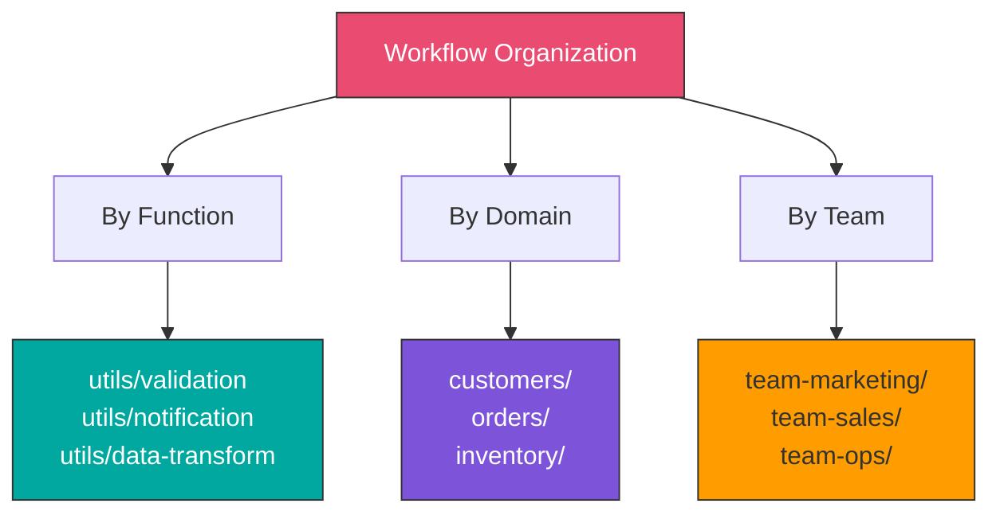

#### Naming Conventions

**Subworkflow Names:**
```
Pattern: [Type] [Action] [Entity]

Examples:
✓ util-validate-customer
✓ util-send-notification
✓ util-transform-order-data
✓ api-fetch-customer-data
✓ api-update-inventory
✓ process-payment-refund
✓ process-order-fulfillment
```

**Main Workflow Names:**
```
Pattern: [Domain] [Process/Action]

Examples:
✓ orders-new-order-processing
✓ customers-onboarding-flow
✓ inventory-stock-sync
✓ marketing-campaign-trigger
```

**Prefix System:**
```
util-    = Utility/helper workflows
api-     = API integration wrappers
process- = Business process workflows
cron-    = Scheduled jobs
webhook- = Webhook handlers
```

---

#### Workflow Documentation Template

**Inline Documentation (Use Sticky Notes):**
```markdown
# Subworkflow: Validate Customer Data

## Purpose
Validates customer data format, checks database,
and applies business rules.

## Input Parameters
{
  "firstName": string (required),
  "lastName": string (required),
  "email": string (required),
  "phone": string (optional),
  "age": number (optional),
  "country": string (optional)
}

## Output
{
  "customer": object,
  "validation": {
    "isValid": boolean,
    "exists": boolean,
    "customerId": string | null,
    "errors": array,
    "warnings": array,
    "validatedAt": timestamp
  }
}

## Usage Example
Execute Workflow: "util-validate-customer"
Input: { firstName: "John", lastName: "Doe", email: "john@example.com" }

## Dependencies
- Database: customers table
- None

## Version: 1.2.0
## Last Updated: 2024-01-15
## Owner: Team Operations
```

---

### 5. Advanced Patterns

#### Pattern: Workflow Chain

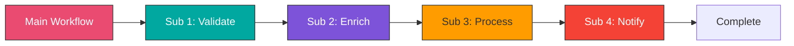

**Implementation:**
```javascript
// Main workflow orchestrates multiple subworkflows

// Step 1: Execute Workflow - Validate
// Returns: validation result

// Step 2: IF - Validation Passed
//   True → Continue
//   False → Error handler

// Step 3: Execute Workflow - Enrich
// Returns: enriched data

// Step 4: Execute Workflow - Process Business Logic
// Returns: processing result

// Step 5: Execute Workflow - Send Notifications
// Returns: notification status

// Step 6: Final logging
```

---

#### Pattern: Parallel Subworkflows

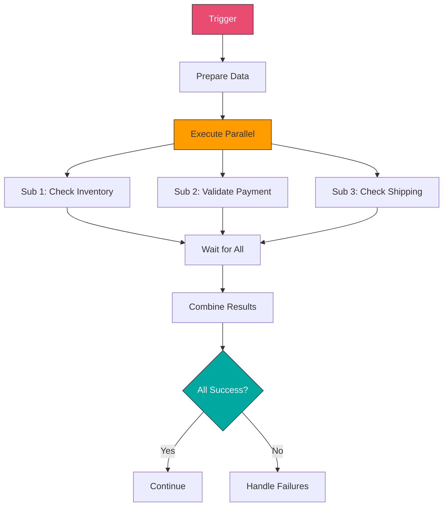

**Implementation:**
```javascript
// Node 1: Function - Create Parallel Requests
const order = $json;

return [
  {
    json: {
      workflow: 'check-inventory',
      params: {
        productId: order.productId,
        quantity: order.quantity
      }
    }
  },
  {
    json: {
      workflow: 'validate-payment',
      params: {
        customerId: order.customerId,
        amount: order.amount
      }
    }
  },
  {
    json: {
      workflow: 'check-shipping',
      params: {
        address: order.shippingAddress,
        weight: order.weight
      }
    }
  }
];

// Node 2: Split In Batches

// Node 3: Switch - Route to appropriate subworkflow
// Based on $json.workflow

// Execute different subworkflows in parallel

// Node 4: Merge - Wait for all

// Node 5: Function - Analyze Combined Results
const results = $input.all();
const summary = {
  inventoryOk: false,
  paymentOk: false,
  shippingOk: false,
  failures: []
};

for (const result of results) {
  if (result.json.workflow === 'check-inventory') {
    summary.inventoryOk = result.json.available;
    if (!result.json.available) {
      summary.failures.push('Inventory not available');
    }
  }
  else if (result.json.workflow === 'validate-payment') {
    summary.paymentOk = result.json.valid;
    if (!result.json.valid) {
      summary.failures.push('Payment validation failed');
    }
  }
  else if (result.json.workflow === 'check-shipping') {
    summary.shippingOk = result.json.available;
    if (!result.json.available) {
      summary.failures.push('Shipping not available');
    }
  }
}

summary.allOk =
  summary.inventoryOk &&
  summary.paymentOk &&
  summary.shippingOk;

return { json: summary };
```

---

#### Pattern: Conditional Subworkflow Execution

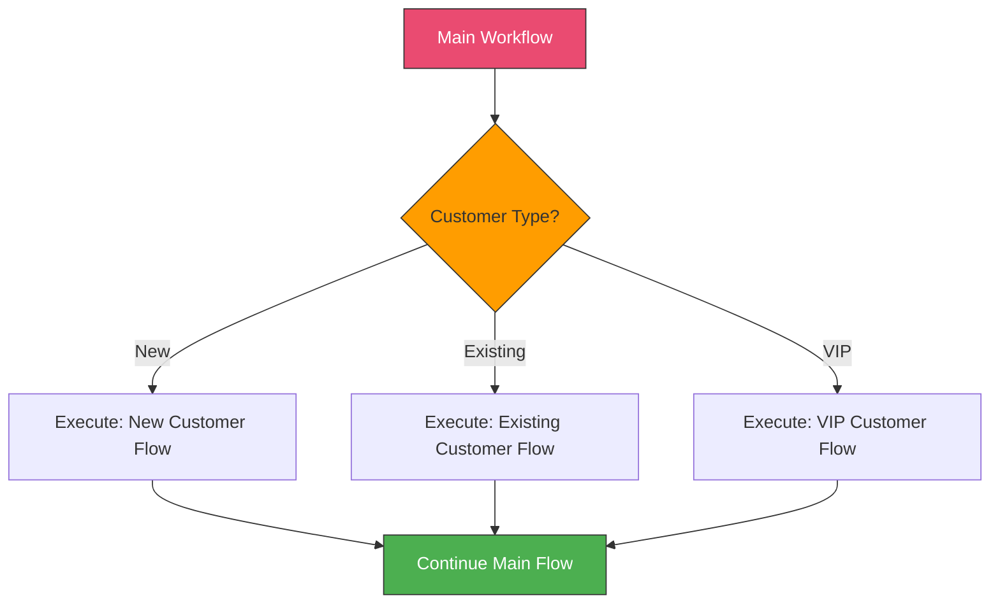

---

### 6. Performance Considerations

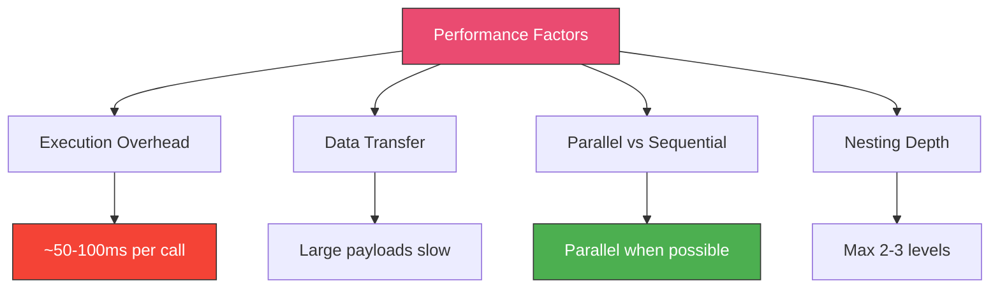

#### Optimization Tips

**1. Minimize Data Transfer:**
```javascript
// ✗ Bad: Pass entire object
return {
  json: {
    ...entireCustomerObject, // 50 fields
    ...entireOrderObject     // 100 fields
  }
};

// ✓ Good: Pass only needed data
return {
  json: {
    customerId: $json.customerId,
    orderId: $json.orderId,
    amount: $json.amount
  }
};
```

**2. Use Parallel Execution:**
```javascript
// ✗ Bad: Sequential subworkflows
Execute Workflow 1 → Wait → Execute Workflow 2 → Wait → Execute Workflow 3

// ✓ Good: Parallel subworkflows
Split → [Workflow 1, Workflow 2, Workflow 3] → Merge
```

**3. Limit Nesting:**
```javascript
// ✗ Bad: Deep nesting
Main → Sub1 → Sub2 → Sub3 → Sub4

// ✓ Good: Flat orchestration
Main → [Sub1, Sub2, Sub3, Sub4] (parallel)
```

**4. Cache Common Data:**
```javascript
// In subworkflow, cache frequently accessed data
const cache = $('Check Cache').item?.json?.data;

if (cache && cache.timestamp > Date.now() - 300000) { // 5 min
  return { json: cache };
} else {
  // Fetch fresh data and update cache
}
```

---

## Hands-On Exercises

### [Exercise 1: Build Validation Library](./exercises/exercise-1-validation-library.md)

Create reusable validation subworkflows:
1. Email validator subworkflow
2. Phone number validator subworkflow
3. Address validator subworkflow
4. Credit card validator subworkflow (format only)
5. Main workflow using all validators

**Learning Goals:**
- Create modular subworkflows
- Parameter passing
- Error handling in subworkflows
- Return standardized results

---

### [Exercise 2: Data Enrichment Pipeline](./exercises/exercise-2-enrichment-pipeline.md)

Build a multi-stage enrichment system:
1. Customer data enrichment subworkflow
2. Product data enrichment subworkflow
3. Order calculation subworkflow
4. Main order processing workflow
5. Parallel enrichment execution

**Learning Goals:**
- Parallel subworkflow execution
- Data merging from multiple sources
- Performance optimization
- Complex data transformation

---

### [Exercise 3: Notification Hub](./exercises/exercise-3-notification-hub.md)

Create a centralized notification system:
1. Email notification subworkflow
2. Slack notification subworkflow
3. SMS notification subworkflow
4. Push notification subworkflow
5. Main notification router workflow
6. Template management

**Learning Goals:**
- Multi-channel notifications
- Template-based messages
- Error handling and retries
- Delivery tracking

---

## Real-World Project: Modular Order Processing System

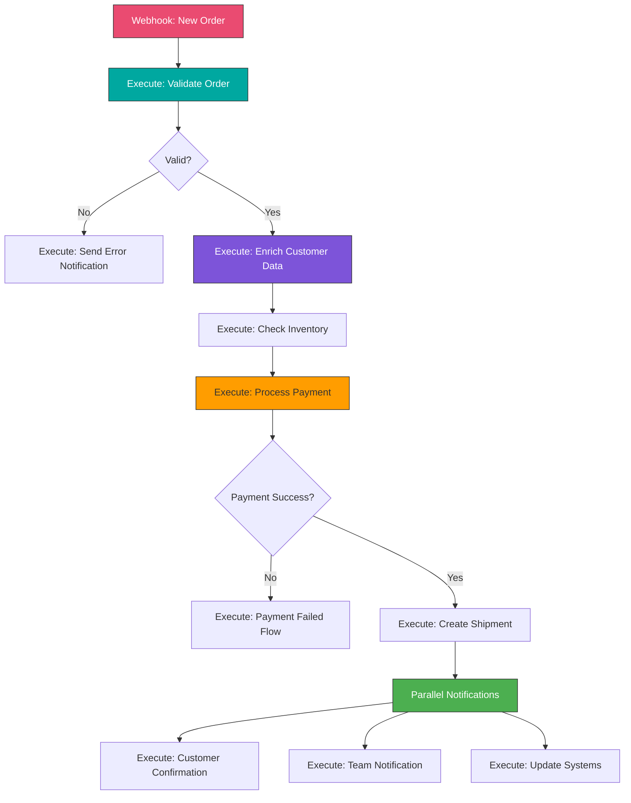

**Components to Build:**

1. **util-validate-order**: Validate order structure and data
2. **util-enrich-customer**: Enrich customer information
3. **api-check-inventory**: Check product availability
4. **api-process-payment**: Handle payment processing
5. **process-create-shipment**: Create shipping label
6. **util-send-notification**: Multi-channel notifications
7. **Main: order-processing**: Orchestrates all subworkflows

**Key Features:**
- Modular, reusable components
- Independent testing of each component
- Easy maintenance and updates
- Clear separation of concerns
- Comprehensive error handling
- Parallel execution where possible

---

## Best Practices Summary

### Design Principles
- ✓ Single Responsibility: Each subworkflow does one thing well
- ✓ DRY (Don't Repeat Yourself): Reuse common logic
- ✓ Clear Interfaces: Define clear input/output contracts
- ✓ Error Handling: Handle errors gracefully in subworkflows
- ✓ Documentation: Document purpose, parameters, and usage
- ✓ Versioning: Track subworkflow versions

### Organization
- ✓ Use consistent naming conventions
- ✓ Group related subworkflows
- ✓ Create workflow libraries by domain
- ✓ Document dependencies
- ✓ Maintain a workflow catalog

### Performance
- ✓ Minimize data transfer between workflows
- ✓ Use parallel execution when possible
- ✓ Limit nesting depth (max 2-3 levels)
- ✓ Cache frequently accessed data
- ✓ Monitor subworkflow execution times

### Testing
- ✓ Test subworkflows independently
- ✓ Use sample data for testing
- ✓ Validate input parameters
- ✓ Test error scenarios
- ✓ Document test cases

---

## Key Takeaways

- ✓ Subworkflows enable code reuse and better organization
- ✓ Execute Workflow node is the primary tool for modularity
- ✓ Pass only necessary data between workflows
- ✓ Use parallel execution for independent operations
- ✓ Maintain clear documentation and naming conventions
- ✓ Balance modularity with performance
- ✓ Design workflows with single responsibility principle

---

## Additional Resources

**n8n Documentation:**
- [Execute Workflow Node](https://docs.n8n.io/integrations/builtin/core-nodes/n8n-nodes-base.executeworkflow/)
- [Workflow Settings](https://docs.n8n.io/workflows/settings/)
- [Best Practices](https://docs.n8n.io/workflows/best-practices/)

**Workflow Patterns:**
- [Design Patterns](https://docs.n8n.io/workflows/components/)
- [Error Handling](https://docs.n8n.io/flow-logic/error-handling/)

**Community Resources:**
- n8n Community Templates
- Workflow Best Practices Forum
- Example Subworkflow Libraries

---

## Next Steps

**Continue to:** [Week 10: Performance and Scalability](../week-10/README.md)

**Practice More:**
- Build a library of utility subworkflows
- Refactor existing workflows into modular components
- Create a workflow documentation system
- Implement parallel execution patterns
- Build a workflow catalog for your team
- Measure and optimize subworkflow performance

---

_Remember: Good modular design makes workflows easier to maintain, test, and scale. Start with simple subworkflows and gradually build your library of reusable components._
