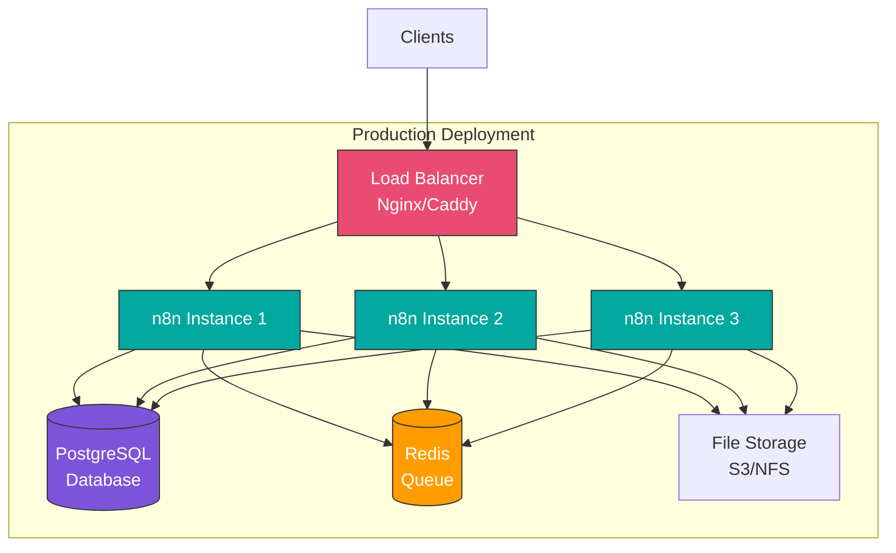
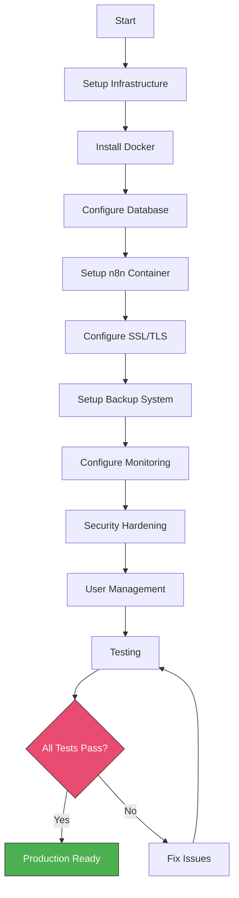

# Module 7: Enterprise Features and Self-Hosting

## Overview

Deploy n8n in production environments with proper security, user management, backup strategies, and compliance measures. Learn enterprise-grade deployment and administration.

**Duration:** 2 weeks (20-30 hours)

## Learning Objectives

- Deploy n8n in production environments
- Configure environment variables and settings
- Implement user management and RBAC
- Set up automated backup and disaster recovery
- Configure SSL/TLS and security measures
- Implement queue mode for horizontal scaling
- Ensure compliance and security best practices

## Module Contents

### [Week 11: Self-Hosting and Administration](./week-11/README.md)
- Docker deployment best practices
- Environment configuration
- Database setup and maintenance (PostgreSQL)
- SSL/TLS configuration with reverse proxies
- User management and permissions
- Queue mode architecture
- Backup and disaster recovery
- Monitoring and logging

### [Week 12: Security and Compliance](./week-12/README.md)
- Credential encryption and management
- Environment variable best practices
- API key rotation strategies
- Data privacy considerations
- Audit logging
- Compliance patterns (GDPR, HIPAA basics)
- Security hardening checklist
- Penetration testing basics

## Production Architecture

## Projects

1. **Production Deployment** - Full VPS setup with Docker
2. **Backup System** - Automated workflow and database backups
3. **Multi-User Environment** - Team workspace with permissions
4. **Security Audit** - Comprehensive security review
5. **HA Setup** - High-availability configuration

## Key Topics

### Self-Hosting
- Docker Compose setup
- Database configuration
- Reverse proxy setup
- SSL certificates
- Environment variables
- Queue mode

### Security
- Credential management
- Network security
- Access control
- Audit logging
- Compliance requirements

### Administration
- User management
- Backup strategies
- Monitoring setup
- Update procedures
- Troubleshooting

## Prerequisites

- Completed Modules 1-6
- Basic Linux system administration
- Understanding of Docker
- Networking knowledge

## Deployment Checklist

## Next Steps

After completing this module, proceed to [Module 8: Real-World Applications and Expert Patterns](../module-08-real-world/README.md)
