# Week 11: Self-Hosting and Administration - Visual Guides

This document contains all visual diagrams for Week 11 content.

## Table of Contents

1. [Docker Deployment Architecture](#docker-deployment-architecture)
2. [Environment Deployment Flow](#environment-deployment-flow)
3. [Database Architecture](#database-architecture)
4. [SSL/TLS Configuration Flow](#ssltls-configuration-flow)
5. [User Management & RBAC](#user-management--rbac)
6. [Queue Mode Architecture](#queue-mode-architecture)
7. [Backup & Disaster Recovery](#backup--disaster-recovery)

---

## Docker Deployment Architecture

### Simple Single-Instance Setup

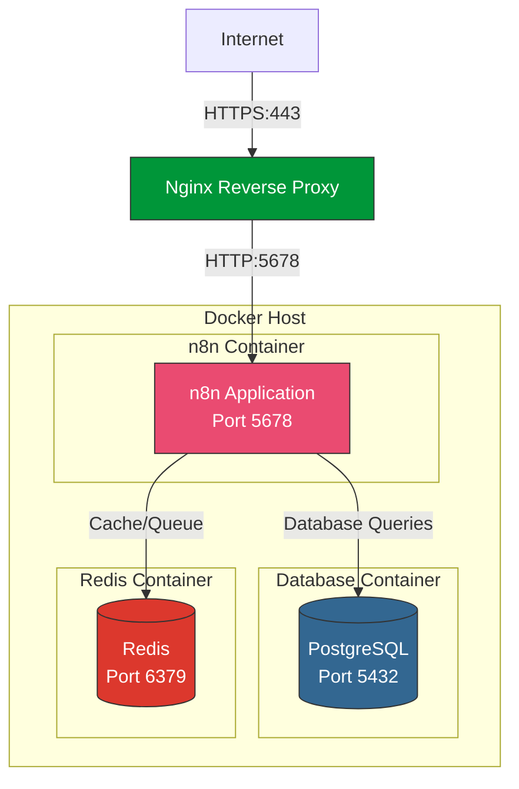

### Production Multi-Instance Setup

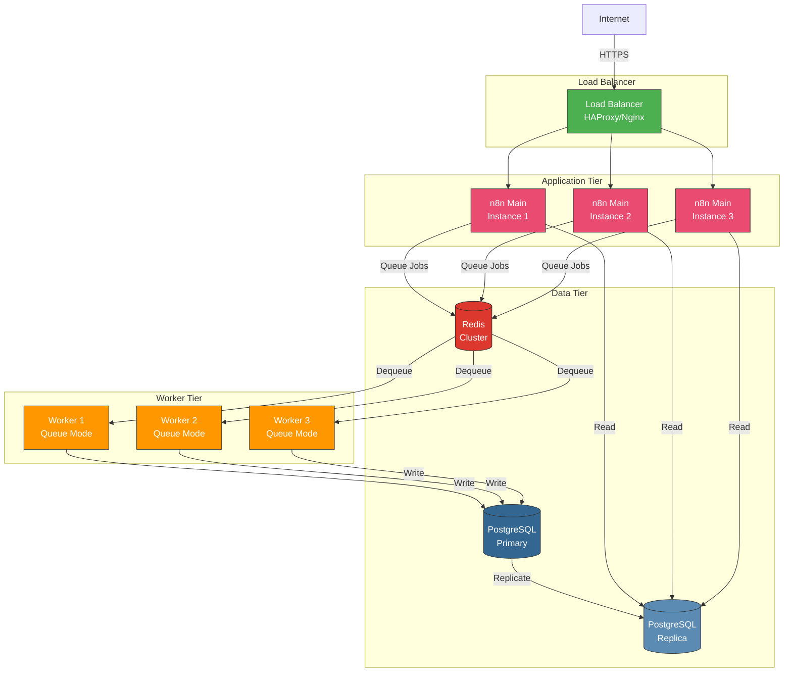

---

## Environment Deployment Flow

### Development to Production Pipeline

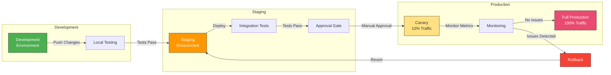

### Environment Configuration Hierarchy

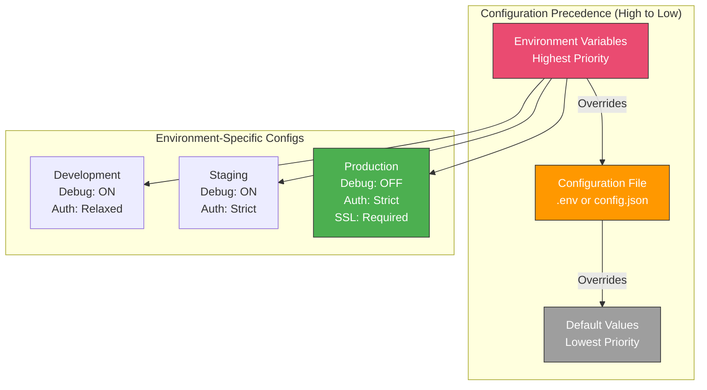

---

## Database Architecture

### PostgreSQL Schema Overview

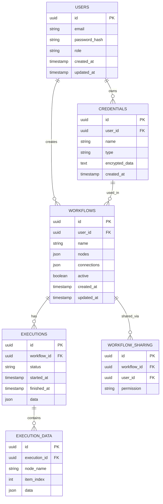

### Database Connection Pooling

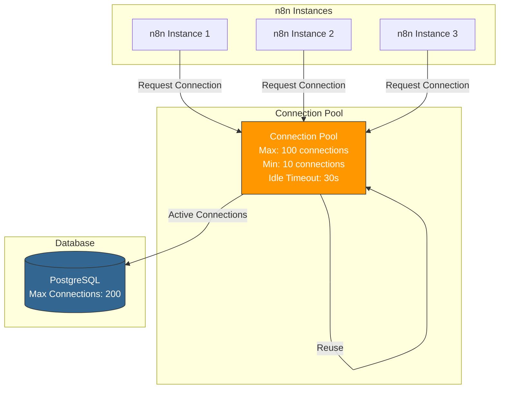

---

## SSL/TLS Configuration Flow

### Certificate Generation and Installation

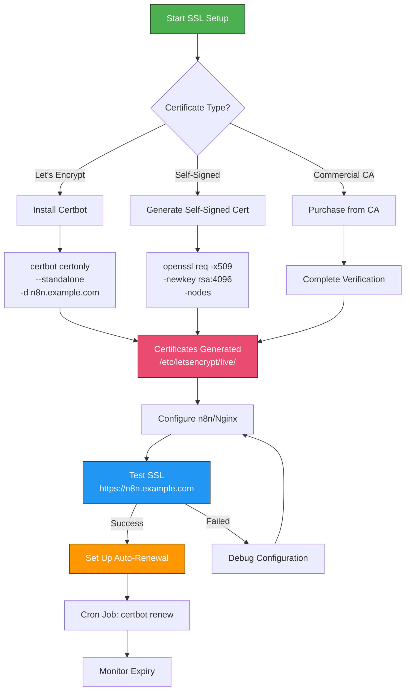

### SSL/TLS Handshake Flow

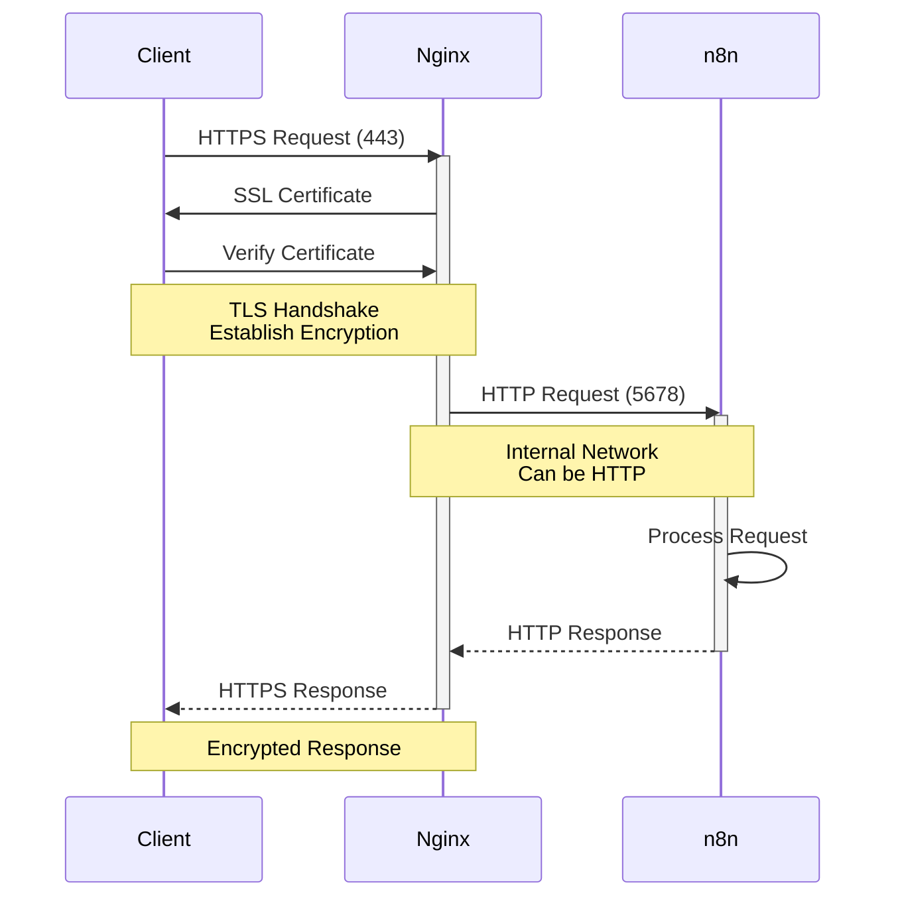

---

## User Management & RBAC

### Role-Based Access Control Model

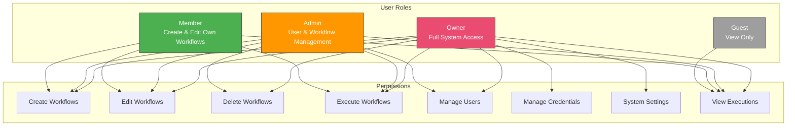

### Workflow Sharing Model

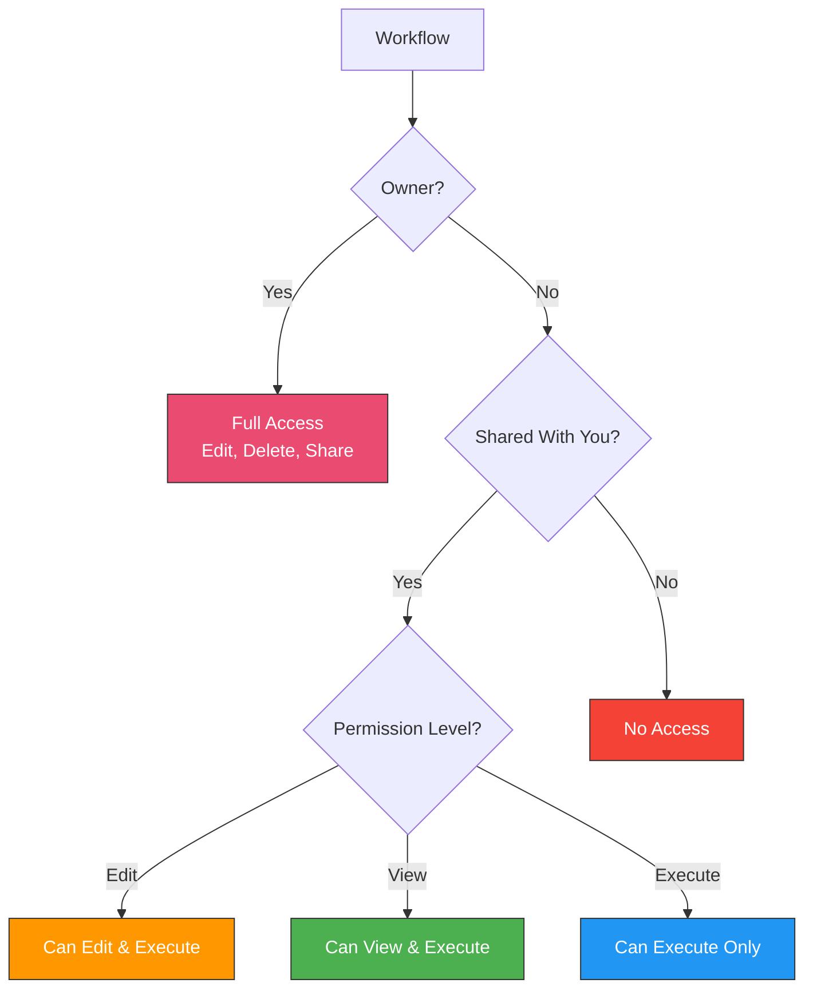

---

## Queue Mode Architecture

### Main Process vs Worker Processes

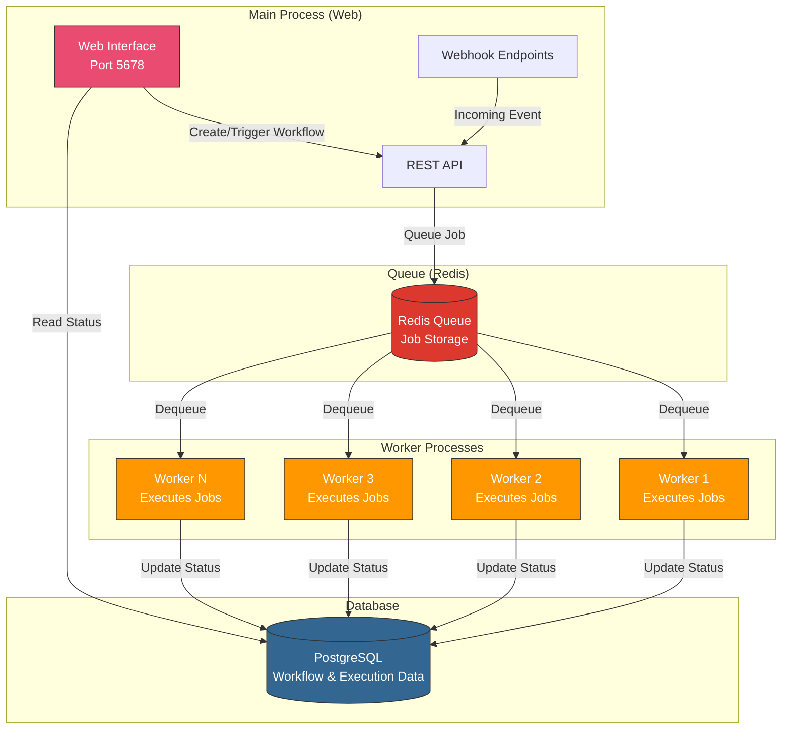

### Workflow Execution with Queue Mode

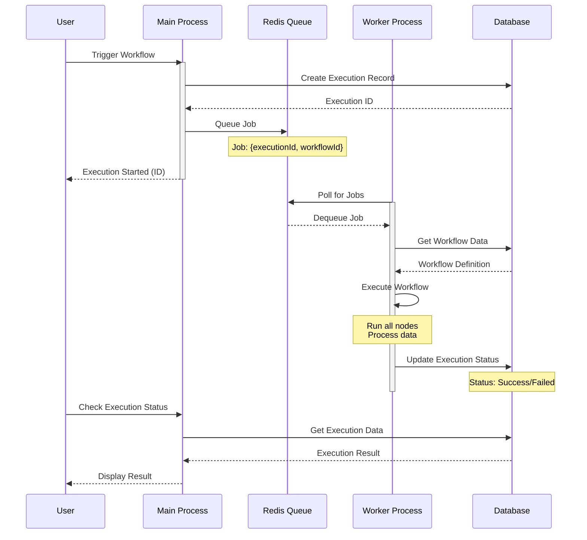

---

## Backup & Disaster Recovery

### Backup Strategy

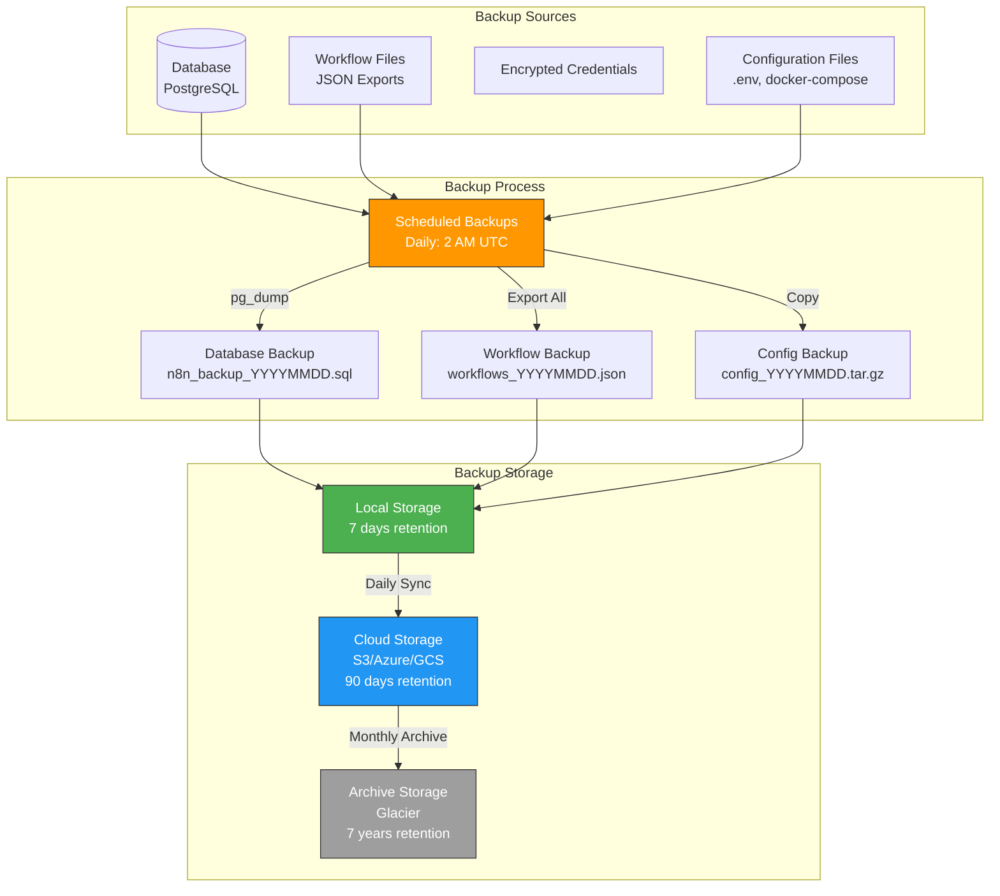

### Disaster Recovery Process

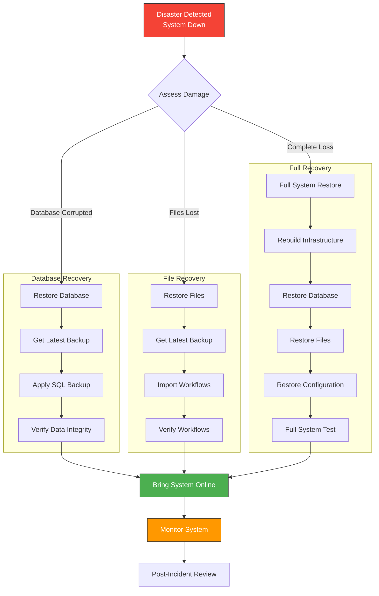

### Recovery Time Objectives (RTO)

```mermaid
gantt
    title Recovery Time Objectives by Disaster Type
    dateFormat HH:mm
    axisFormat %H:%M

    section Database Corruption
    Detect Issue           :00:00, 15m
    Get Latest Backup     :00:15, 10m
    Restore Database      :00:25, 30m
    Verify & Test         :00:55, 15m
    System Online         :01:10, 1m

    section File Loss
    Detect Issue          :00:00, 10m
    Get Backups          :00:10, 15m
    Restore Files        :00:25, 20m
    Import Workflows     :00:45, 15m
    System Online        :01:00, 1m

    section Complete Loss
    Detect & Assess      :00:00, 30m
    Provision Infra      :00:30, 60m
    Restore All Data     :01:30, 45m
    Configure System     :02:15, 30m
    Full Testing         :02:45, 30m
    System Online        :03:15, 1m
```

---

## Monitoring and Health Checks

### Health Check Flow

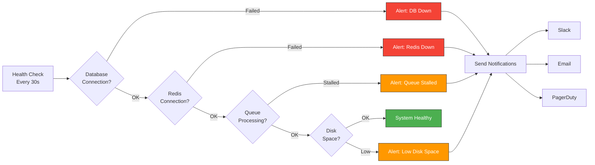

---

## Quick Reference Commands

### Docker Compose Production Setup

```yaml
# Example docker-compose.yml structure
services:
  n8n:
    image: n8nio/n8n
    environment:
      - DB_TYPE=postgresdb
      - EXECUTIONS_MODE=queue

  postgres:
    image: postgres:14

  redis:
    image: redis:7-alpine

  worker:
    image: n8nio/n8n
    command: worker
```

### Essential Commands

```bash
# View logs
docker-compose logs -f n8n

# Database backup
docker exec n8n-postgres pg_dump -U n8n n8n > backup.sql

# Restart services
docker-compose restart n8n

# Scale workers
docker-compose up -d --scale worker=5

# Check health
curl http://localhost:5678/healthz
```

---

**Use these diagrams as references when implementing your production n8n deployment!**
