# Week 12: Security and Compliance - Visual Guides

This document contains all visual diagrams for Week 12 content.

## Table of Contents

1. [Credential Encryption Flow](#credential-encryption-flow)
2. [Environment Variable Hierarchy](#environment-variable-hierarchy)
3. [API Key Rotation Process](#api-key-rotation-process)
4. [GDPR Compliance Workflow](#gdpr-compliance-workflow)
5. [Audit Trail Architecture](#audit-trail-architecture)
6. [Security Layers](#security-layers)

---

## Credential Encryption Flow

### Credential Storage and Retrieval

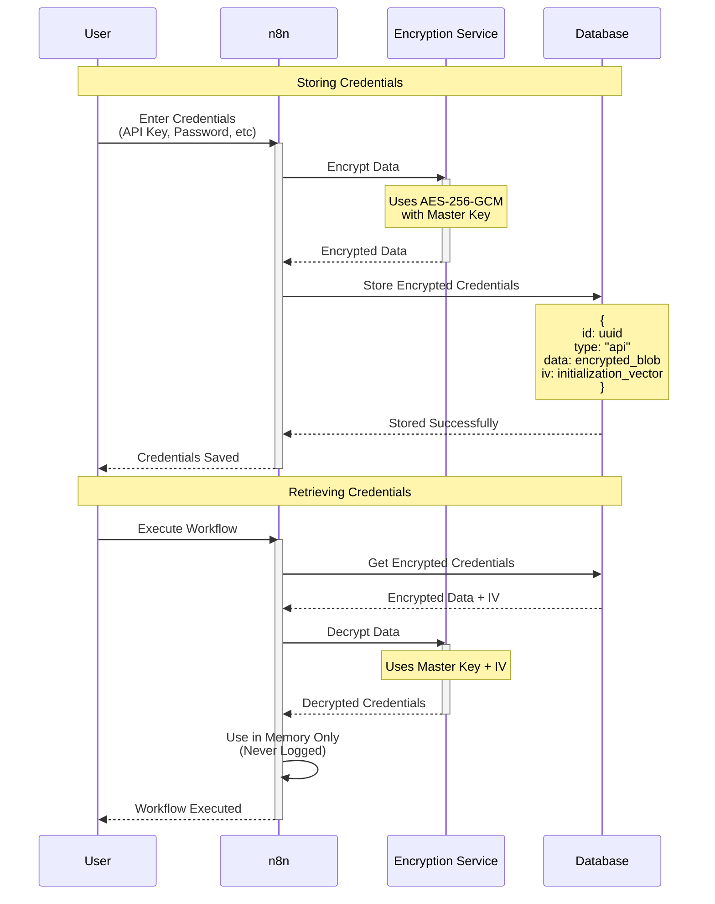

### Encryption Key Management

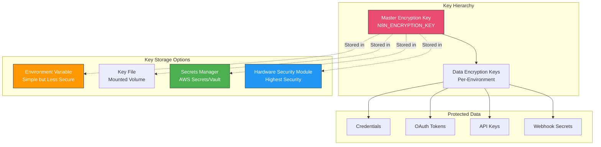

---

## Environment Variable Hierarchy

### Configuration Precedence

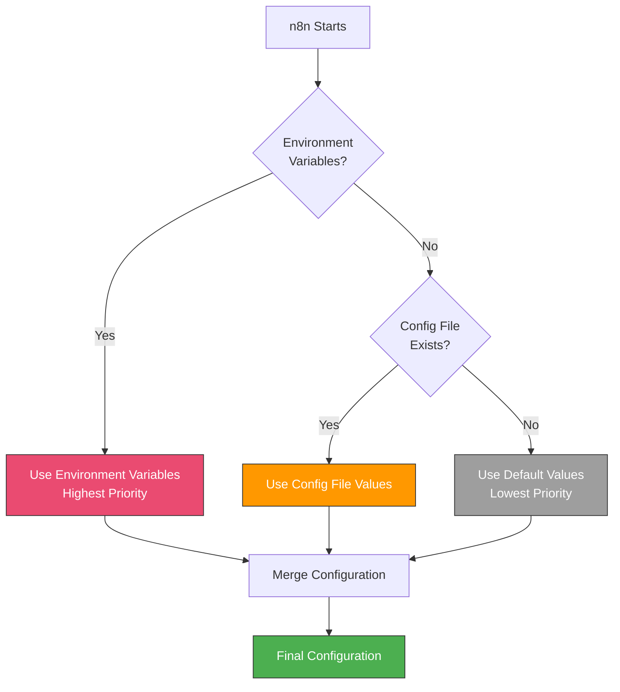

### Environment Variable Categories

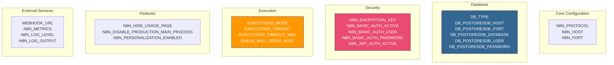

### Environment-Specific Configuration

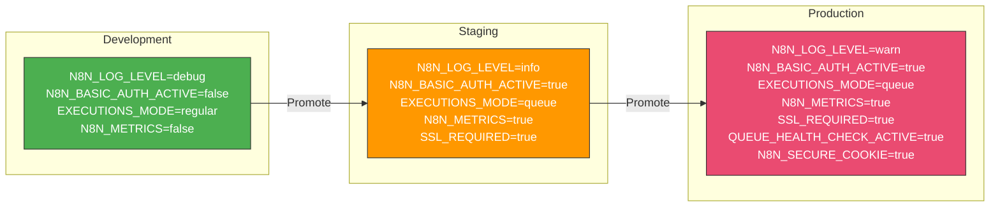

---

## API Key Rotation Process

### Zero-Downtime Key Rotation

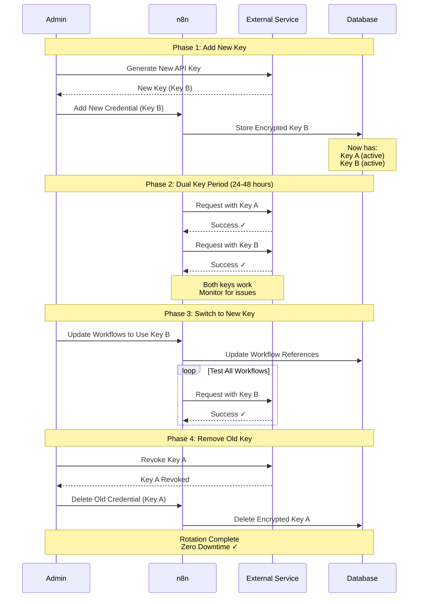

### Automated Rotation Schedule

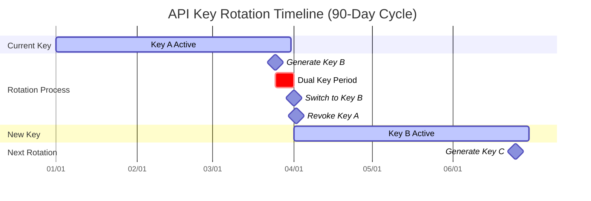

### Rotation Workflow

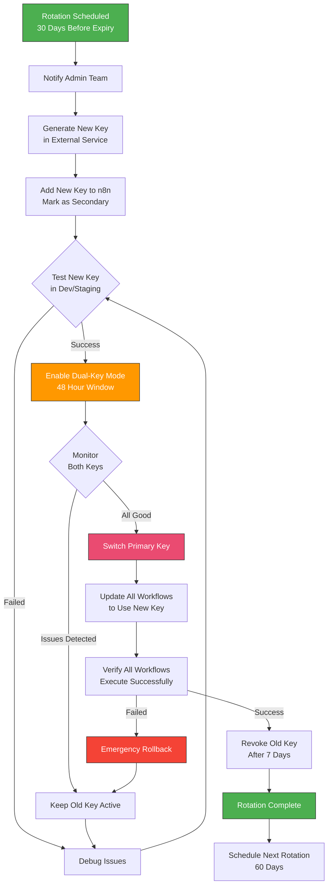

---

## GDPR Compliance Workflow

### Data Subject Request Handling

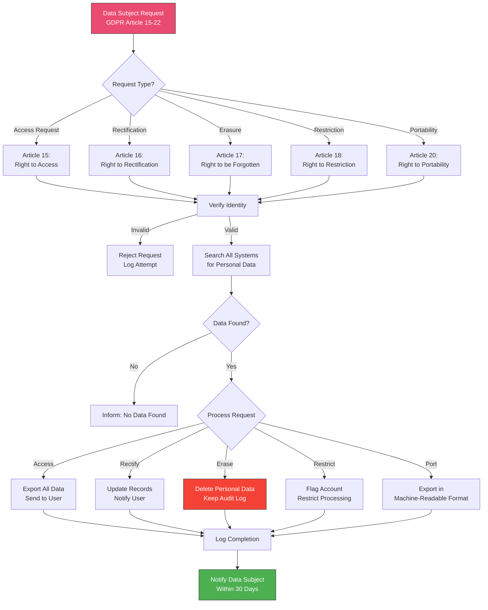

### Personal Data in n8n

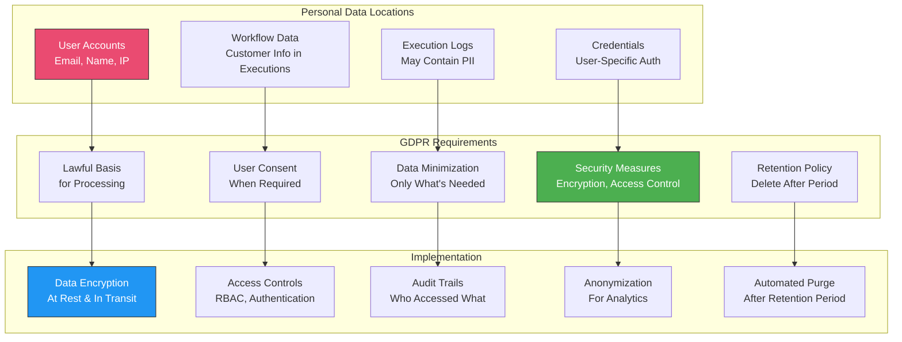

### Data Retention Policy

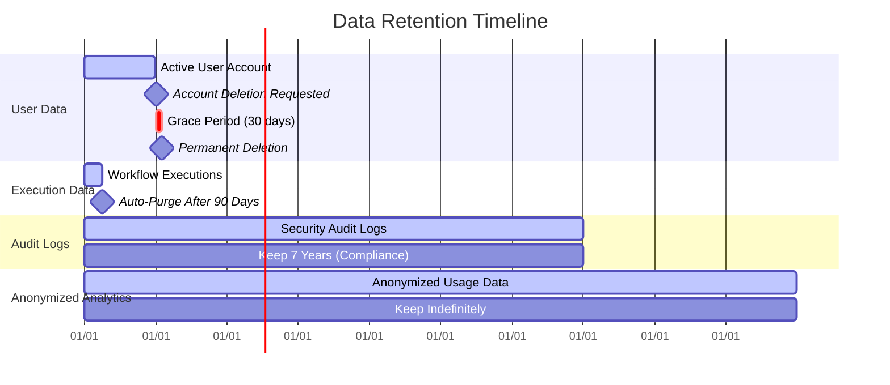

---

## Audit Trail Architecture

### Audit Event Logging

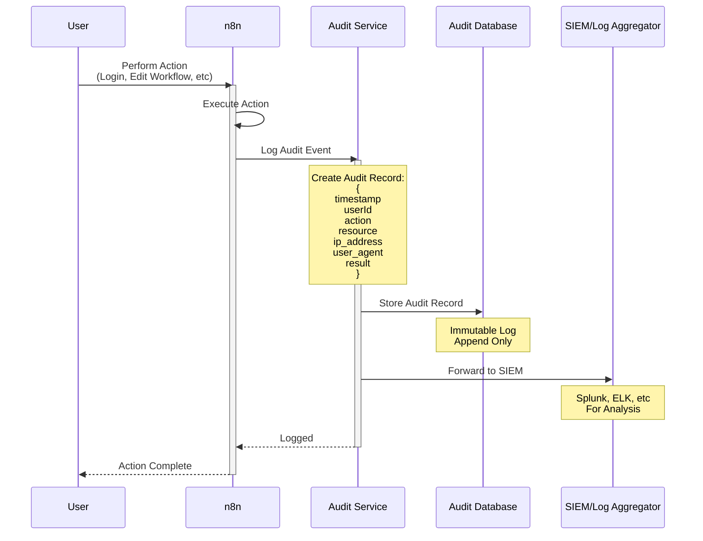

### Auditable Events

```mermaid
graph TB
    subgraph "User Actions"
        LOGIN[User Login/Logout]
        FAILED[Failed Login Attempts]
        PWD[Password Changes]
        ROLE[Role Changes]
    end

    subgraph "Workflow Actions"
        CREATE[Workflow Created]
        EDIT[Workflow Modified]
        DELETE[Workflow Deleted]
        EXECUTE[Workflow Executed]
        SHARE[Workflow Shared]
    end

    subgraph "Credential Actions"
        CRED_ADD[Credential Added]
        CRED_EDIT[Credential Modified]
        CRED_DEL[Credential Deleted]
        CRED_USE[Credential Used]
    end

    subgraph "System Actions"
        CONFIG[Configuration Changed]
        BACKUP[Backup Created]
        RESTORE[Restore Performed]
        UPDATE[System Updated]
    end

    subgraph "Audit Log"
        AUDIT_DB[(Audit Database<br/>Immutable Records)]
    end

    LOGIN --> AUDIT_DB
    FAILED --> AUDIT_DB
    PWD --> AUDIT_DB
    ROLE --> AUDIT_DB

    CREATE --> AUDIT_DB
    EDIT --> AUDIT_DB
    DELETE --> AUDIT_DB
    EXECUTE --> AUDIT_DB
    SHARE --> AUDIT_DB

    CRED_ADD --> AUDIT_DB
    CRED_EDIT --> AUDIT_DB
    CRED_DEL --> AUDIT_DB
    CRED_USE --> AUDIT_DB

    CONFIG --> AUDIT_DB
    BACKUP --> AUDIT_DB
    RESTORE --> AUDIT_DB
    UPDATE --> AUDIT_DB

    style AUDIT_DB fill:#EA4B71,stroke:#333,color:#fff
    style FAILED fill:#F44336,stroke:#333,color:#fff
    style CRED_USE fill:#FF9800,stroke:#333,color:#fff
```

### Audit Log Schema

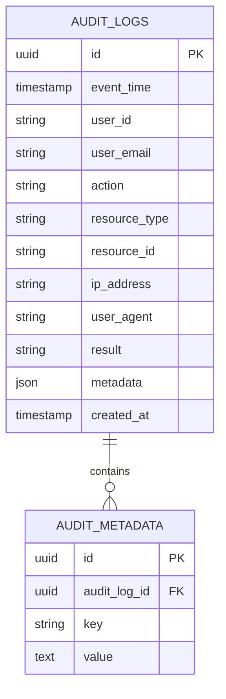

---

## Security Layers

### Defense in Depth

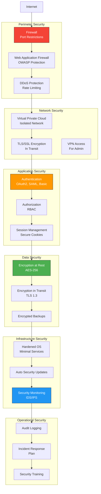

### Security Checklist

```mermaid
flowchart TD
    START[Security Assessment] --> PERIMETER{Perimeter<br/>Secure?}

    PERIMETER -->|No| FIX_PERIMETER[Configure Firewall<br/>Enable WAF<br/>Set Rate Limits]
    PERIMETER -->|Yes| NETWORK{Network<br/>Secure?}

    FIX_PERIMETER --> NETWORK

    NETWORK -->|No| FIX_NETWORK[Enable TLS<br/>Configure VPC<br/>Set up VPN]
    NETWORK -->|Yes| APP{Application<br/>Secure?}

    FIX_NETWORK --> APP

    APP -->|No| FIX_APP[Enable Auth<br/>Configure RBAC<br/>Secure Sessions]
    APP -->|Yes| DATA{Data<br/>Secure?}

    FIX_APP --> DATA

    DATA -->|No| FIX_DATA[Enable Encryption<br/>Secure Backups<br/>Rotate Keys]
    DATA -->|Yes| INFRA{Infrastructure<br/>Secure?}

    FIX_DATA --> INFRA

    INFRA -->|No| FIX_INFRA[Harden OS<br/>Enable Updates<br/>Deploy Monitoring]
    INFRA -->|Yes| OPS{Operations<br/>Secure?}

    FIX_INFRA --> OPS

    OPS -->|No| FIX_OPS[Enable Audit Logs<br/>Create Incident Plan<br/>Train Team]
    OPS -->|Yes| COMPLETE[Security Assessment<br/>Complete ✓]

    FIX_OPS --> COMPLETE

    style START fill:#4CAF50,stroke:#333,color:#fff
    style COMPLETE fill:#4CAF50,stroke:#333,color:#fff
    style FIX_PERIMETER fill:#F44336,stroke:#333,color:#fff
    style FIX_NETWORK fill:#F44336,stroke:#333,color:#fff
    style FIX_APP fill:#F44336,stroke:#333,color:#fff
    style FIX_DATA fill:#F44336,stroke:#333,color:#fff
    style FIX_INFRA fill:#F44336,stroke:#333,color:#fff
    style FIX_OPS fill:#F44336,stroke:#333,color:#fff
```

---

## Compliance Frameworks

### Compliance Mapping

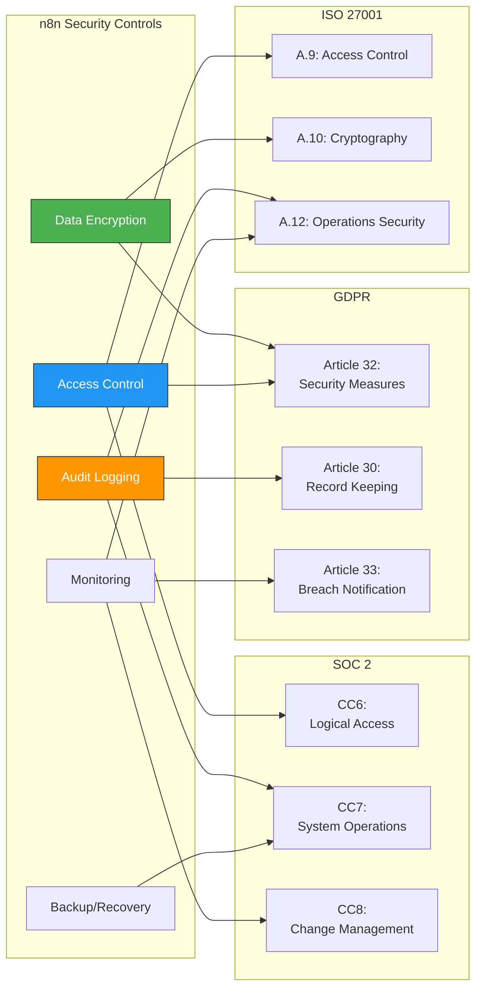

---

## Quick Security Commands

### Security Verification Scripts

```bash
# Check encryption key
echo $N8N_ENCRYPTION_KEY | wc -c
# Should be 32+ characters

# Verify TLS certificate
openssl s_client -connect n8n.example.com:443 -showcerts

# Check file permissions
ls -la ~/.n8n/
# Should not be world-readable

# Audit recent logins
docker-compose logs n8n | grep "Login"

# Check for exposed credentials in logs
docker-compose logs n8n | grep -i "password\|api.*key\|secret"
# Should find nothing!

# Verify database encryption
docker exec n8n-db psql -U n8n -c "SELECT pg_database.datname, pg_tablespace.spcname FROM pg_database JOIN pg_tablespace ON pg_database.dattablespace = pg_tablespace.oid;"
```

---

**Use these diagrams to implement comprehensive security and compliance measures in your n8n deployment!**
