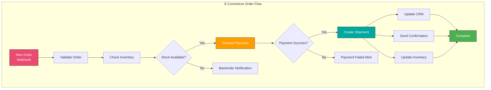
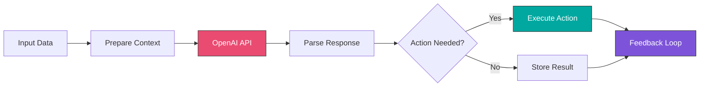
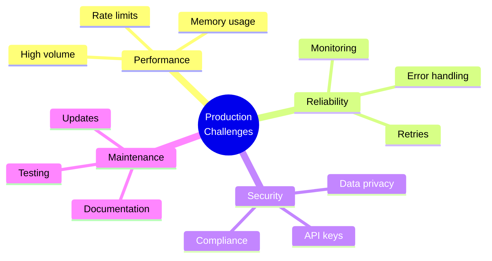

# Module 8: Real-World Applications and Expert Patterns

## Overview

Apply all your n8n knowledge to build complete, production-ready business applications. Learn AI integrations, complex business automations, and event-driven architectures.

**Duration:** 2 weeks (25-35 hours)

## Learning Objectives

- Design end-to-end business process automations
- Integrate multiple systems seamlessly
- Implement complex business logic
- Build AI-powered workflows
- Create event-driven architectures
- Document enterprise workflows effectively
- Handle real-world edge cases

## Module Contents

### [Week 13: Complex Business Automations](./week-13/README.md)
- Order processing automation end-to-end
- Customer onboarding workflows
- Automated reporting systems
- Multi-stage approval workflows
- Event-driven architecture patterns
- State machine implementations
- Business process documentation

### [Week 14: AI and Advanced Integrations](./week-14/README.md)
- OpenAI and AI node integration
- Building AI-powered chatbots
- Document processing with AI
- Sentiment analysis workflows
- Image and audio processing
- LangChain integration
- Vector databases for AI
- Prompt engineering in workflows

## Business Automation Patterns

## Major Projects

### 1. E-Commerce Integration Hub
Complete system connecting:
- Shopify/WooCommerce store
- Inventory management
- Shipping providers
- Accounting software (QuickBooks)
- Email marketing (Mailchimp)
- Customer support (Zendesk)

### 2. Marketing Automation Platform
Multi-channel campaign management:
- Lead capture and scoring
- Email sequence automation
- Social media posting
- Analytics dashboard
- A/B testing workflows
- ROI tracking

### 3. DevOps Automation Suite
CI/CD and monitoring:
- GitHub webhook integration
- Automated testing triggers
- Deployment workflows
- Incident response automation
- Status page updates
- Team notifications

### 4. AI-Powered Customer Support
Intelligent support system:
- Ticket classification
- Sentiment analysis
- Automated responses
- Knowledge base integration
- Escalation routing
- Performance analytics

### 5. Data Pipeline Platform
ETL workflows:
- Multiple data sources
- Data transformation
- Quality validation
- Multiple destinations
- Error handling
- Monitoring dashboard

## AI Integration Patterns

### AI Use Cases in n8n

1. **Content Generation**
   - Blog post writing
   - Product descriptions
   - Email templates
   - Social media posts

2. **Data Analysis**
   - Sentiment analysis
   - Text classification
   - Entity extraction
   - Summarization

3. **Conversational AI**
   - Chatbots
   - FAQ automation
   - Customer support
   - Lead qualification

4. **Document Processing**
   - PDF extraction
   - Form filling
   - Data validation
   - Translation

## Prerequisites

- Completed Modules 1-7
- Strong understanding of n8n concepts
- Experience with APIs and integrations
- Business process knowledge

## Key Skills Developed

- System architecture design
- Integration strategy
- Business logic implementation
- AI workflow design
- Production deployment
- Documentation practices

## Real-World Challenges

## Next Steps

After completing this module, proceed to [Module 9: Expert Techniques and Advanced Patterns](../module-09-expert/README.md)
