# Week 13: Complex Business Automations - Visual Guides

This document contains all visual diagrams for Week 13 content.

## Table of Contents

1. [E-commerce Order Processing Flow](#e-commerce-order-processing-flow)
2. [Customer Onboarding Journey](#customer-onboarding-journey)
3. [Multi-Stage Approval Workflow](#multi-stage-approval-workflow)
4. [Event-Driven Architecture](#event-driven-architecture)
5. [Financial Reconciliation Process](#financial-reconciliation-process)

---

## E-commerce Order Processing Flow

### Complete Order Fulfillment Process

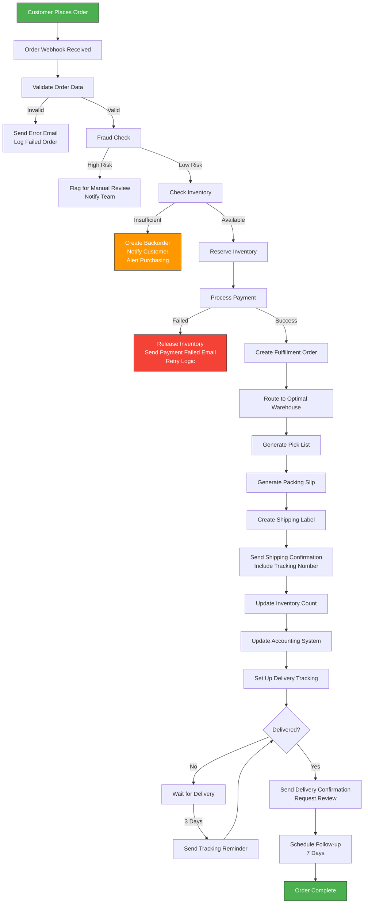

### Multi-Channel Order Integration

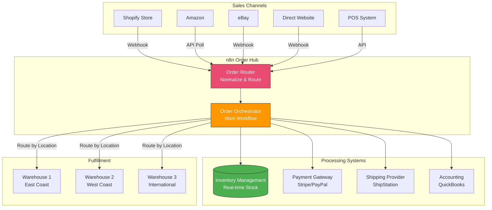

### Inventory Synchronization

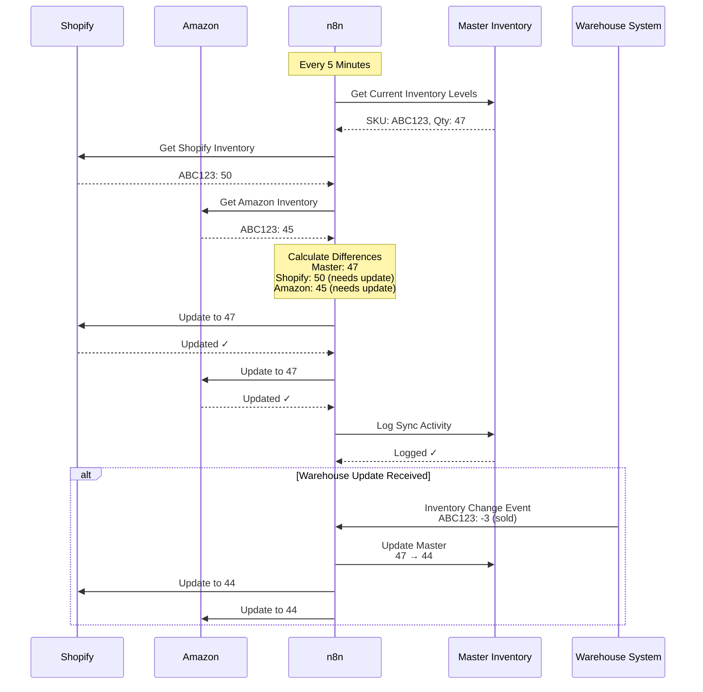

---

## Customer Onboarding Journey

### Employee Onboarding Automation

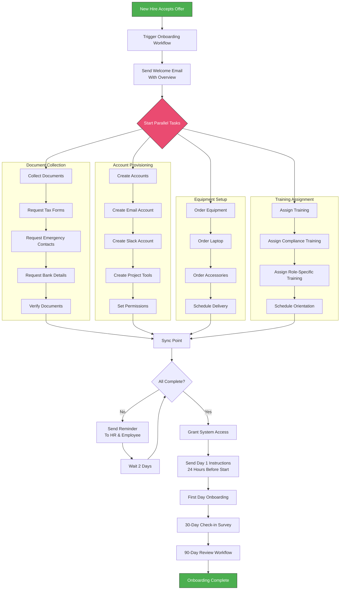

### Onboarding Task Tracking

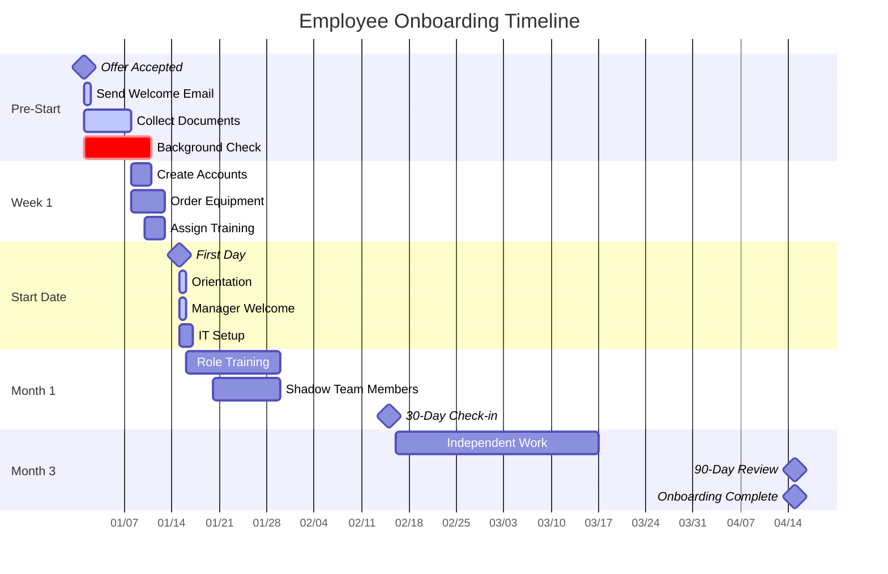

---

## Multi-Stage Approval Workflow

### Dynamic Approval Routing

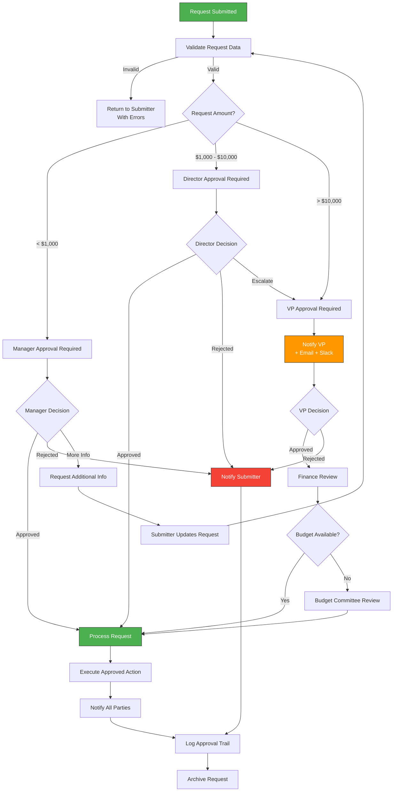

### Approval Escalation

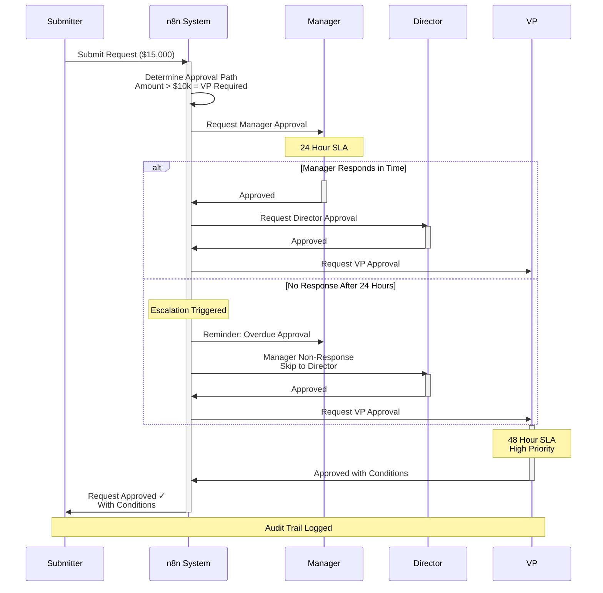

---

## Event-Driven Architecture

### Event Bus Pattern

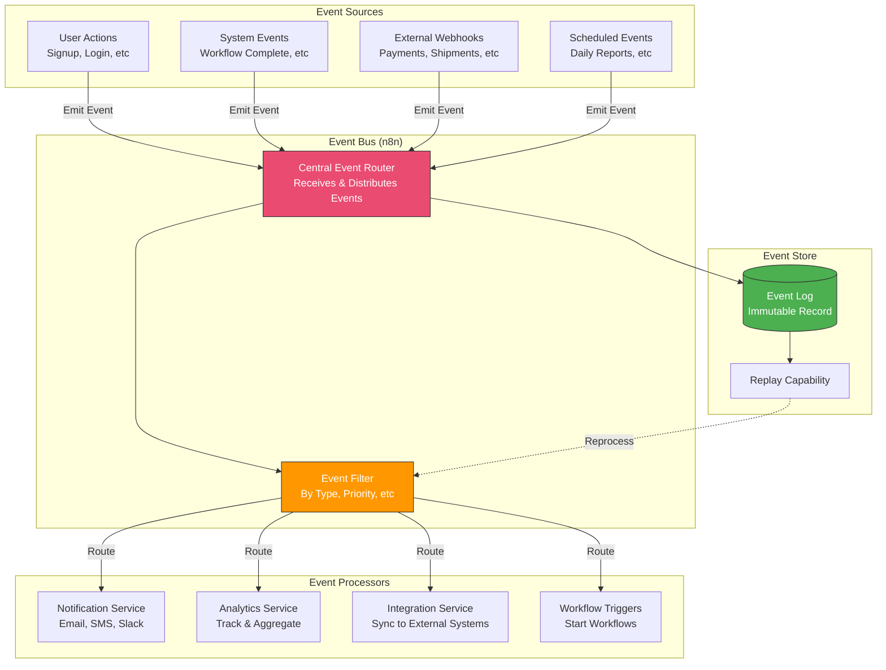

### Event Flow Example: Order Placed

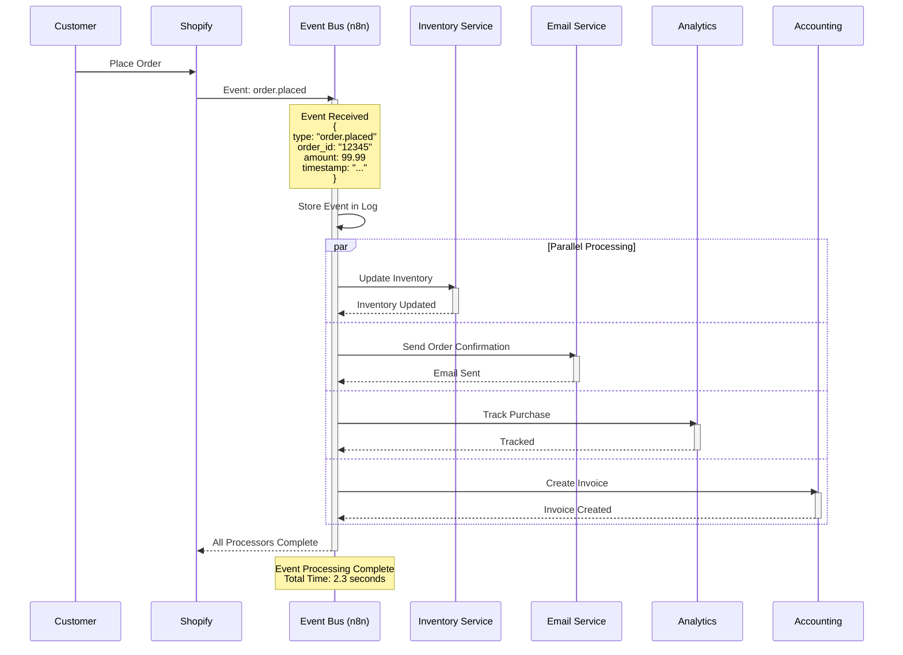

### Microservices Coordination

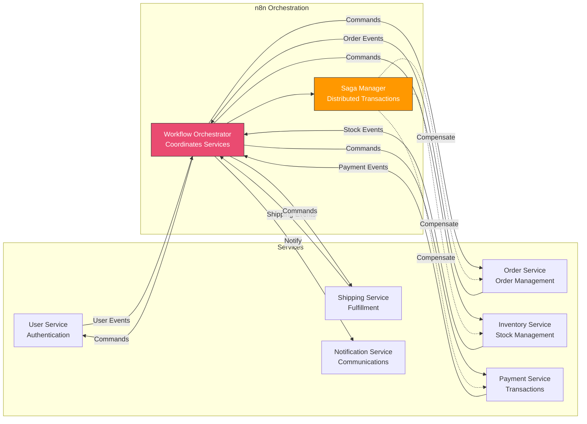

---

## Financial Reconciliation Process

### Automated Reconciliation Workflow

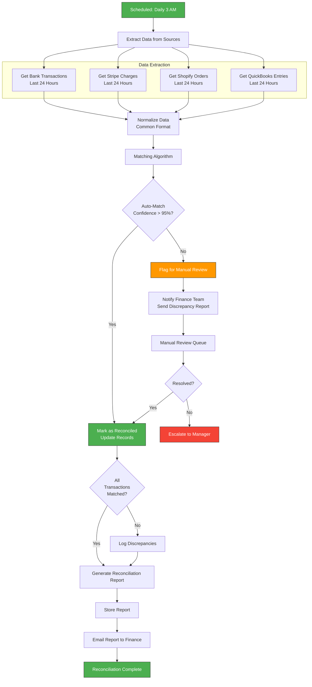

### Transaction Matching Logic

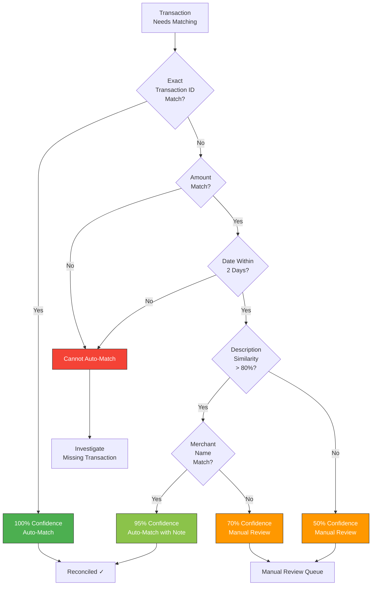

### Reconciliation Dashboard

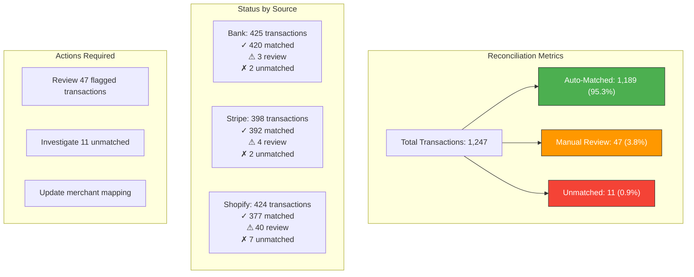

---

## Quick Reference: Business Process Patterns

### Common Workflow Patterns

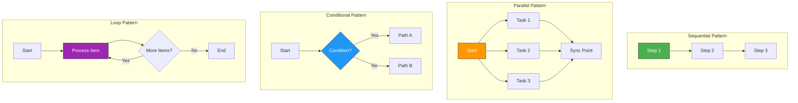

---

**Use these diagrams to design and implement complex business automation workflows!**
