# Week 14: AI and Advanced Integrations - Visual Guides

This document contains all visual diagrams for Week 14 content.

## Table of Contents

1. [AI Integration Architecture](#ai-integration-architecture)
2. [Chatbot Conversation Flow](#chatbot-conversation-flow)
3. [RAG (Retrieval Augmented Generation)](#rag-retrieval-augmented-generation)
4. [Content Generation Pipeline](#content-generation-pipeline)
5. [Document Processing Workflow](#document-processing-workflow)
6. [Sentiment Analysis System](#sentiment-analysis-system)

---

## AI Integration Architecture

### n8n + AI Services Architecture

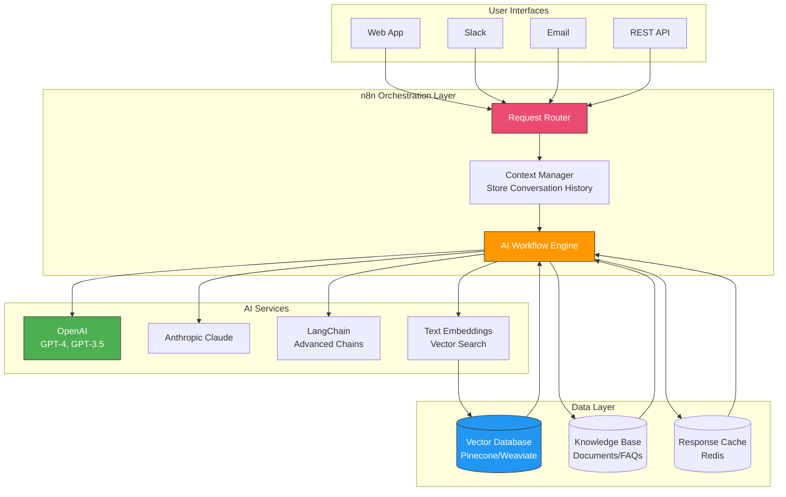

### AI Model Selection Flow

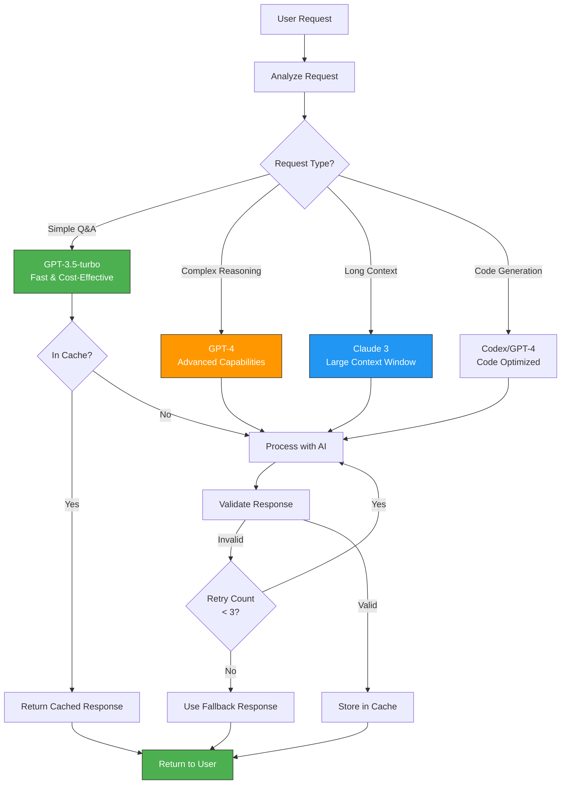

---

## Chatbot Conversation Flow

### Multi-Turn Conversation Management

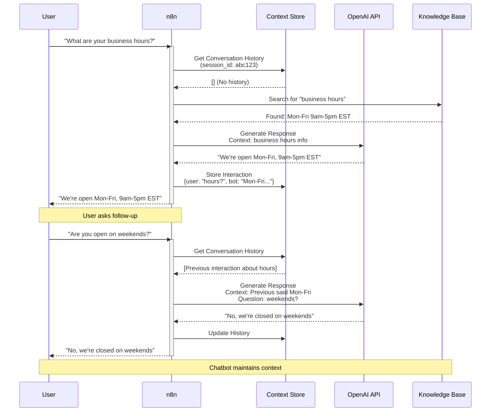

### Intent Recognition and Routing

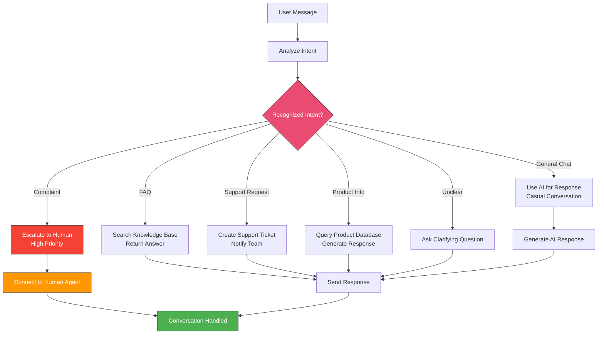

### Chatbot Architecture

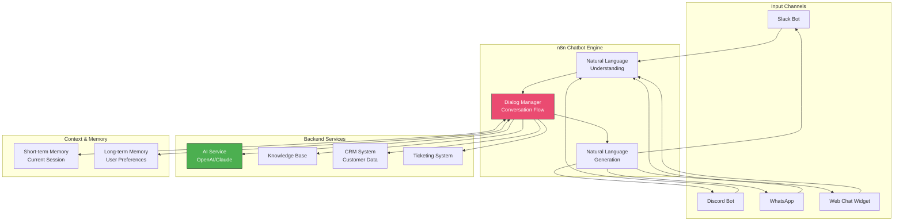

---

## RAG (Retrieval Augmented Generation)

### RAG Architecture

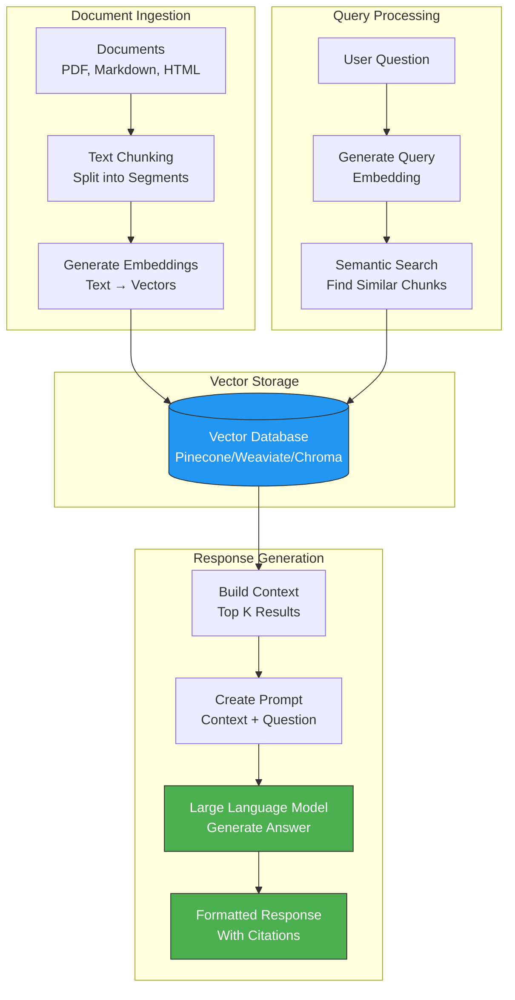

### RAG Workflow Sequence

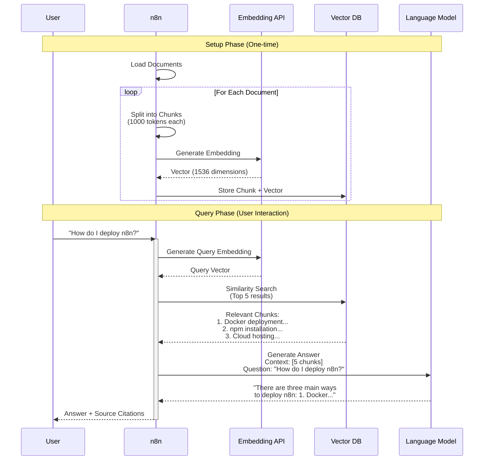

### Document Chunking Strategy

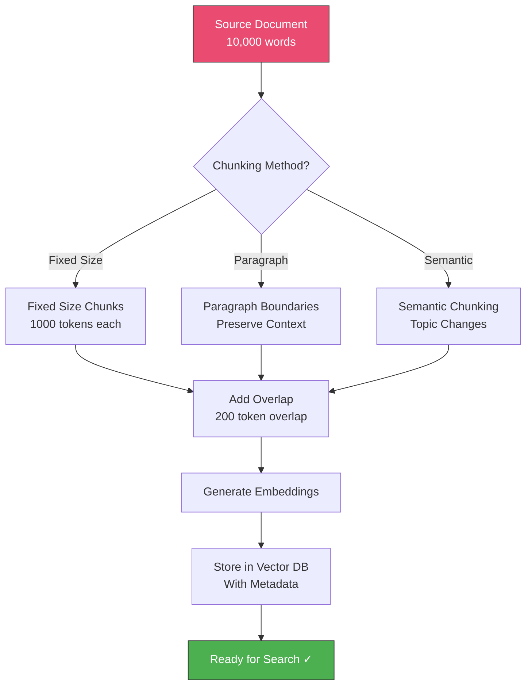

---

## Content Generation Pipeline

### Automated Content Creation

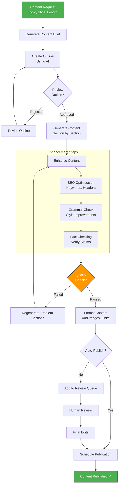

### Multi-Format Content Generation

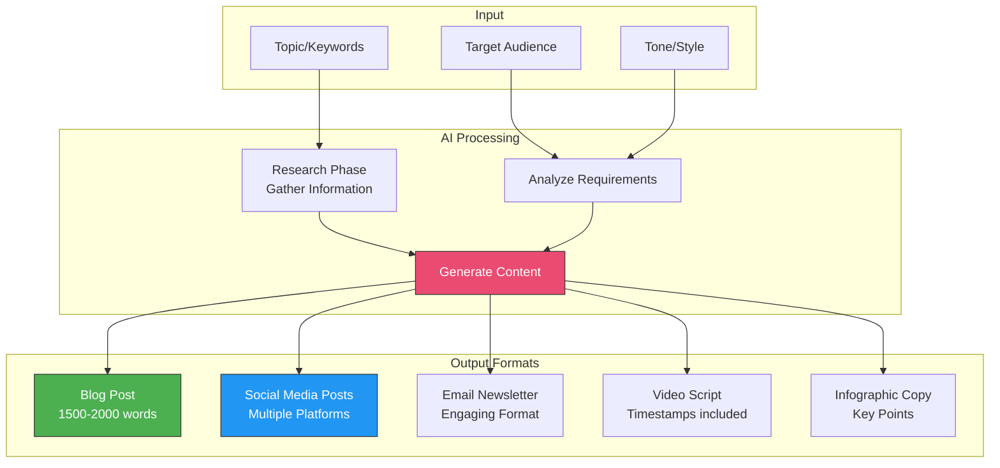

---

## Document Processing Workflow

### Intelligent Document Processing

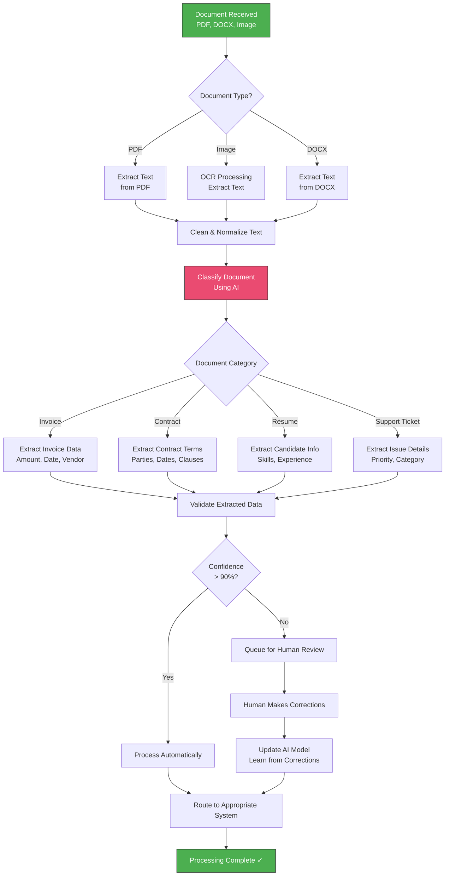

### Document Analysis Pipeline

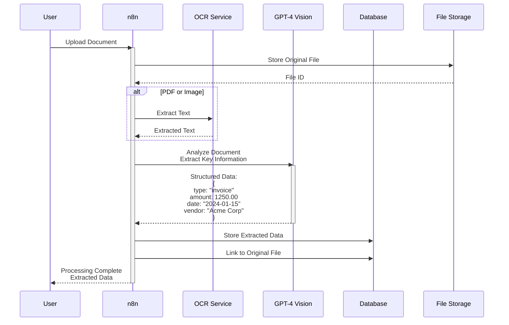

---

## Sentiment Analysis System

### Real-Time Sentiment Analysis

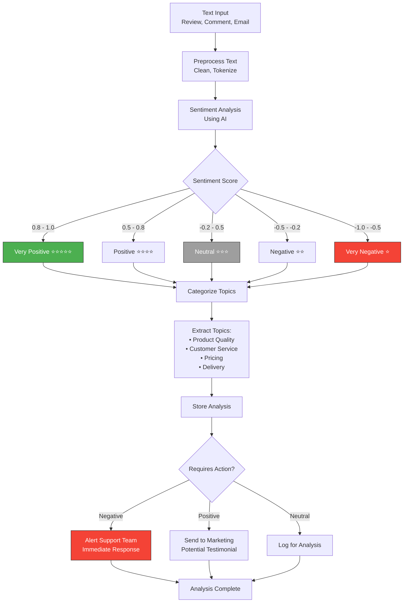

### Sentiment Trend Analysis

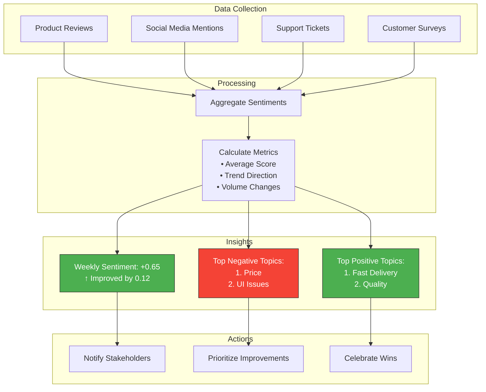

---

## AI Cost Optimization

### Token Usage Optimization

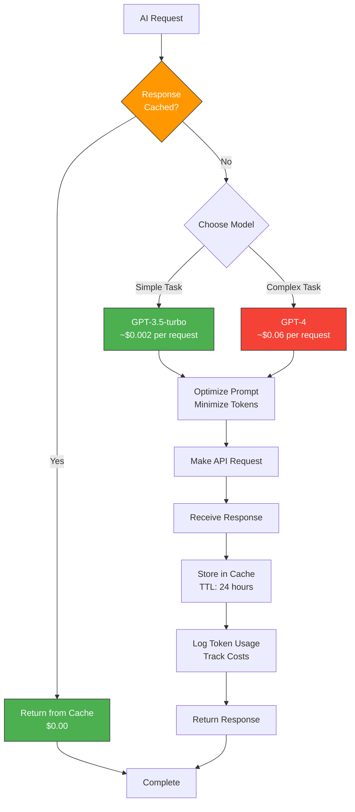

### Cost Monitoring Dashboard

```mermaid
graph TB
    subgraph "Daily AI Costs"
        TODAY[Today: $127.45<br/>↓ 12% vs yesterday]
        BREAKDOWN[Model Breakdown:<br/>• GPT-4: $89.20 (70%)<br/>• GPT-3.5: $28.15 (22%)<br/>• Embeddings: $10.10 (8%)]
    end

    subgraph "Usage Metrics"
        REQUESTS[Total Requests: 8,456<br/>Cache Hit Rate: 34%]
        AVG_TOKENS[Avg Tokens per Request:<br/>Input: 450<br/>Output: 280]
    end

    subgraph "Optimization Opportunities"
        CACHE_MORE[Increase Cache TTL<br/>Potential Savings: $23/day]
        USE_GPT35[Use GPT-3.5 More<br/>Potential Savings: $15/day]
        OPTIMIZE_PROMPTS[Shorten Prompts<br/>Potential Savings: $8/day]
    end

    style TODAY fill:#4CAF50,stroke:#333,color:#fff
    style CACHE_MORE fill:#FF9800,stroke:#333,color:#fff
```

---

## Quick AI Integration Patterns

### Common AI Use Cases in n8n

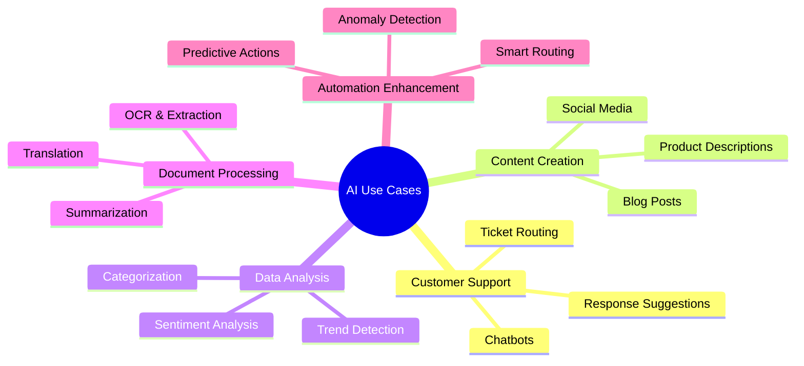

---

**Use these diagrams to build powerful AI-enhanced workflows in n8n!**
