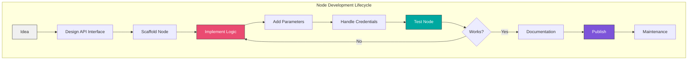
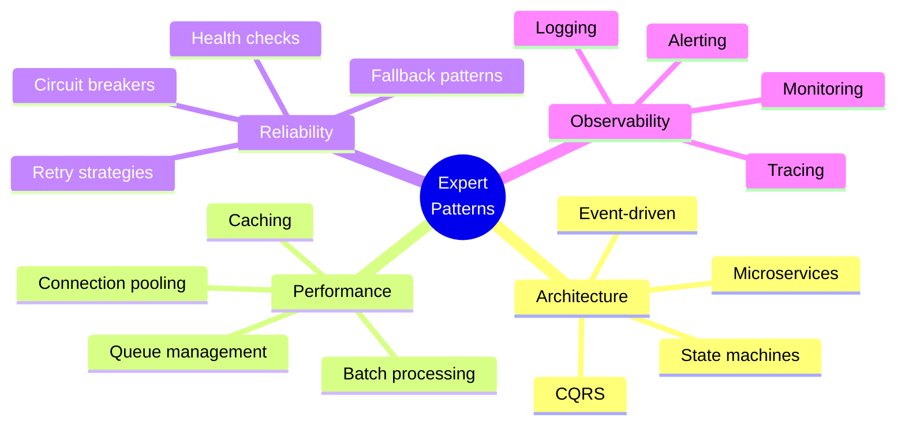
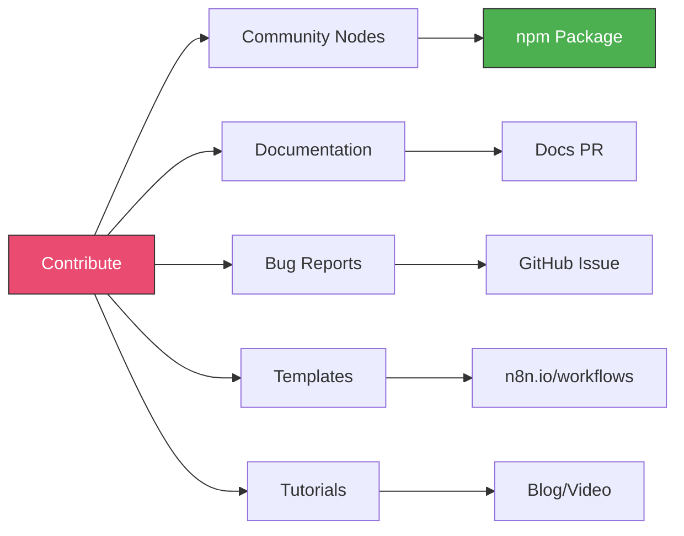
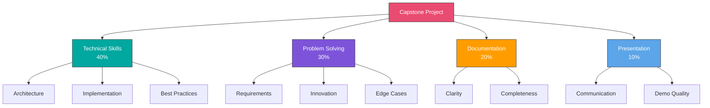
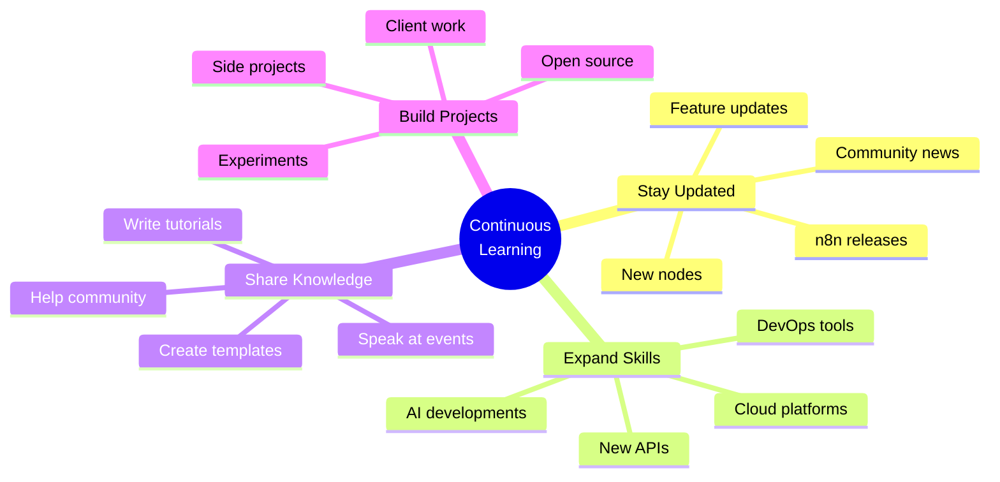

# Module 9: Expert Techniques and Advanced Patterns

## Overview

Reach expert level by learning custom node development, contributing to the n8n community, and building your own extensions. Complete a comprehensive capstone project demonstrating mastery.

**Duration:** 2 weeks (30-40 hours)

## Learning Objectives

- Understand n8n's internal architecture
- Develop custom nodes with TypeScript
- Test and publish community nodes
- Contribute to the n8n ecosystem
- Build private node packages for teams
- Architect complex automation systems
- Master advanced troubleshooting techniques

## Module Contents

### [Week 15: Custom Nodes and Extensions](./week-15/README.md)
- n8n architecture overview
- Node development basics
- TypeScript for n8n
- Testing custom nodes
- Publishing to npm
- Creating community nodes
- Maintaining node packages
- Debugging and troubleshooting

### [Week 16: Capstone Project and Best Practices](./week-16/README.md)
- Architecture patterns for complex systems
- Testing strategies for workflows
- Documentation standards
- Team collaboration practices
- Cost optimization techniques
- Troubleshooting advanced issues
- **Capstone Project** - Build your masterpiece

## Custom Node Development



### Node Structure

```typescript
import {
  IExecuteFunctions,
  INodeType,
  INodeTypeDescription,
  INodeExecutionData,
} from 'n8n-workflow';

export class MyCustomNode implements INodeType {
  description: INodeTypeDescription = {
    displayName: 'My Custom Node',
    name: 'myCustomNode',
    group: ['transform'],
    version: 1,
    description: 'Custom node functionality',
    defaults: {
      name: 'My Custom Node',
    },
    inputs: ['main'],
    outputs: ['main'],
    properties: [
      // Node parameters
    ],
  };

  async execute(this: IExecuteFunctions): Promise<INodeExecutionData[][]> {
    // Node logic
  }
}
```

## Capstone Project Options

### 1. E-Commerce Integration Hub
**Complexity:** Advanced
**Components:**
- Multi-store integration (Shopify, WooCommerce)
- Inventory synchronization
- Order processing automation
- Shipping integration
- Accounting sync (QuickBooks, Xero)
- Customer communication
- Analytics dashboard

**Technical Requirements:**
- Custom nodes for proprietary systems
- Error handling and retries
- Rate limit management
- Data transformation
- Monitoring and alerting
- Documentation

### 2. Marketing Automation Platform
**Complexity:** Advanced
**Components:**
- Lead capture (forms, APIs)
- Lead scoring system
- Email campaign automation
- Social media scheduler
- Content generation (AI)
- Analytics and reporting
- A/B testing framework

**Technical Requirements:**
- AI integration (OpenAI)
- Database operations
- Conditional workflows
- Scheduled tasks
- Webhook handling
- Performance optimization

### 3. DevOps Automation Suite
**Complexity:** Expert
**Components:**
- CI/CD pipeline integration
- Automated testing workflows
- Deployment automation
- Incident response system
- Monitoring and alerting
- Status page management
- Post-mortem automation

**Technical Requirements:**
- GitHub/GitLab integration
- Custom trigger nodes
- Webhook processing
- Error handling
- Notification systems
- State management

### 4. Data Pipeline Platform
**Complexity:** Advanced
**Components:**
- Multi-source data ingestion
- Data validation and cleaning
- Transformation pipelines
- Quality checks
- Multiple destinations
- Error recovery
- Audit logging

**Technical Requirements:**
- Database operations
- Batch processing
- Data validation
- Error handling
- Monitoring
- Performance optimization

### 5. Custom Business Solution
**Complexity:** Variable
**Your own project solving a real business problem**

Design and implement your own solution demonstrating:
- Requirements gathering
- Architecture design
- Implementation
- Testing
- Documentation
- Deployment

## Expert Patterns



### Advanced Patterns

1. **Circuit Breaker Pattern**
   - Prevent cascading failures
   - Automatic recovery
   - Fallback mechanisms

2. **Saga Pattern**
   - Distributed transactions
   - Compensating actions
   - State management

3. **CQRS (Command Query Responsibility Segregation)**
   - Separate read/write models
   - Event sourcing
   - Scalability

4. **Event-Driven Architecture**
   - Loose coupling
   - Asynchronous processing
   - Event streams

## Community Contribution

### Ways to Contribute



1. **Create Community Nodes**
   - Identify missing integrations
   - Develop and test
   - Publish to npm
   - Submit to n8n community

2. **Share Workflow Templates**
   - Document use cases
   - Share on n8n.io
   - Write blog posts
   - Create video tutorials

3. **Improve Documentation**
   - Fix errors
   - Add examples
   - Write guides
   - Translate content

4. **Help the Community**
   - Answer forum questions
   - Share knowledge
   - Mentor beginners
   - Review PRs

## Capstone Project Requirements

Your capstone must include:

### Technical Requirements
- [ ] Minimum 5 integrated services
- [ ] Custom business logic
- [ ] Error handling and retries
- [ ] Monitoring and logging
- [ ] At least one subworkflow
- [ ] Database operations (if applicable)
- [ ] Proper credential management
- [ ] Performance optimization

### Documentation Requirements
- [ ] Architecture diagram
- [ ] Setup instructions
- [ ] Configuration guide
- [ ] API documentation
- [ ] Troubleshooting guide
- [ ] Future enhancements

### Code Quality
- [ ] Well-structured workflows
- [ ] Proper naming conventions
- [ ] Comments and notes
- [ ] Error messages
- [ ] Test cases

### Presentation
- [ ] Demo video (5-10 minutes)
- [ ] Problem statement
- [ ] Solution overview
- [ ] Technical highlights
- [ ] Lessons learned

## Assessment Criteria



## Certification Path

Upon completion:

**Expert Level Achievement:**
- ✓ Built production-grade workflows
- ✓ Developed custom nodes
- ✓ Completed capstone project
- ✓ Contributed to n8n ecosystem
- ✓ Demonstrated mastery of advanced concepts

**Next Steps:**
1. Share your capstone project
2. Continue contributing to n8n
3. Build n8n-based products/services
4. Mentor other learners
5. Join the n8n community as an expert

## Ongoing Learning



## Final Thoughts

Congratulations on reaching expert level! You now have the skills to:

- Build enterprise-grade automation systems
- Develop custom n8n nodes
- Architect complex integrations
- Optimize for performance and scale
- Deploy production systems
- Contribute to the n8n community

**The journey continues:**
- Keep learning and experimenting
- Share your knowledge
- Build amazing things
- Help others succeed

Welcome to the n8n expert community!

## Resources

- [n8n Community Forum](https://community.n8n.io)
- [n8n GitHub Repository](https://github.com/n8n-io/n8n)
- [Node Development Docs](https://docs.n8n.io/integrations/creating-nodes/)
- [TypeScript Handbook](https://www.typescriptlang.org/docs/)
- [n8n Discord Server](https://discord.gg/n8n)
